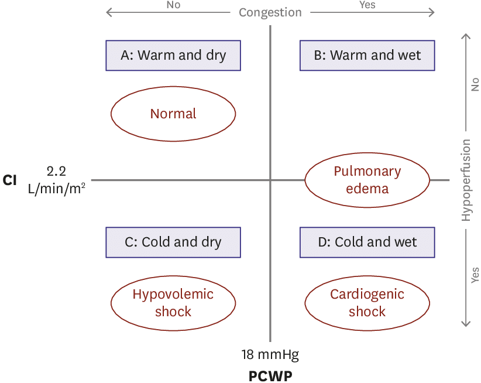

# Evaluation

## 摘要
Congestion（wet vs dry：肺水腫、腳水腫、頸靜脈）× Perfusion（cold vs warm：體液不足、AKI、肢端冰冷、意識改變）畫成 2×2 表格。

## 內文

> 💡 CI (cardiac index): cardiac output / body surface area

1. **Congestion** (**<u>wet</u>** vs dry):
   1. Pulmonary edema: dyspnea, orthopnea, paroxymal nucturnal dyspnea, B-line, infiltrated CXR
      > 💡 PCWP(pulmonary capillary wedge pressure): 透過 Swan-Ganz catheter 測量, congestion 時會高
   2. Leg edema
   3. Jugular vein: distention, hepatojugular reflux
2. **Perfusion** (**<u>cold</u>** vs warm):
   1. Fluid insufficiency: IVC under echo, poor response to diuretic
   2. Acute renal injury: low urine output, CRE, BUN
   3. Cold extremities
   4. Altered mental status
