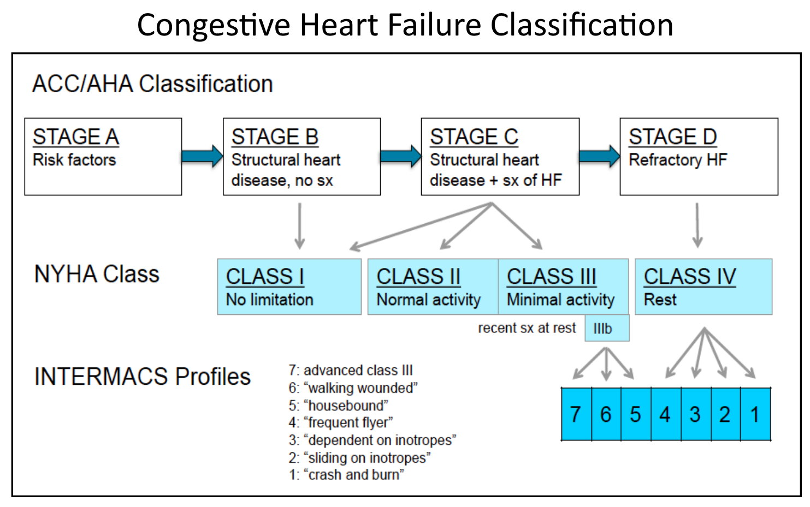
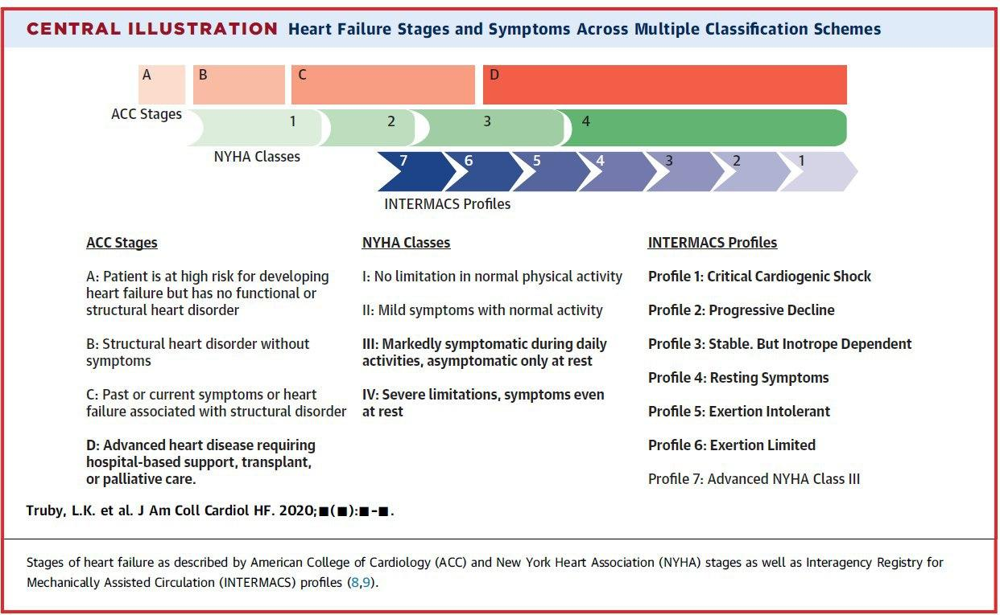

# Symptom staging 疾病嚴重程度

## 摘要
NYHA 症狀分級、ACC/AHA A–D 分期（著重提早預防）、Intermacs profile（評估機械循環輔助需求）。

## 內文
[[Symptom staging 疾病嚴重程度/NYHA functional Class|摘要]]

[[Symptom staging 疾病嚴重程度/ACC／AHA Stage|摘要]]

[[Symptom staging 疾病嚴重程度/Intermacs Profile|摘要]]

