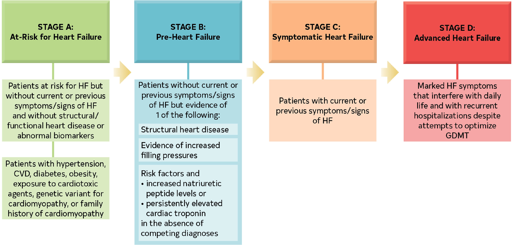

# ACC/AHA Stage

## 摘要
更著重提早預防

## 內文
1. Stage A(At-risk)、B(Pre failure)：預防
2. Stage C(current or previous failure)：必須持續治療防止惡化 ＆ 復發
3. Stage D(Advanced failure)：考慮植入性 mechanical circulation support OR 移植

