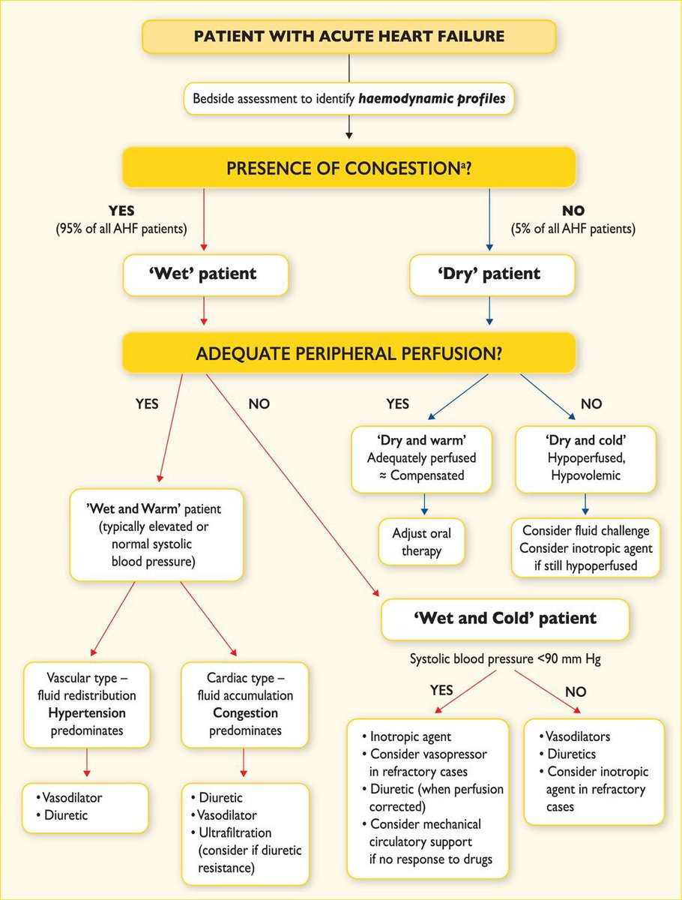

# Treatment Algorithm

## 摘要
2016 ESC：利尿劑治 congestion、靜脈血管擴張劑治高血壓型、dry & cold 給 fluid challenge；wet & cold & 低血壓用 inotropes 的三原則。

## 內文
1. diuretics for congestion (for hypotension, wait for perfusion corrected)
2. intravenous vasodilator(NTG, Nitroprusside) for vascular type AHF (hypertension induced redistribution)
3. fluid challenge for **dry & cold**
4. [[Treatment Algorithm/Inotropes for wet & cold & low BP|扁平]]

