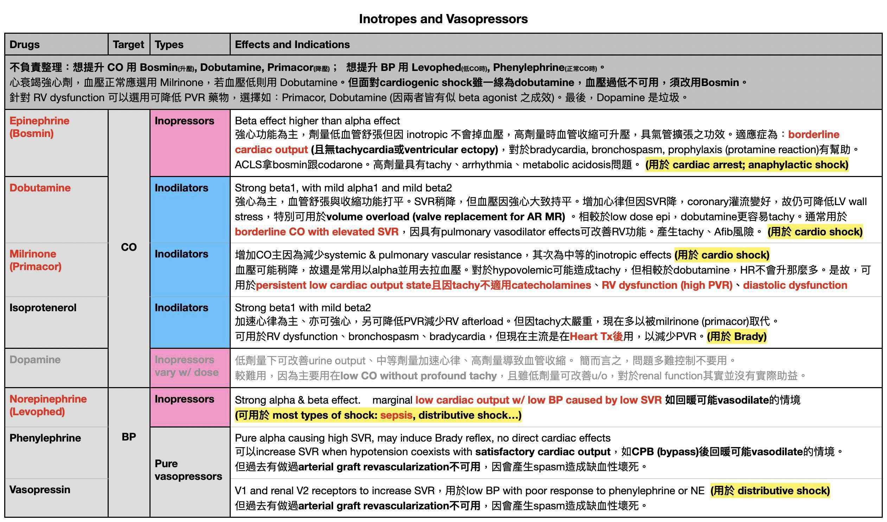
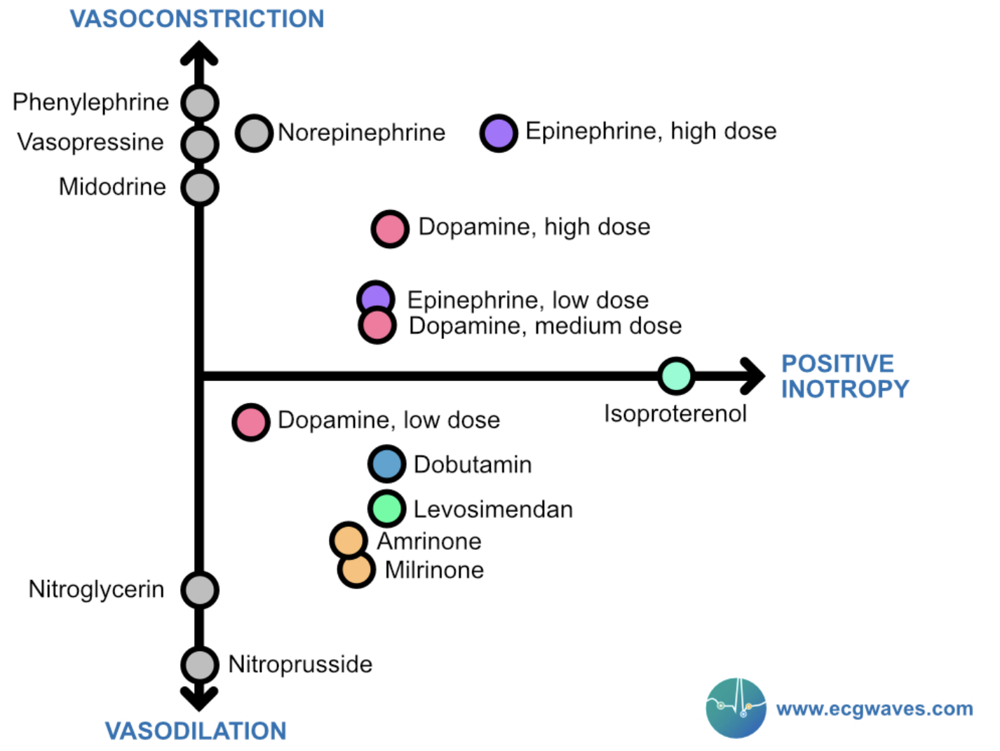
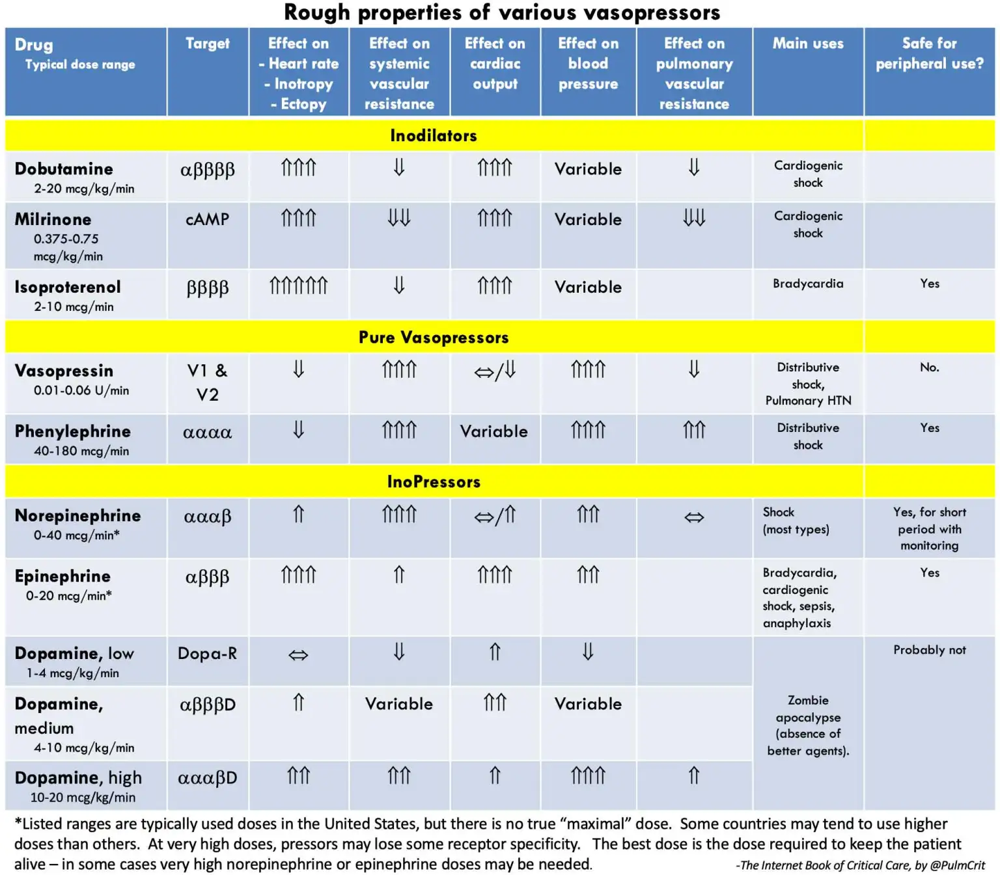

# Inotropes for wet & cold & low BP (hemodynamic support)

## 摘要
三原則：最大化 cardiac output 與舒張壓、避免心搏過速以保留舒張填充時間、盡量不增加心肌耗氧；附五張圖。

## 內文
1. Maximize cardiac output & diastolic pressure
2. Avoid tachycardia & preserve diastolic filling time
3. Minimize any increase in myocardial oxygen demand

