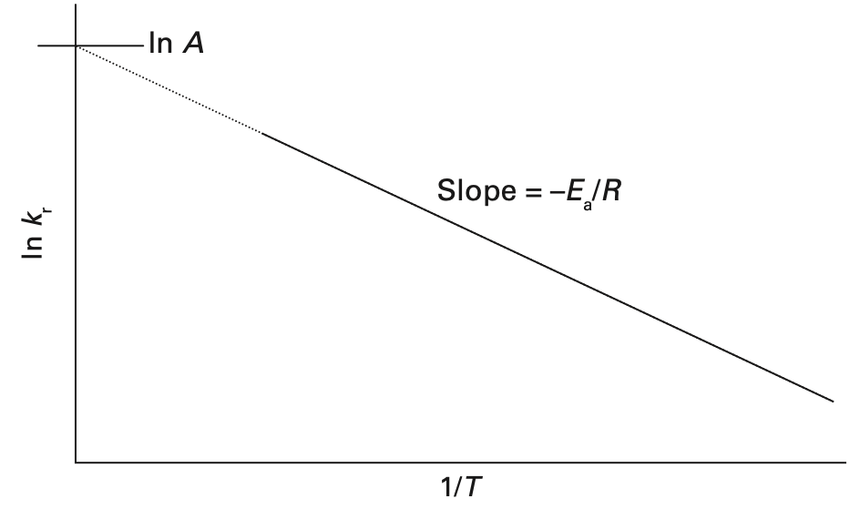
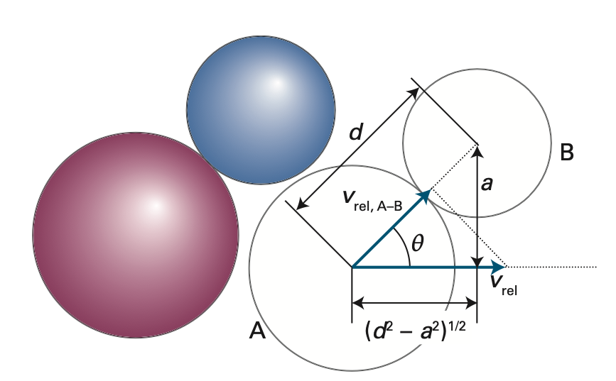

# Collision theory: Arrhenius equation

## 內文
### 經驗公式

1. 對於反應速率常數 $k_r$ 與溫度 T 之間的關係，有經驗公式 $k_r = A e^{-E_a/RT}$，如下圖
   
   - A 的物理意義是碰撞頻率，所以稱為 frequency factor

   [[Collision theory Arrhenius equation/e-Ea／RT 則是有效碰撞的比例，其中 Ea 是活化能|摘要]]

### 碰撞動力學

1. 在空間中有兩種粒子 A & B，其中某個粒子 A 一秒內撞擊到的粒子 B 數量為 $z = \sigma v_{rel} \rho_B$
   1. 其中 $v_{rel}$ 為兩粒子的相對速度
   2. $\sigma = \pi (d_A + d_B)^2$ 為此粒子可以撞到的截面範圍，即質心在這個圓柱截面內的粒子 B 都可以被這顆粒子 A 撞到
   3. $\rho_B$ 為單位體積的 B 粒子數，即 $\rho_B = N_A[B]$
2. 對於一顆 A 而言，一秒可以撞 z 次 B，但是我們有 $\rho_A$ 顆 A ⇒ A 撞 B 的總撞擊次數為 $Z_{AB} = \sigma v_{rel} \rho_B \rho_A$ （同時也是 B 撞 A 的總撞擊次數）
3. 就算在兩粒子距離小於 $d_A + d_B$ 而有碰撞到，但可能只是擦撞，無法超過活化能
   ⇒ 把 <u>碰撞半徑</u> $\sigma$ 改成 <u>有效碰撞半徑</u> $\sigma_{eff}$
   1. 有效碰撞半徑 $\sigma_{eff}$ 和 <u>兩粒子相對動能</u> $\varepsilon_{kin}$ 有關，動能越大，有效碰撞半徑 $\sigma_{eff}$ 越大
   2. 有效碰撞半徑 $\sigma_{eff}$ 和 <u>活化能</u> $\varepsilon_a$ 有關，活化能越小，有效碰撞半徑 $\sigma_{eff}$ 越大
   3. 在有效碰撞半徑 $\sigma_{eff}$ 邊緣，兩粒子撞擊時交換的總能量 $\varepsilon_{col}$ 會剛好等於 活化能 $\varepsilon_a$
      $\varepsilon_{col} =\frac{1}{2}\mu (v_{rel,A-B})^2 = \frac{1}{2}\mu (v_{rel}\cos\theta)^2 = \frac{1}{2}\mu v_{rel}^2(\frac{d^2 - a^2 }{d^2}) = \varepsilon_{kin}(\frac{d^2 - a^2 }{d^2}) =\varepsilon_a$
      - 其中 $\pi d^2 = \pi(d_A + d_B)^2 = \sigma、\pi a^2 = \sigma_{eff}$，如下圖
      
   4. 因為 $\varepsilon_{kin}(\frac{d^2 - a^2 }{d^2}) =\varepsilon_a$ ⇒ $a^2 = (1-\frac{\varepsilon_a}{\varepsilon_{kin}}) d^2$
      ⇒ $\sigma_{eff} = (1-\frac{\varepsilon_a}{\varepsilon_{kin}}) \sigma$
   5. 因此 A 撞 B 的總撞擊次數為 $Z_{AB} = \sigma_{eff} v_{rel} \rho_B \rho_A$
      但因為粒子並非均勻的擁有動能，而是呈現 Maxwell-Boltzmann distribution，而 $\sigma_{eff}、v_{rel}$ 均為積分後平均的結果，即 $\begin{cases} \sigma_{eff,mean} = \int \sigma_{eff}(\varepsilon_{kin})P(\varepsilon_{kin})d\varepsilon_{kin} \\ v_{rel,mean} = \int v_{rel}(\varepsilon_{kin})P(\varepsilon_{kin})d\varepsilon_{kin} \end{cases}$
      因此不應該個別積分、取平均再相乘，而是應該先相乘後再積分、取平均
      即 $(\sigma_{eff}v_{rel})_{mean} = \int \sigma_{eff}(\varepsilon_{kin})v_{rel}(\varepsilon_{kin})P(\varepsilon_{kin})d\varepsilon_{kin}$
      1. $\sigma_{eff}(\varepsilon_{kin}) = (1-\frac{\varepsilon_a}{\varepsilon_{kin}}) \sigma$
      2. $v_{rel}(\varepsilon_{kin}) = (\frac{2 \varepsilon_{kin}}{\mu})^{\frac{1}{2}}$
      3. $P(\varepsilon_{kin})\varepsilon_{kin} = 2 \pi (\frac{1}{\pi kT})^\frac{3}{2} \varepsilon_{kin}^\frac{1}{2} e^{-\varepsilon_{kin} /kT} d\varepsilon_{kin}$
      4. 理論是積分是從 $\varepsilon_{kin} = 0$ 取到 $\varepsilon_{kin} = \infin$，即 $\int_{\varepsilon_{kin} = 0}^{\varepsilon_{kin} = \infin}$。但因為我們知道在 $\varepsilon_{kin}< \varepsilon_{a}$ 的時候不可能有有效碰撞，因此可以改從 $\varepsilon_{kin}= \varepsilon_{a}$ 開始取，即 $\int_{\varepsilon_{kin} = \varepsilon_{a}}^{\varepsilon_{kin} = \infin}$
   6. 積分起來：
      $$
      (\sigma_{eff}v_{rel})_{mean} = \int_{\varepsilon_{kin} = \varepsilon_{a}}^{\varepsilon_{kin} = \infin} \sigma_{eff}(\varepsilon_{kin})v_{rel}(\varepsilon_{kin})P(\varepsilon_{kin})d\varepsilon_{kin} \\=\int_{\varepsilon_{kin} = \varepsilon_{a}}^{\varepsilon_{kin} = \infin} (1-\frac{\varepsilon_a}{\varepsilon_{kin}}) \sigma(\frac{2 \varepsilon_{kin}}{\mu})^{\frac{1}{2}}2 \pi (\frac{1}{\pi kT})^\frac{3}{2} \varepsilon_{kin}^\frac{1}{2} e^{-\varepsilon_{kin} /kT} d\varepsilon_{kin}\\=2 \pi\sigma (\frac{1}{\pi kT})^\frac{3}{2}(\frac{2 }{\mu})^\frac{1}{2} \int_{\varepsilon_{kin} = \varepsilon_{a}}^{\varepsilon_{kin} = \infin} (1-\frac{\varepsilon_a}{\varepsilon_{kin}}) \varepsilon_{kin} e^{-\varepsilon_{kin} /kT} d\varepsilon_{kin}\\=(\frac{8kT}{\pi \mu })^\frac{1}{2} \frac{\sigma}{(kT)^2} \int_{\varepsilon_{kin} = \varepsilon_{a}}^{\varepsilon_{kin} = \infin} ( \varepsilon_{kin} e^{\frac{-\varepsilon_{kin}}{kT}} d\varepsilon_{kin} - \varepsilon_{a} e^{\frac{-\varepsilon_{kin}}{kT}} d\varepsilon_{kin})\\ = (\frac{8kT}{\pi \mu })^\frac{1}{2} \frac{\sigma}{(kT)^2} [( \varepsilon_{a} - \varepsilon_{kin} - kT)kT e^{-\varepsilon_{kin}/kT}] \Big|_{\varepsilon_{kin} = \varepsilon_a}^{\varepsilon_{kin} =\infin}\\ = (\frac{8kT}{\pi \mu })^\frac{1}{2}\frac{\sigma}{(kT)^2} [(kT)^2e^{-\varepsilon_{a}/kT}]  \\ =\sigma(\frac{8kT}{\pi \mu })^\frac{1}{2} e^{-\varepsilon_{a}/kT} = \sigma v_{rel} e^{-\varepsilon_{a}/kT}
      $$
      - 4 → 5：$\int xe^{ax} dx = \frac{ax -1}{a^2}e^{ax}$
      - 7 → 7：$(\frac{8kT}{\pi \mu })^\frac{1}{2} = v_{rel}$
   7. A 撞 B 的總有效撞擊次數為 $Z_{AB} = \sigma_{eff} v_{rel} \rho_B \rho_A = \sigma v_{rel} e^{-\varepsilon_{a}/kT}\rho_B \rho_A$
      又因為 $\frac{d[A]}{dt} = k_r[A][B]$ ⇒ $\frac{d\rho_A}{dt} = k_r \rho_A\rho_B \frac{1}{N_A}$，其中 $\frac{d\rho_A}{dt}$ 即為 $Z_{AB}$
      ⇒ 反應速率 $k_r = N_A\frac{d\rho_A}{dt}\frac{1}{\rho_A\rho_B} = N_A \frac{Z_{AB}}{\rho_A\rho_B} = N_A\sigma v_{rel} e^{-\varepsilon_{a}/kT}$
      如果寫作 $k_r = A e^{-\varepsilon_{a}/kT}$ 的話則 $A = N_A\sigma v_{rel}$
      1. $N_A = 6 * 10^{23}$ 為亞佛加厥常數
      2. $\sigma = (d_A + d_B)^2\pi$ 為以 <u>兩粒子半徑和</u> 為半徑，所畫出的圓面積
      3. $v_{rel} =(\frac{8kT}{\pi \mu })^\frac{1}{2}$ 為 A、B 兩粒子相對速度，與 $T^{\frac{1}{2}}$ 成正比
      4. 實驗值往往比理論值小 ⇒ 代表可能分子不是球體，而且要特定角度才能有反應
      5. 偶爾實驗值比理論值大 ⇒ 像 $\ce{K + Br2 -> K+ + Br2-}$，可以發現在 K 還沒撞擊前就電子就先跑過去
         什麼時候電子會跑過去？ ⇒ 當反應是**<u>放熱反應</u>**，總能量降低的時候
         總能量 = 解離能(<0) + 電子結合能(>0) + 電力位能 (>0)
         1. ionization energy of K = 420 kJ / mol
         2. electron affinity of Br2 = 250 kJ / mol
         3. 解離能 & 電子結合能是固定的，變動的那項是電力位能 $U = \frac{kqQ}{R}$
            也就是夠近的時候 （R 夠小）電子就會跑過去
