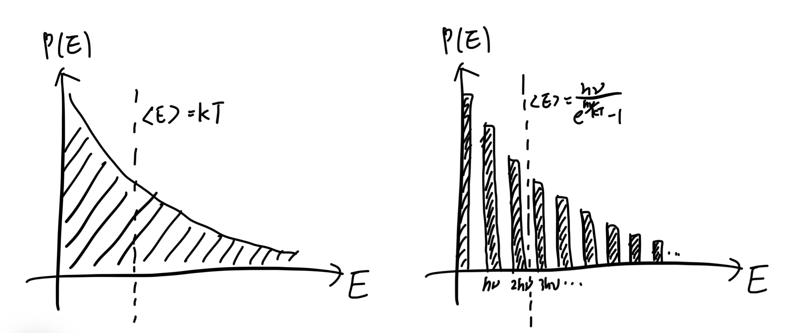

# Discrete energy level ⇒ Bose-Einstein statistics

## 內文
1. 前提假設：
   1. 能量 E 不連續，而是量子化的。
   2. 對於 simple oscillator，能量 $E = nh\nu$，where $n=0,1,2,3,…$
      亦即每次想要增加能量給 oscillator，需要一次增加 $\Delta E = h\nu$ 的能量
   3. 對於 simple oscillator 而言，一個能階（例如 $E = 2h\nu$）即為一個 microstate
2. 對於頻率為 $\nu$ 的 simple oscillator 而言，所求平均能量 $\langle E \rangle$ 即為
   $$
   \langle E_\nu \rangle =\sum_{n=0}^{\infin} E_\nu(n) p_\nu(n)=  \frac{\sum_{n=0}^{\infin}E_\nu(n)e^{-E_\nu(n)/k_BT}}{\sum_{n=0}^{\infin}e^{-E_\nu(n)/k_BT}} = \frac{\sum_{n=0}^{\infin}nh\nu e^{-nh\nu/k_BT}}{\sum_{n=0}^{\infin}e^{-nh\nu/k_BT}}
   $$
   其中 $p_\nu(n) = \frac{e^{-E_\nu(n)/k_BT}}{\sum_{n=0}^{\infin}e^{-E_\nu(n)/k_BT}}$，$e^{E_\nu(n)/k_BT}$ 為 Boltzmann factor；$E_\nu(n) = nh\nu$
3. 分別計算分子分母的級數：
   $$
   \langle E_\nu \rangle = \frac{\sum_{n=0}^{\infin}nh\nu e^{-nh\nu/k_BT}}{\sum_{n=0}^{\infin}e^{-nh\nu/k_BT}} = \frac{h\nu e^{-h\nu/k_BT}/(1-e^{-h\nu/k_BT})^2} {1 / (1-{e^{-h\nu/k_BT}})}\\= h\nu\frac{e^{-h\nu/k_BT}}{1-e^{-h\nu/k_BT}} = \frac{h\nu}{e^{\frac{h\nu}{k_BT}}-1}
   $$
   1. 分母：$\sum_{n=0}^{\infin}{(e^{-h\nu/k_BT})}^{n} = \frac{1}{1-{(e^{-h\nu/k_BT})}}$
      因為 $x^0 + x^1 + x^2 + x^3+… = \frac{1}{1-x}$
   2. 分子：$\sum_{n=0}^{\infin}nh\nu e^{-nh\nu/k_BT} = \frac{h\nu e^{-nh\nu/k_BT}}{(1-e^{-nh\nu/k_BT})^2}$
      因為 $0x^0 + 1x^1 + 2x^2 + 3x^3+… = \frac{d(x^0 + x^1 + x^2 + x^3+…)}{dx} = \frac{d(1-x)^{-1}}{dx} \\= -(1-x)^{-2} = \frac{1}{(1-x)^2}$
      而 $0e^{0x} + 1e^{1x}+ 2e^{2x} + 3e^{3x}+… = \frac{d(e^{0x} + e^{1x}+ e^{2x} + e^{3x}+…)}{dx} = \frac{d(1-e^{x})^{-1}}{dx} \\= -e^{x}(1-e^{x})^{-2} = \frac{e^{x}}{(1-e^{x})^2}$
   即對於頻率為 $\nu$ 的 simple oscillator 而言，平均能量 $\langle E \rangle = \frac{h\nu}{e^{h\nu/k_BT}-1}$
4. 延伸一：
   對於頻率 $\nu$ 很小的 simple oscillator 而言，$\langle E \rangle = \frac{h\nu}{e^{h\nu/k_BT}-1} \approx \frac{h\nu}{1 + \frac{h\nu}{k_BT}-1} = k_BT$
   對於頻率 $\nu$ 很大的 simple oscillator 而言，$\langle E \rangle = \frac{h\nu}{e^{h\nu/k_BT}-1} \approx \frac{h\nu}{e^{h\nu/k_BT}} =h\nu e^{-h\nu/k_BT}$
5. 延伸二：
   比較兩者
   $\langle E_\nu \rangle = \frac{\sum_{n=0}^{\infin}E_\nu(n) e^{-E_\nu(n)/k_BT}}{\sum_{n=0}^{\infin}e^{-E_\nu(n)/k_BT}} = \frac{h\nu}{e^{h\nu/k_BT}-1}$
   $\langle E \rangle = \frac{\int_{-\infin}^{\infin}E e^{-E/k_BT}dE}{\int_{-\infin}^{\infin}e^{-E/k_BT}dE} = k_BT$
   可以發現其實後者就是前者當 $\lim_{\nu→0} \langle E_\nu \rangle$ 的極限情況，即如果把量子能階縮窄到無限窄，其實就會變回連續性的分佈
   
