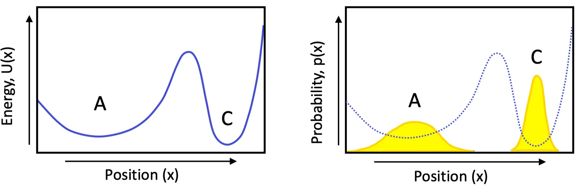

# Probability of macrostate：自由能

## 內文

1. 定義某 macrostate 為一群 microstates 的集合
   ex: 定義上圖 A 族群為一個 macrostate，C 族群為另一個 macrostate
2. 此 macrostate 出現的機率即為底下所有 microstate 之和，即
   $p(A) \propto \sum_{\mu_A} e^{\frac{-U(\mu_A)}{kT}}$
3. 因為 A 族群有相同的內能 $U_A$，因此可以寫成
   $$
   p(A) \propto \sum_{\mu_A}  e^{\frac{-U(\mu_A)}{kT}}  = \Omega_A \times e^{\frac{-U_A}{kT}} = e^{\frac{1}{k}S_A}\times e^{\frac{-U_A}{kT}} = e^{\frac{-(U_A-TS_A)}{kT}}
   $$
   即此時機率應該要用自由能 $A = U-TS$ 來計算
