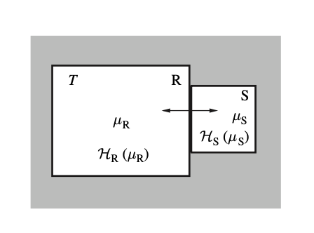

# Probability of microstate：內能

## 內文

1. 如上圖，假設某 <u>系統 S</u> 與 <u>熱庫 R</u> 達成熱平衡，且與外界完全隔離，則內能 $U_R + U_S = U_{total}$ 為定值
2. 定義某 microstate 為 $\mu_S$ 或 $\mu_R$
   定義某 macrostate 為 $U_S$ 或 $U_R$
   其中 $\Omega(U_S) = \mathrm{count} ( \mu_S)$，$\Omega(U_R) = \mathrm{count} ( \mu_R)$
3. 對於某個 macrostate $U_{R_1} + U_{S_1} = U_{total}$ 而言，總共有 $\Omega(U_{R_1}) \times \Omega(U_{S_1})$ 個 microstate；
   對於另一個 macrostate $U_{R_2} + U_{S_2} = U_{total}$ 而言，總共有 $\Omega(U_{R_2}) \times \Omega(U_{S_2})$ 個 microstate
   而全部所有的可能的能量分配方式，總共有 $\sum \Omega(U_{R}) \times \Omega(U_{S})$ 種可能性
4. 對於某個特定的 microstate $u_S$，因為 S 系統的所有可能性已經確定下來了（就這一種），因此 $u_S$ 出現的機率取決於 <u>熱庫 R</u> 的組合數 $\Omega(U_R)$ ，即為
   $$
   p(\mu_S) = \frac{\Omega(U_R)}{\sum \Omega(U_{R}) \times \Omega(U_{S})} = \frac{\Omega(U_{total} - U_S)}{\sum \Omega(U_{R}) \times \Omega(U_{S})}\propto \Omega(U_{total} - U_S)
   $$
5. 帶入 $S = k\ln{\Omega}$：
   $$
   \Omega(U_{total} - U_S) = e^{\frac{1}{k}S(U_{total} - U_S) }
   $$
6. 因為 $U_S \ll U_{total}$ 且 $\frac{\partial S(U_{total})}{\partial U_{total}} = \frac{1}{T}$ 因此可以利用泰勒展開
   $$
   S(U_{total} - U_S) = S(U_{total} )- U_S\frac{\partial S(U_{total})}{\partial U_{total}} = S(U_{total} )- U_S\frac{1}{T}
   $$
7. 綜合以上三式：
   $$
   p(\mu_S) \propto \Omega(U_{total} - U_S) = e^{\frac{1}{k}S(U_{total} - U_S) } = e^{\frac{1}{k}(S(U_{total} )- U_S\frac{1}{T} )} \\ \propto e^{\frac{1}{k}(- U_S\frac{1}{T} )} = e^{\frac{-U_S}{kT}}
   $$
8. 結論：對於任意 microstate $\mu_S$ 而言，機率 $p(\mu_S) \propto e^{\frac{-U(\mu_S)}{kT}}$
   而因為機率相加等於一，因此要 normalize over all possible $\mu$：
   $$
   p(\mu_S) =\frac{  e^{\frac{-U(\mu_S)}{kT}} }{\sum_{\mu} e^{\frac{-U(\mu)}{kT}}}
   $$
