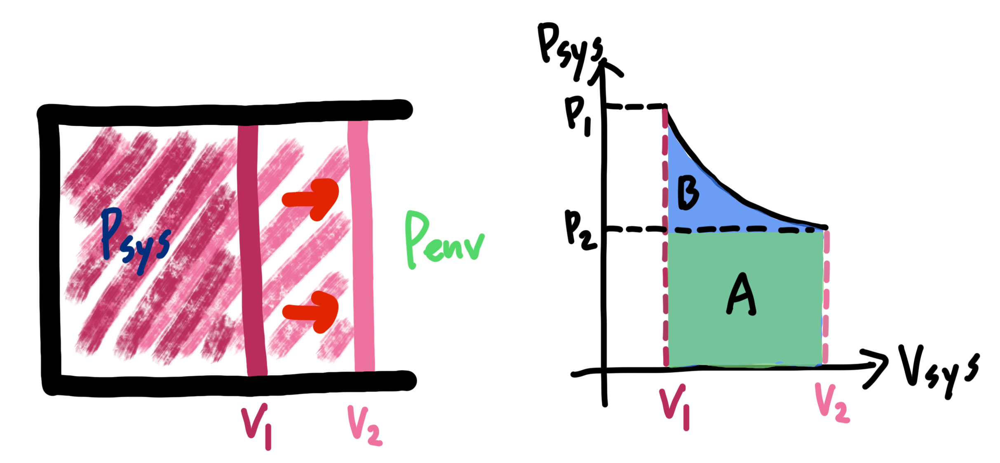
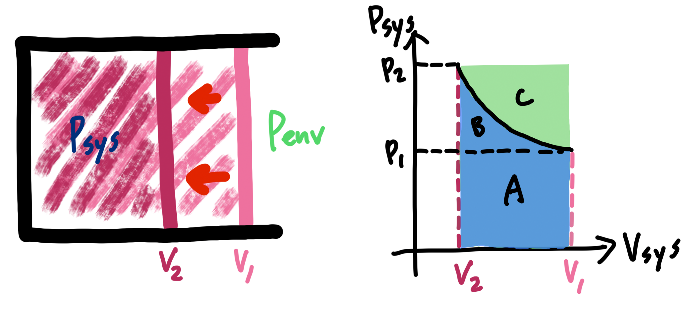

# 功 w：施力使物體朝著力的方向移動，此時能量的轉移稱為做功，記作 $dw = \vec F \cdot d\vec s$

## 內文
1. **<u>膨脹功</u>**：對於任何物質而言，任何體積變化都有做功（因為要對抗大氣壓力），但通常討論氣體的體積變化為主（因為液體固體的體積變化相對氣體而言太小）
   假設此系統內壓力為 $P_{sys}$，外界壓力為 $P_{env}$
   1. 其中外界看到的膨脹功 $dw_{env} = -\vert F_{env} \vert dx = - P_{env}dV$
   2. 系統覺得自己做的膨脹功 $dw_{sys} = -\vert F_{sys} \vert dx = -P_{sys}dV$
   3. 為什麼兩者不一定相等？因為**<u>會轉化為邊界的動能，再變成熱耗散掉（邊界有摩擦力）</u>**
   4. 如果沒有特別描述， $w = w_{env}$ （因為這才是真正有做到功的部分）
   - 注意：因為系統是主角，所以上述 $dw$ 均表示系統本身接受到的功，即向內做功為正，向外做功為負。但因為體積擴大 dV 為正，因此要加負號
2. **<u>可逆程序 (reversible)</u>**：如果**<u>在做功過程中，系統壓力</u>** $P_{sys}$ **<u>永遠等於外界壓力</u>** $P_{env}$，則稱為可逆程序。此過程中 $w_{rev} = w_{env} = w_{sys}=-\int P dV$
   1. 如果外壓恆定，內壓就要跟著恆定
      舉例：化學反應不斷生成氣體（雖然體積 V 一直增加，但可以假設系統內外壓力隨時都相等） $w_{rev} = w_{env} = \int -P_{env}dV = -P_{env}\int dV = -P_{env}\Delta V$
   2. 如果內壓變化，外壓就得跟著變化
      舉例：對於封閉系統中的理想氣體 $P_{sys} = \frac{nRT}{V}$ ，其在可逆程序時所做的功
      $w_{rev} = w_{sys} = \int -P_{sys}dV = -\int \frac{nRT}{V}dV = -nRT\ln(\frac{V_2}{V_1})$
3. 分別討論膨脹功與壓縮功（以系統為主角，因此向系統內做功為正，向外界做功為負）：
   1. 膨脹：因為是系統對外界做功，因此 $w < 0$， $dV > 0$
      
      1. 從 $P_{sys} = P_1$ 開始，一直到 $P_{sys} = P_2 =P_{env}$ 結束（在 $V_2$ 達成平衡）
      2. 外界覺得自己接受的功 $w_{env} = - \int P_{env}dV$ ，若 $P_{env}$ 為定值即為圖中區域 A
      3. 系統覺得自己做的功 $w_{sys} = -\int P_{sys}dV$，即圖中區域 A+B
      4. 可以看出 $P_{sys} ≥ P_{env}$（這樣才會膨脹），且只有在可逆程序時等號才會成立
         ⇒ $w_{env} ≤ w_{sys} < 0$ ，**<u>且只有在可逆程序時等號才會成立</u>**( $w_{env} = w_{sys} =w_{rev}$)
   2. 壓縮：因為是外界對系統做功，因此 $w > 0$， $dV < 0$
      
      1. 從 $P_{sys} = P_1$ 開始，一直到 $P_{sys} = P_2 =P_{env}$ 結束（在 $V_2$ 達成平衡）
      2. 外界覺得自己做的功 $w_{env} = - \int P_{env}dV$ ，若 $P_{env}$ 為定值即為圖中區域 A+B+C
      3. 系統覺得自己接受的功 $w_{sys} = -\int P_{sys}dV$，即圖中區域 A+B
      4. 可以看出 $P_{sys} ≤ P_{env}$（這樣才會壓縮），且只有在可逆程序時等號才會成立
         ⇒ $0<w_{env} ≤ w_{sys}$ ，**<u>且只有在可逆程序時等號才會成立</u>**( $w_{env} = w_{sys} =w_{rev}$)
   3. 總結
      1. $w_{env} ≤ w_{sys}$ ，且只有在可逆程序時等號才會成立
      2. $w_{sys} - w_{env}$ 即為消失的功 ⇒ 轉化為邊界的動能，再變成熱耗散掉
