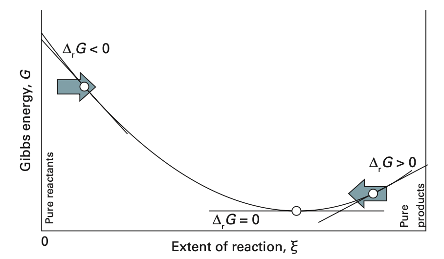
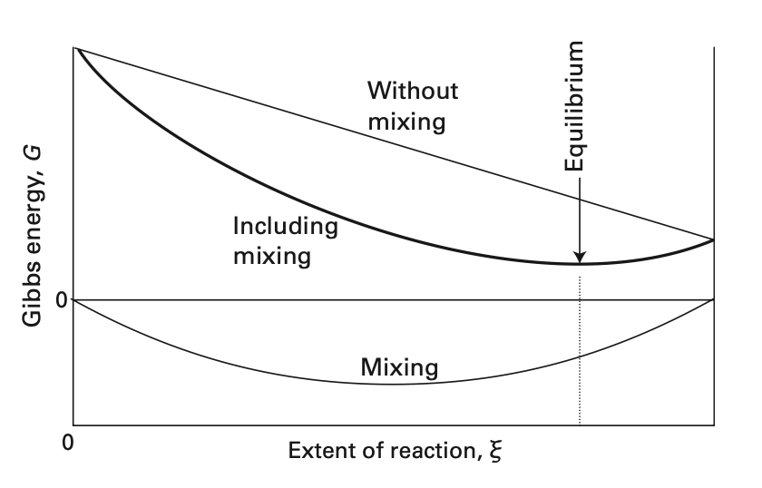

# 化學反應的平衡

## 內文
- 其實化學反應與擴散並無本質區別，就是把一些粒子從系統拿出來，再放些新粒子進系統

假設有一化學反應 $\ce{aA + bB<=>cC + dD}$

1. 定義 $\nu_J$ 為各化合物係數（反應物要加負號）：$\nu_A = -a$，$\nu_B = -b$，$\nu_C = c$，$\nu_D =d$
   則此反應式可以寫為如下的形式： $\sum \nu_J J = 0$
2. 定義 $\xi$ 為反應量，即經過反應後，任一化合物 J 的數量變化 $\Delta n_J = \nu_J \xi$
   若只進行一點點反應，則可以寫成 $dn_J = \nu_J d\xi$
   注意：$\xi$ 與 $d\xi$ 均可正可負，若 $\xi > 0$ 代表反應向右，$\xi< 0$ 代表反應向左
3. 進行少量反應產生的自由能變化 $dG = \sum \mu_J dn_J = \sum \mu_J\nu_J d\xi$
   - 定義 **<u>Reaction Gibbs energy</u>** $\Delta_r G = \frac{\partial G}{\partial \xi} = \sum \mu_J \nu_J$
     注意： $\Delta_r G$ 不是常數；對於每份 $d\xi$ 而言其 $dG$ 均不相同
4. 因為 $\mu_J = \mu_{J}^{\minuso} + RT\ln(a_J)$ （見 <u>活性 Activity</u>），因此將式子改寫為
   $\Delta_r G = \sum \mu_J \nu_J = \sum \mu_{J}^{\minuso}\nu_J +\sum RT\ln(a_J)\nu_J = \sum \mu_{J}^{\minuso}\nu_J +RT\sum \nu_J \ln(a_J)$
   - 定義 **<u>Standard reaction Gibbs energy</u>** $\Delta_r G^{\minuso} = \sum \mu_{J}^{\minuso}v_J$
     注意：因為 $\mu_{J}^{\minuso}$只與化合物本身有關，因此 $\Delta_r G^{\minuso}$ 在確定化合物與係數之後就是常數
   - $RT\sum \nu_J\ln (a_J) = RT\ln[\prod (a_J^{\nu_J})]$，此時定義 **<u>Reaction quotient</u>** $Q = \prod (a_J^{\nu_J})$
     即 $Q = ({a_A})^{\nu_A}(a_B)^{\nu_B}(a_C)^{\nu_C}(a_D)^{\nu_D} = \frac{(a_C)^c(a_D)^d}{({a_A})^a(a_B)^b}$
   最終改寫為 $\Delta_r G = \Delta_r G^{\minuso} + RT\ln(Q)$
5. 反應達成平衡的條件
   兩個想法：
   1. 可以從 $\frac{ \partial S_{total}}{\partial \xi} = 0$ 去推
   2. 如果平衡時 G 不是最小值，則任何使 dG < 0 的反應均為自發反應
   ⇒ 平衡時 G 為最小值，即 $\frac{\partial G}{\partial \xi} =\Delta_r G = 0$
   
   帶入 $\Delta_r G = \Delta_r G^{\minuso} + RT\ln(Q) = 0$
   ⇒ $\Delta_r G^{\minuso} = -RT\ln(Q)$ ，定義此時平衡狀態的 Q 為 **<u>平衡常數 K</u>**
   ⇒ 得到公式 $\Delta_r G^{\minuso} = -RT\ln(K)$ 以及 $K = e^{\frac{-\Delta_r G^{\minuso}}{RT}}$
6. a_J 的帶入（見 <u>活性 Activity</u>）
   1. 理想氣體：$a_J =P_J$ 即為分壓
   2. 純物質的理想固體、理想液體： $a_J = 1$
   3. 理想溶液：$a_J = c_J = [J]$ （常用）或 $a_J = x_J$（少用）
7. $\Delta_r G = \Delta_r G^{\minuso} + RT\ln(Q)$ 的意義：
   
   1. $\Delta_r G$ 代表自由能的實際變化斜率
   2. $\Delta_r G^{\minuso}$代表上圖 Without mixing 直線的斜率，即純粹的粒子置換造成的自由能變化
   3. $RT\ln(Q)$ 代表上圖 Mixing 的曲線斜率，即多種純物質混合前後產生的自由能變化
      $\frac{\partial G_{mix} }{\partial \xi} = \frac{\partial [RT\sum \ln(a_J) n_J ]}{\partial \xi} =\frac{\partial [RT\sum \ln(a_J) \nu_J\xi ]}{\partial \xi} = RT\ln(Q)$（見 <u>混合物的自由能</u>）
