# 反應控制

## 內文
1. 未平衡前：動力學
   假設兩個同樣的反應物 A B會進行兩種不同的反應，生成兩種產物 P1 P2
   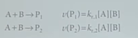
   注意這裡 [P2]/[P1] 指的是生成速率 即 d[P2]/dt 和 d[P1]/dt，不是濃度
   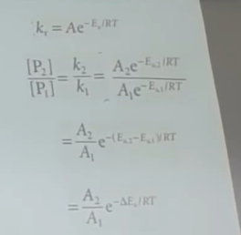
   即產量比例由兩反應活化能差值來決定
   如果想改變此比例也可以改變溫度
2. 平衡後：熱力學
   這裡 [P2]/[P1] 指的就是濃度
   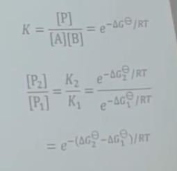
3. 自己分解 / 變形 的一級反應 難道可以不經由碰撞嗎？為什麼可以是一級反應？
   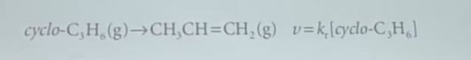
   **Lindemann-Hinshelwood mechanism：**
   假設兩 A 分子相撞，其中一個變成帶有很多能量的 A\*
   此 A\* 可能會撞擊其他分子把能量變弱
   此 A\* 也可能藉此直接分解
   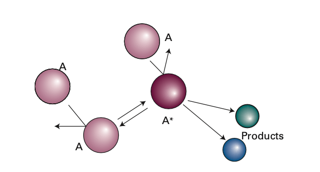
   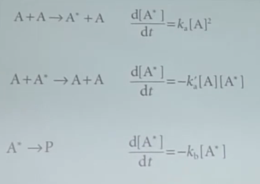
   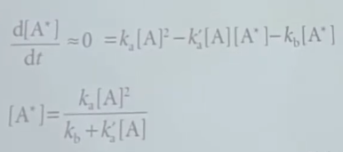
   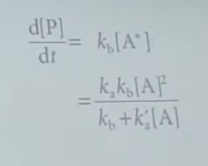
   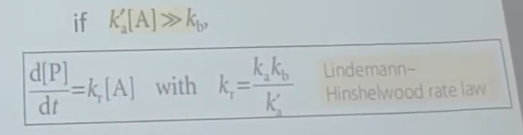
   確實可以是一級反應
   但前提是分解的反應速率要很小，而可逆反應的速率很大
   
   而如果是可逆反應的速率很小，而分解的反應速率很大
   ⇒ 變成二級反應
   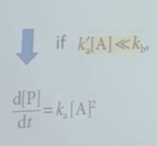
   如果不想近似，那可以取 k_r 倒數，必與 1/[A] 成 線性關係
   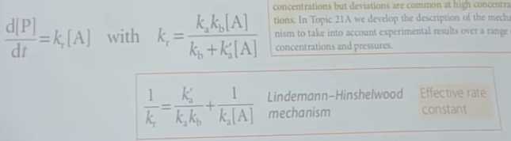
