# 反應機制：Elementary reaction

## 內文
1. **反應機制**
   如下圖的反應，看起來很簡單，實際上反應並不是這樣發生的
   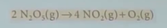
   而是下面這四條式子加起來的淨反應式才會變成是上面這個樣子
   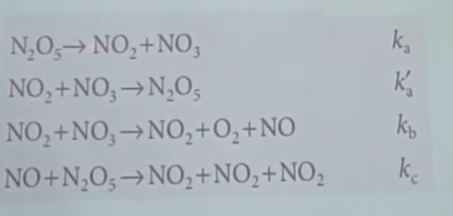
   這四個最基礎的反應稱為 elementary reaction
   1. 不需要標相(phase)
   2. 長得一樣的化合物也要重複寫幾次，不可以用係數表示
   3. 代表真實碰撞、真實發生的反應（所以不會有三個反應物，因為三個東西撞在一起的機率超低）
   4. molecularity：unimolecular reaction ⇒ 一個反應物，bimolecular reaction ⇒ 兩個反應物
   5. 如果是 elementary reaction，則反應的反應速率一定可以寫成 v = k[A] (unimolecular reaction) 或是 v = k[A][B] (bimolecular reaction)
   假設 A → P 這個反應實際上是一個 A → I → P 這樣個連鎖反應
   A → I 的速率常數 是 k_a ，I → P 的速率常數 是 k_b
   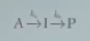
   假設一開始只有 A
   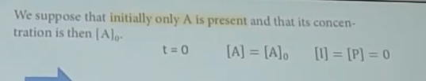
   左邊三個是一開始的列式，顯然只能從最上面開始積
   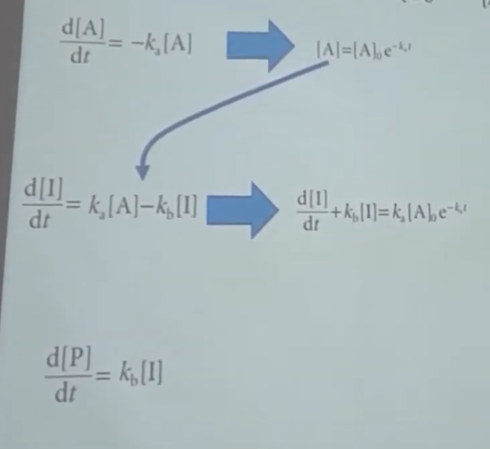
   第一條的積分
   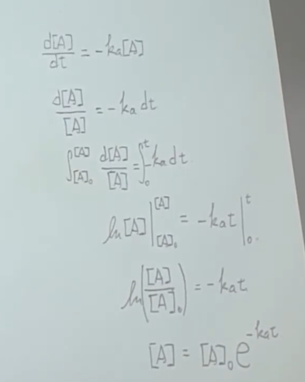
   第二條的積分
   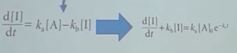
   要積兩次：指數項積一次，下面再積一次
   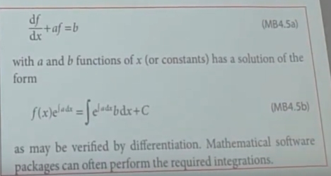
   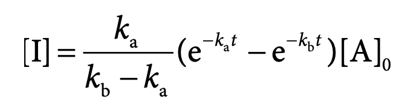
   [P] 也可以積分，不過用質量守恆可以更簡單
   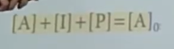
2. steady-state approximation：因為剛剛那樣推太複雜了（而且才牽涉三個物質而已），所以可以偷懶一點用近似的方法
   如果把所有物質的濃度畫出來，可以發現中間產物 [I] 的濃度超低
   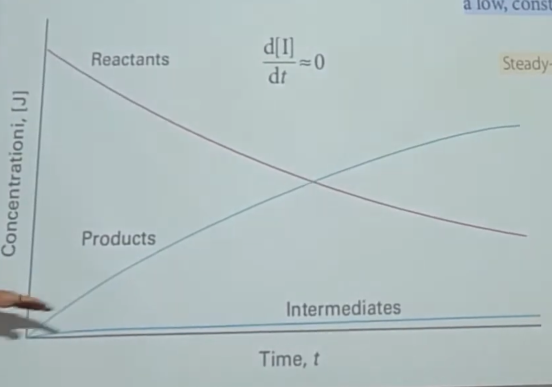
   只要假設
   1. 中間產物 [I] 的濃度超低
   2. [I] 的濃度幾乎不隨時間變化
   ⇒ 可以只求 [A] ，然後 [P] = [A]_0 - [A]
   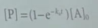
   - 悖論：
     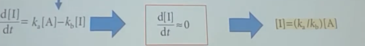
     明明 [A] 就會隨時間改變，那為什麼 [I] 不隨時間改變？
     ⇒ 還必須假設 k_a << k_b ，所以 d[I]/dt 非常非常小
   可以發現整個總反應 A → I → P 的速率常數 就是 k_a 本人

   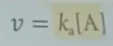
   因為 k_a 太慢了，而且整個反應都需要經過它，因此整個淨反應的速率就只與他有關，稱為速率決定步驟
   速率決定步驟有兩種可能
   1. 可能代表此步驟的活化能超大（速率常數超小）
   2. 可能代表此步驟的反應物濃度超級低
   例題：
   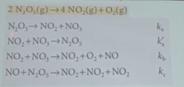
   中間產物 NO、 NO3 都假設濃度 = 0
   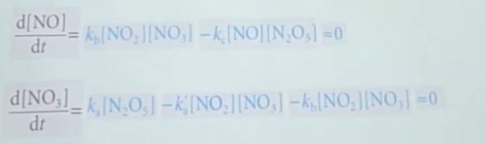
   解聯立
   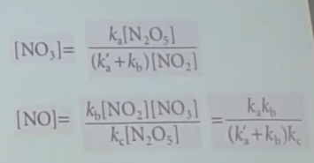
   帶入計算淨反應
   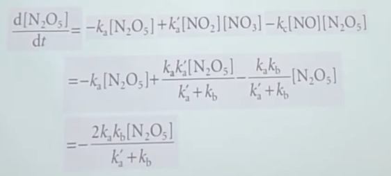
   原來是一級反應（因為 N2O5 的係數是 2 所以反應速率要除以 2）
   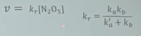
3. pre-equilibrium：如果連鎖反應是長下面這樣，即因為前面那個可逆反應的反應速率很快，所以很快到達平衡
   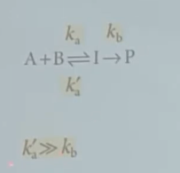
   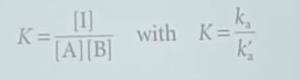
   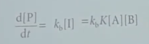
   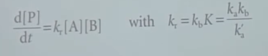
   這樣的假設稱為 pre-equilibrium
   如果 k_a k_a’ k_b 全部帶入 **Arrhenius equation**
   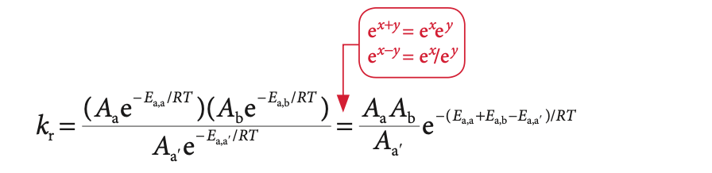
   淨反應活化能即為正反應活化能 - 逆反應活化能
   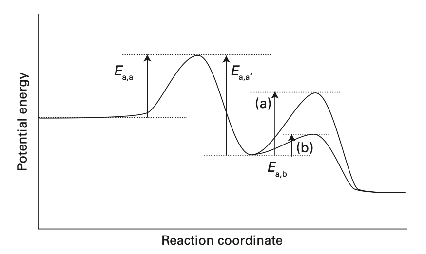
   所以活化能有可能是負的，即溫度越高反應速率越低
