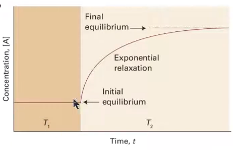

# 反應速率與平衡

## 內文
對於反應 $\ce{A <=>[k_f][k_r] B}$ 而言，可以寫出以下方程：$\begin{cases}\frac{d[A]}{dt} = -k_f[A] + k_r[B]\\ \frac{d[B]}{dt} = k_f[A] - k_r[B] \end{cases}$

1. 如果想知道 [A](t)、[B](t)，則需要知道初始條件 ⇒ 設 $\begin{cases}[A]_0 =[A]_0\\ [B]_0 = 0\\ [A] + [B] = [A]_0 \end{cases}$
   ⇒ $\begin{cases}\frac{d[A]}{dt} = -k_f[A] + k_r([A]_0-[A])= -(k_f+k_r)[A] + k_r[A]_0\\ \frac{d[B]}{dt} = k_f([A]_0-[B]) - k_r[B] = k_f[A]_0 - (k_f+k_r)[B] \end{cases}$
   ⇒ $\begin{cases} [A] = \frac{k_r + k_fe^{-(k_f+k_r)t}}{k_f+k_r}[A]_0\\ [B] = \frac{k_f + k_re^{-(k_f+k_r)t}}{k_f+k_r}[A]_0 \end{cases}$
2. **<u>平衡狀態即為當</u>** $t → \infin$ **<u>時</u>** ⇒ $\begin{cases} [A] = \frac{k_r }{k_f+k_r}[A]_0\\ [B] = \frac{k_f}{k_f+k_r}[A]_0 \end{cases}$
3. 帶入熱力學的平衡常數 $K = \frac{[B]}{[A]}$ 即可發現 $K = \frac{k_f}{k_r}$
4. 亦可以發現平衡狀態下，<u>正反應速率</u> $v = k_f[A]$ 等於 <u>逆反應速率</u> $v = k_r[B]$
5. **<u>Relaxtion method</u>**：本來系統已經平衡了，但是突然改變環境（ex: 改變溫度，稱為 temperature jump）讓它不平衡，再等它恢復平衡
   
   對於反應 $\ce{A <=>[k_f][k_r] B}$ 而言，可以算出 time constant $\tau = \frac{1}{k_f+k_r}$
