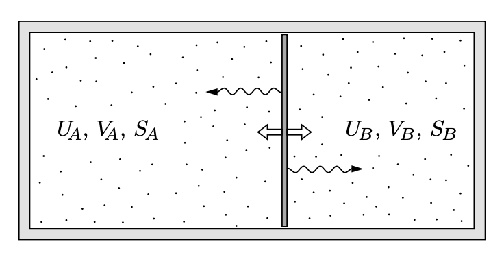

# 壓力平衡 ⇒ 兩系統壓力 $P = T\frac{\partial S}{\partial V}$ 相等

## 內文

如上圖，兩系統間可以交換能量 & 體積，則怎樣分配能量 & 體積能使 $S_{total}$ 為最大值？

1. 與前例同理，兩系統 $dU_A =- dU_B$ 且 $dV_A =- dV_B$
2. 因為要讓 $S_{total}$ 為最大值 ⇒ $\frac{\partial S_{total}}{\partial U_A} = 0$ 且 $\frac{\partial S_{total}}{\partial V_A} = 0$
3. 因為 $S_{total} = S_A + S_B$，
   ⇒ $\frac{\partial S_A}{\partial U_A} = \frac{\partial S_B}{\partial U_B}$ 且 $\frac{\partial S_A}{\partial V_A} = \frac{\partial S_B}{\partial V_B}$
   可以看出兩系統溫度平衡 （$\frac{1}{T} = \frac{\partial S}{\partial U}$）且 壓力平衡（$P = T\frac{\partial S}{\partial V}$）
4. [[壓力平衡 ⇒ 兩系統壓力 P = Tfracpartial Spartial V 相等/圖示：現在 Stotal 變成找二維平面上的最高點了|扁平]]
