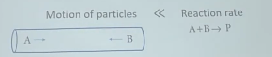
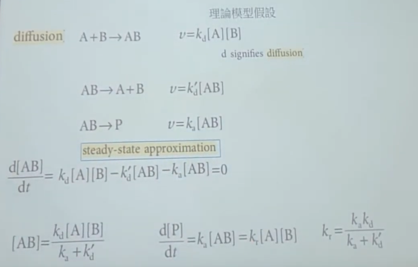
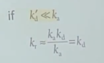
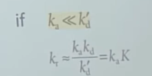

# 擴散速率 vs 反應速率

## 內文
1. 到底速率決定步驟是擴散速率還是反應速率？有可能擴散超慢
   
2. 對於 A + B → P 而言，如果把 A 和 B 經由擴散而碰在一起當作一個反應
3. 並套用 steady state approximation
   
4. 如果擴散速率超慢，稱為 diffusion control limit
   
5. 如果反應速率超慢，稱為 activation control limit
   
