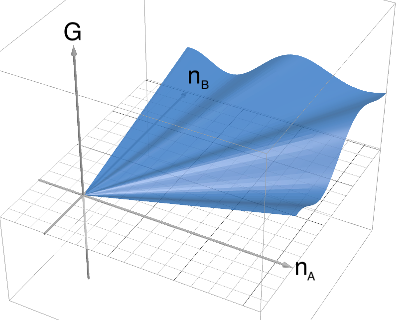
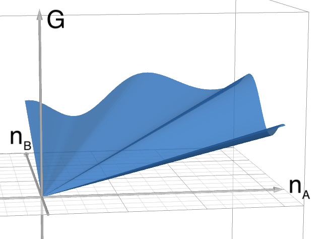
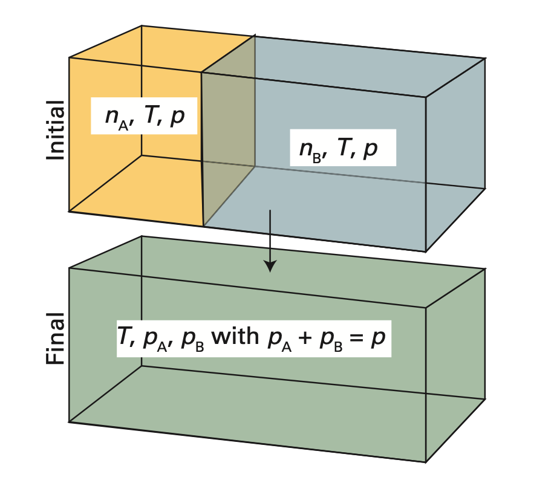

# 氣體混合物的自由能：partial molar Gibbs energy

## 內文
1. 純物質的自由能
   1. $dG = VdP - SdT + \mu dn$
   2. $\mu = \left⟮\frac{\partial G}{\partial n}\right⟯_{T,P} = G_m$
      即每往系統裡增加一莫耳的粒子，都會使其自由能 G 增加 $\mu$
   3. 因為總 G 與 n 成正比，因此 $\mu = G_m$ 為定值
2. 兩物質 (A、B) 組成的混合物系統的自由能
   1. $dG = VdP - SdT + \mu_A dn_A + \mu_B dn_B$
   2. $\mu_A = \left⟮\frac{\partial G}{\partial n_A}\right⟯_{T,P,n_B} = G_{m,A}$
      $\mu_B = \left⟮\frac{\partial G}{\partial n_B}\right⟯_{T,P,n_A} = G_{m,B}$
      即往系統增加一莫耳的粒子 A ，會使其自由能 G 增加 $\mu_A$，而往系統增加一莫耳的粒子 B ，則會使其自由能 G 增加 $\mu_B$。此時化學位能 $\mu$ 稱為 **<u>partial molar energy</u>**
      

      
   3. 如上圖，此時顯然 G 與 $n_A$ 或 $n_B$ 均不再成正比，因此 $\mu_A$ 、$\mu_B$ 不再是定值
      但同時可以發現，只要 $n_A$ 與 $n_B$ 的比例固定，即
      1. $n_{total} = n_A + n_B$
      2. $x_A = \frac{n_A}{n_{total}}$，$x_B = \frac{n_B}{n_{total}}$
      只要 $x_A$ 與 $x_B$ 保持不變，則
      1. G 仍然會和 $n_{total}$ 成正比
      2. $\mu_A$ 、$\mu_B$ 均為定值
   4. 上述敘述可以寫成 $dG = \mu_A dn_A + \mu_B dn_B =(\mu_A x_A + \mu_B x_B) dn_{total}$
      其中因為 G 和 $n_{total}$ 成正比，因此 $\mu_A x_A + \mu_B x_B$ 為定值
      ⇒ $d(\mu_A x_A + \mu_B x_B) = 0$
      ⇒ $\mu_A dx_A + x_Ad\mu_A + \mu_Bd x_B +x_Bd\mu_B = 0$
      因為 $x_A$ 與 $x_B$ 保持不變 ⇒ $x_Ad\mu_A +x_Bd\mu_B = 0$
      寫成通式則為 $\sum x_j d\mu_j = 0$ ⇒ 此公式稱為 **<u>Gibbs–Duhem equation</u>**

      [[氣體混合物的自由能：partial molar Gibbs energy/圖示：一個 mu 變大另一個 mu 就會變小|摘要]]
   5. 同時因為 $dG = \mu_A dn_A + \mu_B dn_B =(\mu_A x_A + \mu_B x_B) dn_{total}$
      兩邊同時積分 ⇒ $G = (\mu_A x_A + \mu_B x_B) n_{total} = \mu_A n_A + \mu_B n_B$
3. 兩理想氣體混合之後的自由能變化
   
   1. 混合前的自由能：
      $$
      G_i = G_A + G_B = \mu_{A}^* n_A +\mu_{B}^* n_B \\= [\mu_{A}^{\minuso} + RT\ln(\frac{P_{A,i}}{P^{\minuso}}) ]n_A + [\mu_{B}^{\minuso} + RT\ln(\frac{P_{B,i}}{P^{\minuso}})] n_B
      $$
      1. $\mu^*$表示純物質狀態下的化學位能（$\mu = G_m$）
      2. $P_{i}$ 為初始的壓力
   2. 混合後的自由能：
      $$
      G_f = \mu_A n_A + \mu_B n_B \\= [\mu_{A}^{\minuso} + RT\ln(\frac{P_{A,f}}{P^{\minuso}}) ]n_A + [\mu_{B}^{\minuso} + RT\ln(\frac{P_{B,f}}{P^{\minuso}})] n_B
      $$
      1. $\mu$ 皆為混合物狀態下的化學位能（即 $\mu_j = \left⟮\frac{\partial G}{\partial n_j}\right⟯_{T,P,n_{others}}$）
      2. $P_{f}$ 為混合後該物質所佔的分壓（理想氣體感受不到其他人，因此壓力就是分壓）
   3. 混合前後的自由能變化：
      $$
      \Delta G = G_f - G_i = RT\ln(\frac{P_{A,f}}{P_{A,i}}) n_A + RT\ln(\frac{P_{B,f}}{P_{B,i}}) n_B
      $$
      如果混合前後壓力均不變（$P_{A_i} = P_{B,i} = P_{A,f} + P_{B,f} = P$），則還可以寫成
      1. $\Delta G = RT\ln(\frac{P_{A,f}}{P_{A,i}}) n_A + RT\ln(\frac{P_{B,f}}{P_{B,i}}) n_B = nRT[x_A\ln(x_A) + x_B\ln(x_B) ]$
      2. 同時 $\Delta S = -\left⟮\frac{\partial \Delta G}{\partial T}\right⟯_{P,N} = -nR[x_A\ln(x_A) + x_B\ln(x_B) ]$
         ⇒ 可以看出 $\Delta G < 0$ 且 $\Delta S > 0$ ⇒ 氣體混合是自發反應（當然）
      3. $\Delta H = \Delta G + T \Delta S = 0$
