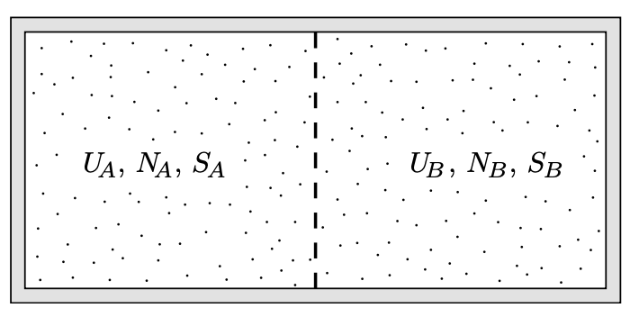

# 氣體的擴散平衡

## 內文
- 如下圖，兩系統中只有一種粒子

1. 如上圖，可以發現 $\mu_A = \mu_B$（見 <u>平衡</u>）
2. $\mu_A = G_{m,A} = \mu_B = G_{m,B}$ （見 <u>molar Gibbs energy</u>）
3. 如果 A、B 是理想氣體，則還有 $\mu = \mu^{\minuso} + RT\ln(\frac{P}{P^{\minuso}})$ （見 <u>Chemical potential</u>）
