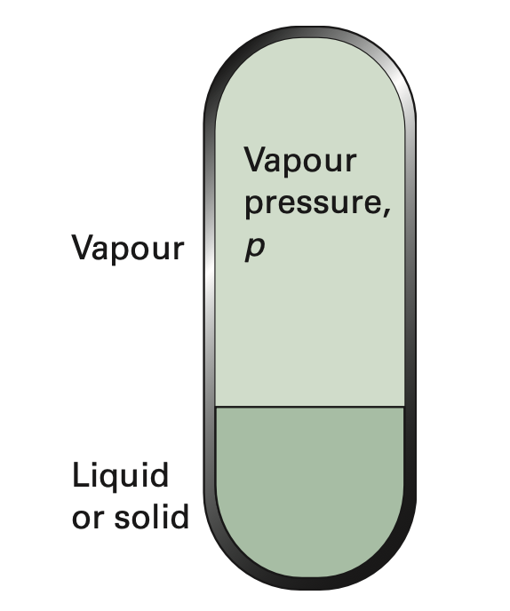

# 氣體純物質的相平衡

## 內文
- 如下圖，此系統中為純物質，形成氣液平衡

1. 如上圖，因為液體粒子可以隨時變成氣體粒子再變回來，其本質上仍是擴散平衡
   ⇒ $\mu_g = \mu_l$（g 表示氣態，l 表示液態）
2. 假設氣體部分為理想氣體，則 $\mu_l = G_{m,l} = \mu_g = G_{m,g} =\mu_g^{\minuso} + RT\ln(\frac{P}{P^{\minuso}})$
3. 定義此時上方壓力為 $P^*$，即純物質狀態下的氣液平衡壓力，稱為**<u>飽和蒸氣壓</u>**
   ⇒ $\mu_l^* = \mu_g^* =\mu_g^{\minuso} + RT\ln(\frac{P^*}{P^{\minuso}})$ ，右上角星號表示純物質
