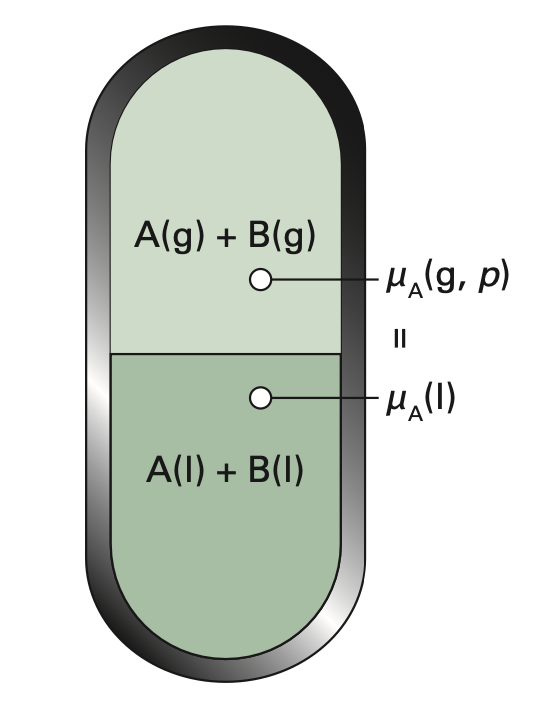

# 混合物的氣液相平衡

## 內文
- 如下圖，此系統中有 A、B 兩純物質，均形成氣液平衡，氣體為理想氣體，液體為理想液體
- 理想液體：
  1. 混合不放熱不吸熱
  2. 體積有加成性

1. 因為 A、B 均形成氣液平衡，因此 $\mu_{g,A} = \mu_{l,A}$，$\mu_{g,A} = \mu_{l,A}$
2. 因為上方氣體為 A、B 兩理想氣體的混合物，因此得知
   $\begin{cases} \mu_{l,A} = \mu_{g,A} = \mu_{g,A}^{\minuso} + RT\ln(\frac{P_A}{P^{\minuso}})\\ \mu_{l,B} =\mu_{g,B} = \mu_{g,B}^{\minuso} + RT\ln(\frac{P_B}{P^{\minuso}}) \end{cases}$
   其中 $P_A$、$P_B$ 為分壓
3. 根據 <u>純物質的相平衡</u> 一節得知
   $\begin{cases} \mu_{g,A}^* =\mu_{g,A}^{\minuso} + RT\ln(\frac{P_A^*}{P^{\minuso}})\\ \mu_{g,B}^* =\mu_{g,B}^{\minuso} + RT\ln(\frac{P_B^*}{P^{\minuso}}) \end{cases}$
   其中 $P_A^*$、$P_B^*$ 為 A、B 各自在純物質狀態下的飽和蒸氣壓
4. 綜合以上兩點可以寫出
   $\begin{cases} \mu_{l,A} = \mu_{g,A} = \mu_{g,A}^* + RT\ln(\frac{P_A}{P_A^*})\\ \mu_{l,B} =\mu_{g,B} = \mu_{g,B}^* + RT\ln(\frac{P_B}{P_B^*}) \end{cases}$
5. 根據 **<u>拉午耳定律</u>**，混合物上方 A 的蒸氣壓 $P_A = x_A P_A^*$，同理 $P_B = x_B P_B^*$
   ⇒ 改寫為
   $\begin{cases} \mu_{l,A} = \mu_{g,A} = \mu_{g,A}^* + RT\ln(x_A)\\ \mu_{l,B} = \mu_{g,B} = \mu_{g,B}^* + RT\ln(x_B) \end{cases}$
   此為 **<u>理想溶液的化學位能</u>** $\mu_l$ 的公式 $\mu_{l} = \mu_{g}^* + RT\ln(x)$
6. 兩理想液體混合之後的自由能變化
   1. 混合前的自由能：
      $$
      G_i = G_A + G_B = \mu_{A}^* n_A +\mu_{B}^* n_B \\
      $$
   2. 混合後的自由能：
      $$
      G_f = \mu_A n_A + \mu_B n_B \\= [\mu_{g,A}^* + RT\ln(x_A) ]n_A + [  \mu_{g,B}^* + RT\ln(x_B)] n_B
      $$
   3. 混合前後的自由能變化：
      $$
      \Delta G = G_f - G_i = RT\ln(x_A) n_A + RT\ln(x_B) n_B
      $$
      1. 同時 $\Delta S = -\left⟮\frac{\partial \Delta G}{\partial T}\right⟯_{P,N} = -nR[x_A\ln(x_A) + x_B\ln(x_B) ]$
         ⇒ 可以看出 $\Delta G < 0$ 且 $\Delta S > 0$ ⇒ 液體混合是自發反應（當然）
      2. $\Delta H = \Delta G + T \Delta S = 0$
