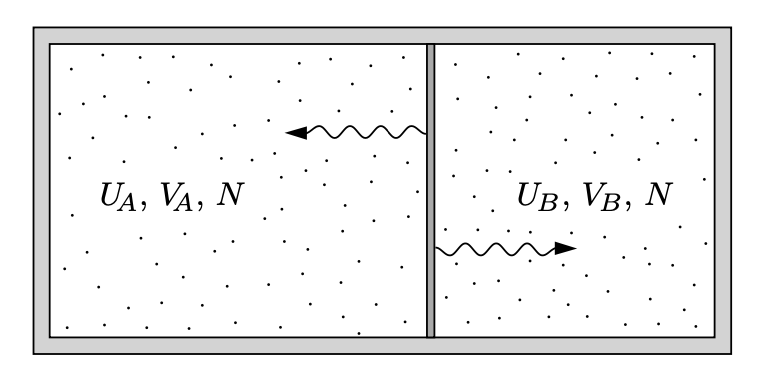

# 溫度 T 的新定義：溫度平衡 ⇒ 兩系統溫度 $\frac{1}{T} = \frac{\partial S}{\partial U}$ 相等

## 內文

如上圖，兩系統間只能交換能量，則怎樣分配能量能使 $S_{total}$ 為最大值？

1. 假設分配給系統 A 的能量有 $U_A$，分配給系統 B 的能量有 $U_B$，則因為 $U_A + U_B = U_{total}$ 為定值，因此 $dU_A =- dU_B$
2. 因為要讓 $S_{total}$ 為最大值 ⇒ $\frac{\partial S_{total}}{\partial U_A} = 0$
3. 因為 $S_{total} = S_A + S_B$，
   ⇒ $\frac{\partial S_{total}}{\partial U_A} = \frac{\partial S_A}{\partial U_A} +\frac{\partial S_B}{\partial U_A} = \frac{\partial S_A}{\partial U_A} - \frac{\partial S_B}{\partial U_B} = 0$
   ⇒ $\frac{\partial S_A}{\partial U_A} = \frac{\partial S_B}{\partial U_B}$
   此時**<u>定義溫度的倒數</u>** $\frac{1}{T} = \frac{\partial S}{\partial U}$，則可以看出兩系統 $\frac{1}{T_A} = \frac{1}{T_B}$，即溫度平衡
4. [[溫度 T 的新定義：溫度平衡 ⇒ 兩系統溫度 frac1T = fracpartial/圖示：可以看出當兩系統 frac1T = fracpartial Spartial U 相等時|扁平]]
