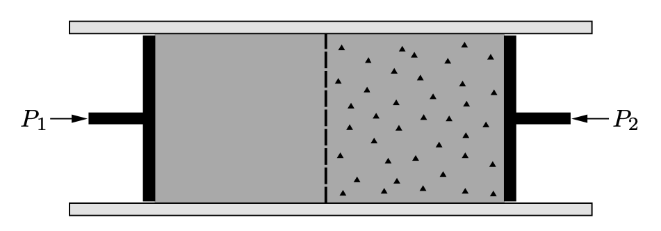

# 滲透壓 Osmotic pressure

## 內文

1. 如上圖，此半透膜兩側的溶液有相同溶劑 A，但右側有加入溶質 B，形成滲透壓
   因為有滲透壓的存在，因此必須維持 $P_2 > P_1$ 才能使整個系統保持平衡
2. 因為整個系統保持平衡 ⇒ $\mu_左(P_1) = \mu_右(P_2)$
3. 其中因為左邊是純物質，因此 $\mu_左(P_1) = \mu_A^*(P_1)$
4. 右邊是混合物，$\mu_右(P_2) = \mu_{A}^*(P_2) + RT\ln(x_A)$
5. $\mu_A^*(P_1) = \mu_{A}^*(P_2) + RT\ln(x_A)$ ⇒ $\mu_A^*(P_2) - \mu_{A}^*(P_1) = -RT\ln(x_A)$
6. 假設 $P_2-P_1 << P_1$，則根據泰勒展開，式子左邊可以改寫為
   $\mu_A^*(P_2) - \mu_{A}^*(P_1) = \mu_A^*(P_1) + (P_2-P_1)\frac{\partial \mu_A^*}{\partial P}- \mu_{A}^*(P_1) = (P_2-P_1)\frac{\partial \mu_A^*}{\partial P}$
   又因為 $\frac{\partial \mu_A^*}{\partial P} = \frac{\partial G_{m,A}}{\partial P} =\frac{1}{n_A}\frac{\partial G_{A}}{\partial P} =\frac{V}{n_A}$ ⇒ $\mu_A^*(P_2) - \mu_{A}^*(P_1) = (P_2-P_1)\frac{V}{n_A}$
   - 也可以直接使用 $\mu_2 - \mu_1 = \frac{V}{n} (P_2 - P_1)$ (見 <u>Chemical potential</u> )
7. 假設 $x_B << 1$，則根據泰勒展開，式子右邊可以改寫為
   $-RT\ln(x_A) = -RT\ln(1-x_B) = x_B RT = \frac{n_B}{n_A}RT$
8. 串在一起：$(P_2-P_1)\frac{V}{n_A} = \frac{n_B}{n_A}RT$
   ⇒ $P_2-P_1 = \frac{n_B}{v}RT$
   此即為滲透壓公式，$\frac{n_B}{v}$ 為 B 的**<u>容積莫耳濃度</u>**
