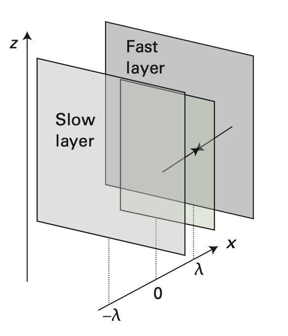

# 理想氣體的動量擴散（黏度）

## 內文
類似於 <u>理想氣體的粒子擴散</u>，不過此系統沒有粒子濃度差異，而是 y 方向的速度 $v_y$ 有差異，即$v_y$ 在往 -x 方向越來越小，往 +x 方向越來越大，寫作 $\frac{\partial v_y(x)}{\partial x} > 0$

此動量會從速度快的部分傳遞給速度慢的部分，如同手拉手，因此稱作黏度

1. 根據 <u>理想氣體的粒子擴散</u>，對於平面 x = 0 而言，左邊過來的粒子通量 $J_L$ 與 右邊過來的粒子通量 $J_R$ 各自為 $\begin{cases} J_{L,n} = \frac{1}{2}\rho_{n}\overline{\vert v_{ x}\vert}\\ J_{R,n} = \frac{1}{2}\rho_{n}\overline{\vert v_{ x}\vert} \end{cases}$ （因為沒有濃度差，所以數量當然一樣）
2. 左邊過來的粒子與右邊過來的粒子會各自攜帶動量，因此能量通量各自為 $\begin{cases} J_{L,p} = \frac{1}{2}\rho_{n}\overline{\vert v_{ x}\vert}mv_y(-\lambda)\\ J_{R,p} = \frac{1}{2}\rho_{n}\overline{\vert v_{ x}\vert}mv_y(\lambda) \end{cases}$，其中 m 為單一粒子的質量
3. 假設 $\lambda << 1$，因此根據泰勒展開，$\begin{cases} v_y(-\lambda) = v_y(0) -\lambda \frac{\partial v_y(0)}{\partial x} \\ v_y(\lambda) =v_y(0) +\lambda \frac{\partial v_y(0)}{\partial x} \end{cases}$
4. 可以算出能量通量 $J_{p} =J_{L,p} - J_{R,p} = \frac{1}{2}\rho_{n}\overline{\vert v_{ x}\vert}m[v_y(-\lambda)-v_y(\lambda)] = \rho_{n}\overline{\vert v_{ x}\vert}m\lambda\frac{\partial v_y}{\partial x}$
   對照 Newton’s law of viscosity： $J_p = -\eta \frac{\partial v_y}{\partial x}$ ，可以發現
   $$
   \eta = \rho_{n}\overline{\vert  v_{ x}\vert}m\lambda
   $$
   1. $\rho_{n} = N_A[c] = \frac{N}{V}= \frac{P}{kT}$ 為單位體積粒子數
   2. $\overline{\vert v_{ x}\vert} = (\frac{2kT}{\pi m})^\frac{1}{2}$為 x 方向分子速率 ${\vert v_{ x}\vert}$ 的平均
   3. $\lambda = \frac{kT}{\sigma P}$ 為平均自由路徑
   4. 因為 $D = \lambda \overline{\vert v_{ x}\vert}$ ，因此 $\eta = \rho_{n}\overline{\vert v_{ x}\vert}m\lambda = Dm\rho_{n}$
