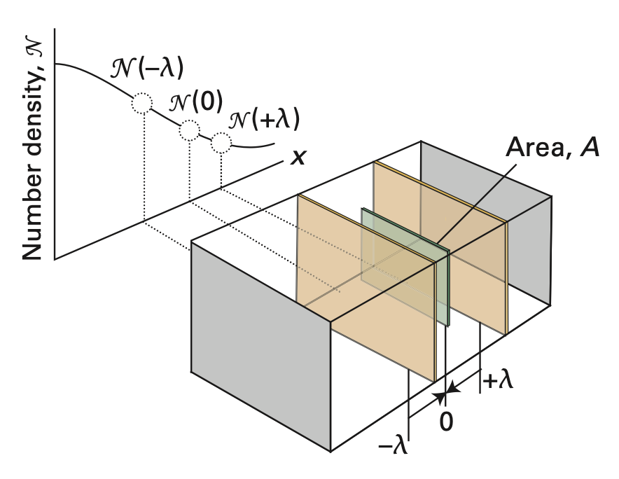

# 理想氣體的能量擴散（熱傳導）

## 內文
類似於 <u>理想氣體的粒子擴散</u>，不過此系統沒有粒子濃度差異，而是有溫度差異，即粒子溫度在往 -x 方向越來越高，往 +x 方向越來越低，即 $\frac{\partial T(x)}{\partial x} < 0$

1. 根據 <u>理想氣體的粒子擴散</u>，對於平面 x = 0 而言，左邊過來的粒子通量 $J_L$ 與 右邊過來的粒子通量 $J_R$ 各自為 $\begin{cases} J_{L,n} = \frac{1}{2}\rho_{n}\overline{\vert v_{ x}\vert}\\ J_{R,n} = \frac{1}{2}\rho_{n}\overline{\vert v_{ x}\vert} \end{cases}$ （因為沒有濃度差，所以數量當然一樣）
2. 左邊過來的粒子與右邊過來的粒子會各自攜帶能量，因此能量通量各自為 $\begin{cases} J_{L,E} = \frac{1}{2}\rho_{n}\overline{\vert v_{ x}\vert}\varepsilon(-\lambda)\\ J_{R,E} = \frac{1}{2}\rho_{n}\overline{\vert v_{ x}\vert}\varepsilon(\lambda) \end{cases}$，其中 $\varepsilon = \frac{d}{2}kT$ 為單一粒子所攜帶的能量，d 為自由度
3. 假設 $\lambda << 1$，因此根據泰勒展開，$\begin{cases} \varepsilon(-\lambda) = \varepsilon(0) -\lambda \frac{\partial \varepsilon(0)}{\partial x} ＝ \varepsilon(0) -\frac{dk\lambda}{2} \frac{\partial T}{\partial x} \\ \varepsilon(\lambda) =\varepsilon(0) +\lambda \frac{\partial \varepsilon(0)}{\partial x} = \varepsilon(0) +\frac{dk\lambda}{2} \frac{\partial T}{\partial x} \end{cases}$
4. 可以算出能量通量 $J_{E} =J_{L,E} - J_{R,E} = \frac{1}{2}\rho_{n}\overline{\vert v_{ x}\vert}[\varepsilon(-\lambda)-\varepsilon(\lambda)] = \frac{d}{2}k\rho_{n}\lambda \overline{\vert v_{ x}\vert}\frac{\partial T}{\partial x}$
   對照 Fourier's law： $J_E = -\kappa \frac{\partial T}{\partial x}$ ，可以發現
   $$
   \kappa = \frac{d}{2}k\rho_{n}\lambda \overline{\vert  v_{ x}\vert }
   $$
   1. $\lambda = \frac{kT}{\sigma P}$ 為平均自由路徑
   2. $\overline{\vert v_{ x}\vert} = (\frac{2kT}{\pi m})^\frac{1}{2}$為 x 方向分子速率 ${\vert v_{ x}\vert}$ 的平均
   3. $\rho_{n} = N_A[c] = \frac{N}{V}= \frac{P}{kT}$ 為單位體積粒子數
   4. d 為自由度
   還可以改寫為
   $$
   \kappa = \frac{d}{2}k\rho_{n}\lambda \overline{\vert  v_{ x}\vert} =  \frac{d}{2}kN_A [c]D = C_{v,m}[c]D
   $$
   1. $C_{v,m} =\left⟮\frac {\partial U}{\partial T}\right⟯_{V} = \left⟮\frac {\partial \varepsilon}{\partial T}\right⟯_{V}N_A = \frac{d}{2}kN_A$ 為定容熱容
   2. $[c]$ 為容積莫耳濃度
   3. $D = \lambda \overline{\vert v_{ x}\vert}$ 為擴散係數
