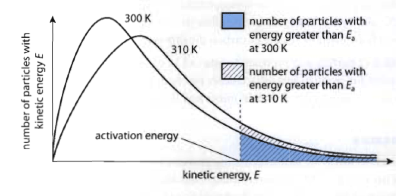

# 理想液體中的動量擴散（黏度）

## 內文
1. 理想氣體與理想液體的差別
   1. 理想氣體之間沒有作用力，動量傳遞純粹靠粒子跑來跑去
   2. 理想液體之間則作用力很強，動量傳遞靠的是手拉手的摩擦力
2. 因此理想液體若要流動，要突破分子間作用力 $\varepsilon_a$
   
   而根據 Maxwell-Boltzmann distribution，動能 $\varepsilon > \varepsilon_a$ 的分子比例 $\propto e^{-\frac{\varepsilon_a}{kT}}\propto \mu$ (mobility)
   因此黏度 viscosity $\eta \propto \frac{1}{\mu} \propto e^{\frac{\varepsilon_a}{kT}}$
   即 $\eta = \eta_0 \ e^{\frac{\varepsilon_a}{kT}}$
   ⇒ 溫度上升，液體的黏度下降
   - 這個公式的前提是
     1. 體積保持不變（體積變大會導致分子間距離變大，作用力變小，黏度變小）
     2. 作用力 E_a 是固定值（但對於複雜大分子而言，分子間作用力很複雜）
     所以這條公式很粗糙
