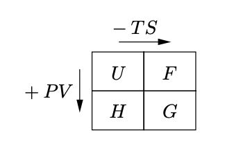
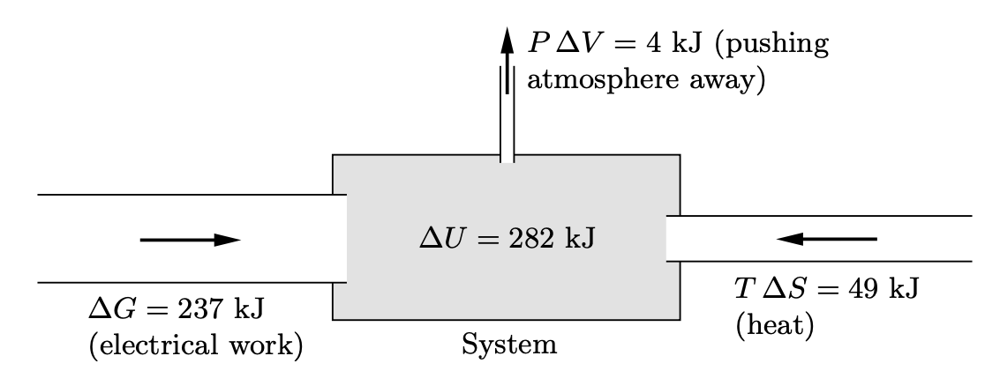

# 能量 U、H、A、G 綜觀

## 內文

1. U 表示此系統本身所蘊含的能量
2. H = U + PV：表示在大氣中生成此系統時所需要的能量 H，除了此系統所蘊含的能量 U 之外，還需要做功 PV 以排開外面的氣壓，給此系統清出空間。同理 H 亦是在大氣中摧毀此系統時可獲得的總能量，因為此空間可以還給外面的氣壓
3. A = U - TS：A 為生成此系統時，外界所需要做的總功。其實生成此系統不需要 U 這麼多能量，因為環境中有溫度，會自動透過熱傳導給予系統 TS 的能量
4. G = U + PV - TS：G 表示在大氣中生成此系統時所需要提供的總能量，其中 -PV 表示大氣做的功（膨脹功、壓縮功）都不算數， +TS 表示環境會透過熱傳自己給系統能量，不需要我做功
5. 例：電解水
   $H = 286 kJ$ 是電解水總共需要的能量，可以分成能量進來、能量出去、能量保留在系統 這三部分討論
   1. 能量進來：電池做電功 $\Delta G = 237 kJ$ + 外界傳熱進來 $T\Delta S = 49kJ$
   2. 能量出去：因為製造了氣體，需要對大氣做膨脹功 $P\Delta V = 4kJ$ 以清出空間
   3. 能量保留在系統：$\Delta U = 282 kJ$
   
