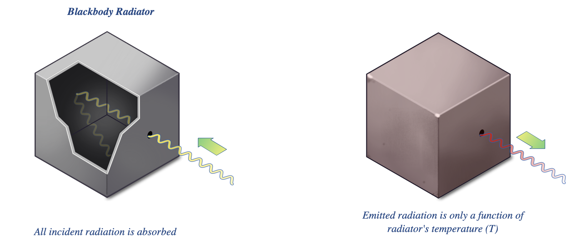
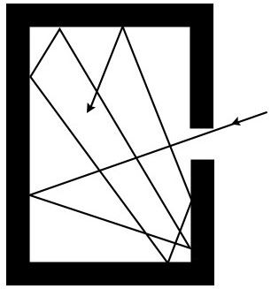

# 黑體輻射

## 內文
### Rayleigh-Jeans law

1. 前提假設
   1. 黑體：A perfect absorber and emitter of radiation，通常想像成一組漆黑空腔與小孔
      

      
   2. 此黑體與外界絕熱（不會向外溢散熱量）且內部處於熱平衡狀態
2. Solve the PDE：根據電磁波公式，$\nabla^2 \vec E = \frac{1}{c^2} \frac{\partial^2 \vec E}{\partial t^2}$ （磁場同理）

   [[黑體輻射/也可以波動形式 vec E(vec r,t ) = vec E0ei|摘要]]

   [[黑體輻射/也可以用 separation of variable 來解|摘要]]
3. Boundary condition：因為此黑體不會向外溢散熱量，因此可以假設在空腔壁處切向電場均為零，即
   1. At the walls $x=0$ ＆ $x=L$ 時 $E_y=0, E_z = 0$
   2. At the walls $y=0$ ＆ $y=L$ 時 $E_x=0, E_z = 0$
   3. At the walls $z=0$ ＆ $z=L$ 時 $E_x=0, E_y = 0$
   - 如果空腔壁電阻不為零，則根據歐姆定律會產生電流而放熱
   - 如果空腔壁電阻為零則會等電位，則電場對壁的切向分量就會為 0
4. 基於 Boundary condition $\forall x \in \{ 0, L\}$ 和 $\forall z \in \{ 0, L\}$ 時 $E_y=0$
   因此對於方程組$\begin{cases} X(x) = e^{ik_xx} \\ Y(y) = e^{ik_yy} \\ Z(z) = e^{ik_zz} \\ k_x^2 + k_y^2 + k_z^2 = \frac{\omega^2}{c^2} \end{cases}$ 而言，只有當
   $\begin{cases} k_x = \frac{n_x\pi}{L}, n_x = 0,1,2,3...\\ k_y = \frac{n_y\pi}{L} , n_y = 0,1,2,3... \\ k_z = \frac{n_z\pi}{L} , n_z = 0,1,2,3... \end{cases}$
   - 即電磁波在空腔內形成駐波
5. 總而言之，目前已知的推論與假設：
   1. $n_x, n_y, n_z$ 互相獨立且均為非負整數
   2. 確定 $(n_x, n_y, n_z)$ 之後就唯一確定頻率 $\nu = \frac{c}{2L}\sqrt{n_x^2 + n_y^2 +n_z^2}$
   3. 每組 $(n_x, n_y, n_z)$ 都各自視為兩個 microstate，都各自擁有 $\langle E(\nu,T)\rangle = kT$（動能 + 位能）
      - 見 <u>Continuous energy level ⇒ Equipartition theorem</u>
      - 兩個 microstate 是因為電磁波有兩個 polarization 方向，vertical and horizontal
      - 可以發現雖然寫作 $\langle E(\nu)\rangle$ 但是根本和頻率 $\nu$ 無關
6. 因為 $n_x, n_y, n_z$ 互相獨立，因此可以想像一個三維的空間，分別有 $n_x, n_y, n_z$ 三個座標軸，而此空間中 $n_x, n_y, n_z$ 皆為非負整數的地方即像是網格中的節點
7. 想知道密度函數 $p(\nu)d\nu$ ，可以直接數三維空間中的節點數 $\Omega(\nu)$，不過因為很難數，因此我們想像這些點在空間中幾乎是連續分布的，用空間中的體積來近似空間中的節點數量
8. 因為 $\nu^2 = \frac{c^2}{4L^2}(n_x^2 + n_y^2 +n_z^2)$ ，因此 $\nu$ 與 $\nu+d\nu$ 之間的體積差 $p(\nu)d\nu$ 在空間中的形狀是一個薄薄的球殼。
   此球殼半徑為 $R = \frac{2L\nu}{c}$，此球殼體積為 $4\pi R^2dR = \frac{32\pi L^3\nu^2}{c^3}d\nu$
   但因為 $n_x, n_y, n_z$ 均為非負整數，因此只計算球殼在第一象限的體積（為原本體積的 1/8），即 $dV(\nu) = p(\nu)d\nu = \frac{4\pi L^3\nu^2}{c^3}d\nu$
   Density of states $g(\nu)d\nu$ 為單位黑體體積的 node 數，即 $g(\nu)d\nu = \frac{4\pi \nu^2}{c^3}d\nu$
9. 黑體輻射所釋放的能量（此公式在低頻率很準，高頻率會造成紫外災變）
   $$
   U(\nu,T) = g(\nu) \cdot \langle E(\nu,T) \rangle \cdot 2 = \frac{4\pi \nu^2}{c^3} * kT * 2 = \frac{8\pi \nu^2kT}{c^3}
   $$

### Wien's Distribution Law

經驗公式：$U(\nu,T) = a\nu^3e^{-b\nu/T}$

在高頻率很精確，在低頻率很爛

### Planck radiation law

1. 根據前兩者的公式 $\begin{cases} U(\nu,T) = a\nu^2T & \text{if } \nu \approx 0 \\ U(\nu,T) = a\nu^3e^{-b\nu/T} & \text{if }\nu \gg0 \end{cases}$ ，普朗克湊出經驗公式：
   $$
   U(\nu,T) = a\nu^3\frac{1}{e^{\frac{b\nu}{T}} -1}
   $$
   ⇒ $\begin{cases} \text{if } \nu \approx 0 & e^{\frac{\nu}{T}} \approx 1+\frac{\nu}{T} & U(\nu,T) = a\nu^2T \\ \text{if } \nu \gg 0 & 1+ e^{\frac{\nu}{T}} \approx e^{\frac{\nu}{T}} & U(\nu,T) = a\nu^3e^{-b\nu/T}\\ \end{cases}$
2. 如何解釋？
   如果延續 Rayleigh-Jeans law $U(\nu,T) = g(\nu) \cdot \langle E(\nu,T) \rangle \cdot 2 = \frac{8\pi \nu^2}{c^3} \langle E(\nu,T) \rangle$
   使用相同的 Density of states $g(\nu)d\nu = \frac{4\pi \nu^2}{c^3}d\nu$
   但是想像空腔壁並非純粹的電磁波反射面，而是由 simple oscillator 構成。這些 simple oscillator 各自有不同的頻率 $\nu$，而且該 oscillator 的能量只能是 $h\nu$ 的整數倍
   則新的 $\langle E(\nu,T) \rangle = \frac{h\nu}{e^{h\nu/kT}-1}$ （詳見 <u>Bose-Einstein statistics</u>）
   - 普朗克心中的空腔壁並非純粹的電磁波反射面，而是由 simple oscillator 構成。有點像是小提琴的琴橋，弦上的能量讓琴橋振動，但因為震動幅度很小，因此琴橋和空腔壁仍可以視為沒有變化的 boundary condition，讓琴弦 / 黑體空腔形成駐波
   - Einstein's View (1905)：Quantization was not a property of the emitters, but an intrinsic property of the electromagnetic radiation itself，with each photon carrying energy $E=h\nu$
   - 黑體不是絕熱（不會向外溢散熱量）而是與外界達成熱平衡（進 = 出）
   - 此常數 h 即為普朗克常數
3. 新的黑體輻射公式
   $$
   U(\nu,T) =  \frac{8\pi \nu^2}{c^3}  \langle E(\nu,T) \rangle = \frac{8\pi \nu^2}{c^3}  \frac{h\nu}{e^{h\nu/kT}-1}
   $$
