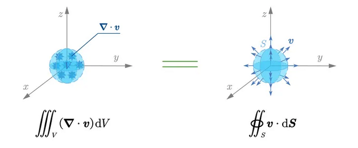
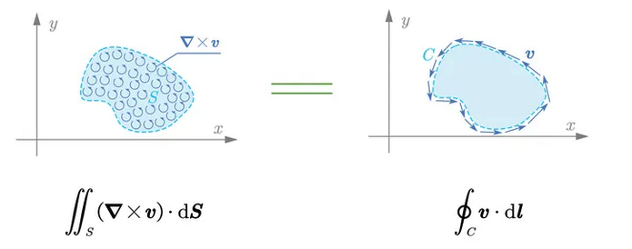
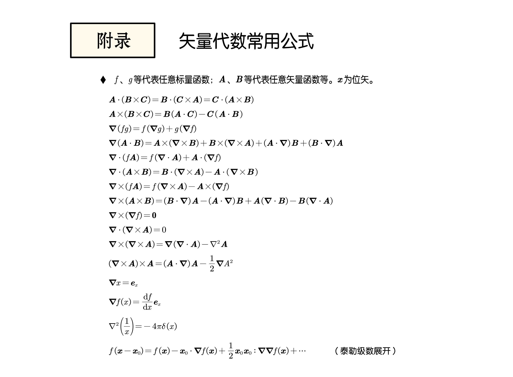

# 向量分析：梯度（純量 ⇒ 向量）、散度（向量 ⇒ 純量）、旋度（向量 ⇒ 向量）

## 內文
$\nabla = [\frac{\partial}{\partial x}\hat{i} + \frac{\partial}{\partial y}\hat{j} + \frac{\partial}{\partial z}\hat{k} ]$

1. 梯度（純量場 ⇒ 向量場）：
   對於空間中的某函數 f，$df = \frac{\partial f}{\partial x}dx + \frac{\partial f}{\partial y}dy + \frac{\partial f}{\partial z}dz \\ = [\frac{\partial f}{\partial x}\hat{i} + \frac{\partial f}{\partial y}\hat{j} + \frac{\partial f}{\partial z}\hat{k} ]\cdot (dx*\hat{i}+dy*\hat{j}+ dz*\hat{k})=\nabla f\cdot d\vec l$
   其中 $\nabla f$ 相當於 $\frac{df}{d\vec l}$，同時因為是內積，因此唯有 $\nabla f$ 與 $d\vec l$ 同方向時，才能使 $df$最大
   因此可以想像，梯度 $∇f$是一個向量，指向 $f$ 高的方向
   $\nabla f = [\frac{\partial}{\partial x}\hat{i} + \frac{\partial}{\partial y}\hat{j} + \frac{\partial}{\partial z}\hat{k} ]f = \frac{\partial f}{\partial x}\hat{i} + \frac{\partial f}{\partial y}\hat{j} + \frac{\partial f}{\partial z}\hat{k}$
   - 注意：
     - $(\vec A \cdot \nabla) f = \vec A \cdot (\nabla f) = \frac{\partial f}{\partial x} A_x + \frac{\partial f}{\partial y}A_y + \frac{\partial f}{\partial z}A_z$
     - 舉例：海拔高度是 x,y 的函數 ⇒ 梯度垂直於等高線，往高處指
     - 舉例：溫度是 x,y,z 的函數 ⇒ 梯度垂直於等溫線
     - 在任何梯度場 $\nabla f$ 中， 把 $\nabla f$ 與 <u>從 A 點到 B 點的路徑</u> 做內積 ⇒ 結果均會相等，與具體路徑無關
     - 即 $\int_A^B \nabla f\cdot d\vec l = f(B)-f(A)$，亦即 $\int_A^B (-\nabla f)\cdot d\vec l = f(A)-f(B)$
     - 因此 **梯度場 = 保守力場**
     - 其中 $-\nabla f$ 稱為保守向量（ex: 重力）， $f$ 則為保守位能（ex: 重力位能）
2. 散度（向量場 ⇒ 純量場）：對於空間中的向量場中的某個點，散度 $\nabla\cdot \vec f = \operatorname{div} \vec f$ 代表這個點流出去的向量比流進去的多多少（有進有出沒關係，全部加起來就好）
   對於向量場 $\vec f= f_x* \hat{i} + f_y* \hat{j}  + f_z*\hat{k}$ 而言，
   $\nabla \cdot f = [\frac{\partial}{\partial x}\hat{i} + \frac{\partial}{\partial y}\hat{j} + \frac{\partial}{\partial z}\hat{k} ]\cdot \vec f = \frac{\partial f_x}{\partial x}\vert\hat{i}\vert^2 + \frac{\partial f_y}{\partial y}\vert\hat{j}\vert^2  + \frac{\partial f_z}{\partial z}\vert\hat{k}\vert^2 =\frac{\partial f_x}{\partial x}+ \frac{\partial f_y}{\partial y}  + \frac{\partial f_z}{\partial z}$

   [[向量分析：梯度（純量 ⇒ 向量）、散度（向量 ⇒ 純量）、旋度（向量 ⇒ 向量）/圖例|摘要]]
3. 旋度（向量場 ⇒ 向量場）：對於空間中的向量場中的某個點旋度 $\nabla\times \vec f = \operatorname{curl} \vec f$ 代表這個點的旋轉程度與方向，方向以旋轉的右手定則決定（相當於放一台風車在這個點，看他怎麼轉）
   對於向量場 $\vec f= f_x* \hat{i} + f_y* \hat{j}  + f_z*\hat{k}$ 而言，
   $\nabla \times \vec f= \left(\frac{\partial}{\partial x}\hat{i} + \frac{\partial}{\partial y}\hat{j} + \frac{\partial}{\partial z}\hat{k}\right)\times \left(f_x\hat{i}+f_y\hat{j}+f_z\hat{k}\right) \\ = \hat{i} \left( \frac{\partial f_z}{\partial y} - \frac{\partial f_y}{\partial z} \right) + \hat{j} \left( \frac{\partial f_x}{\partial z} - \frac{\partial f_z}{\partial x} \right) + \hat{k} \left( \frac{\partial f_y}{\partial x} - \frac{\partial f_x}{\partial y} \right)= \begin{vmatrix} \hat{i} & \hat{j} & \hat{k} \\ \frac{\partial}{\partial x} & \frac{\partial}{\partial y} & \frac{\partial}{\partial z} \\ f_x & f_y & f_z \end{vmatrix}$

   [[向量分析：梯度（純量 ⇒ 向量）、散度（向量 ⇒ 純量）、旋度（向量 ⇒ 向量）/圖例 2|摘要]]
4. 拉普拉斯算子（純量場 ⇒ 純量場）
   對於空間中的某函數 f，
   $\nabla^2 f = (\nabla \cdot \nabla) f  =[\frac{\partial}{\partial x}\hat{i} + \frac{\partial}{\partial y}\hat{j} + \frac{\partial}{\partial z}\hat{k} ]\cdot [\frac{\partial}{\partial x}\hat{i} + \frac{\partial}{\partial y}\hat{j} + \frac{\partial}{\partial z}\hat{k} ]f \\= \frac{\partial^2 f}{(\partial x)^2}+ \frac{\partial^2 f}{(\partial y)^2}  + \frac{\partial^2 f}{(\partial z)^2}$
   因為梯度 $∇f$ 是一個場，因此梯度的散度 $∇^2f$ 即為 $∇f$ 這個場的場源

   [[向量分析：梯度（純量 ⇒ 向量）、散度（向量 ⇒ 純量）、旋度（向量 ⇒ 向量）/舉例：海拔高度是 x,y 的函數 ⇒ 梯度垂直於等高線，往高處指|全文]]

   [[向量分析：梯度（純量 ⇒ 向量）、散度（向量 ⇒ 純量）、旋度（向量 ⇒ 向量）/舉例：溫度 T 是 x,y,z 的函數 ⇒ 梯度 ∇T 垂直於等溫線|全文]]
   某種意義上其實就是二次微分
5. 高斯散度定理：在向量場裡，一個封閉空間中的散度和 = 表面積通量
   [https://byjus.com/maths/divergence-theorem/](https://byjus.com/maths/divergence-theorem/)
   
6. 斯托克斯定理：在向量場裡，一個邊界確定的曲面上所有點的旋度和 = 繞著邊界積一圈（因為裡面會抵銷）
   
7. 舉例：
   1. **<u>梯度場的旋度 = 0</u>** （繞一圈回到原點的樓梯不能只往上）（根據斯托克斯定理）
   2. 旋度場 （$\nabla \times \vec f$ 視為另一個新的向量場） 的曲面積分只與邊界有關，與曲面怎麼選無關（根據斯托克斯定理）
   3. **<u>旋度場的散度 = 0</u>**（在此旋度場中任取一封閉空間 ⇒ 此空間表面上所有點的旋度和 = 0 （此表面視為一個無邊界的曲面）⇒ 此封閉空間表面通量 = 0 ⇒ 散度 = 0 ）（根據斯托克斯定理 + 高斯定理）
8. 更複雜的運算：[https://blog.csdn.net/woaiwulima/article/details/124650800](https://blog.csdn.net/woaiwulima/article/details/124650800)
9. [https://zhuanlan.zhihu.com/p/452461912](https://zhuanlan.zhihu.com/p/452461912)

