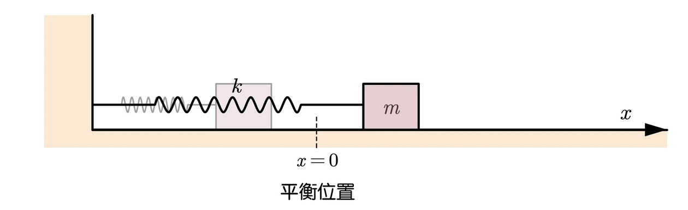

# 單一振子、單一振動

## 內文
1. 對於簡諧振動 ex: 彈簧上的小球，如果彈簧位置偏移平衡點 $\vec x = \vec x' - \vec x_0$，則根據虎克定律，此小球會受到彈力 $\vec F = -k\vec x$
   
2. 根據牛頓第二運動定律，$\vec F = m\vec a$ ⇒ $m\vec{\ddot x} = -k\vec x$
   ⇒ $\ddot x + \frac{k}{m}\vec x = 0$
3. $x(t)$ 的解有很多，例如 $Acos(\sqrt{\frac{k}{m}}t+\theta_0)$，或是 $Asin(\sqrt{\frac{k}{m}}t+\theta_0')$，其中 $A$ & 兩個 $\theta_0$ 都是積分常數（其實這兩個解是一樣的，只是兩個 $\theta_0$ 之間相差 $\frac{\pi}{2}$）
4. 這種正弦波的形式也可以寫成複數再取實部，$x(t) = Ae^{i(\sqrt{\frac{k}{m}}t+\theta_0)} = Ae^{i(\omega t+\theta_0)}$
   1. 其中 $\omega = \sqrt{\frac{k}{m}}$
   2. 注意：**<u>用複數描述簡諧運動時，只有實部是有意義的</u>**
   3. $Ae^{i(\omega t+\theta_0)} = (Ae^{i\theta_0})e^{i\omega t} = Ce^{i\omega t}$，**<u>複振幅 C</u>** 同時包含**<u>振幅 & 初相位角</u>**
