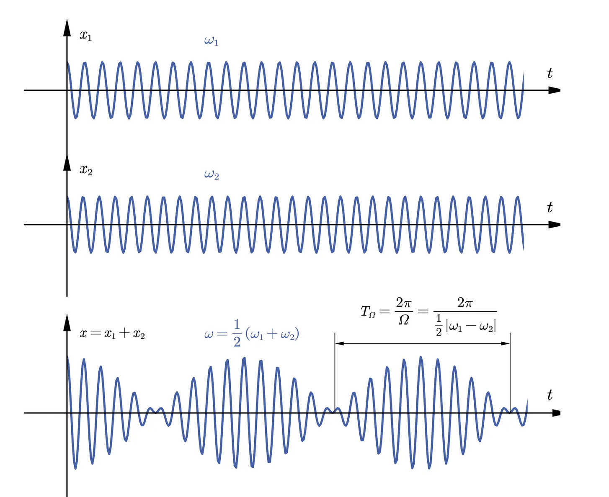
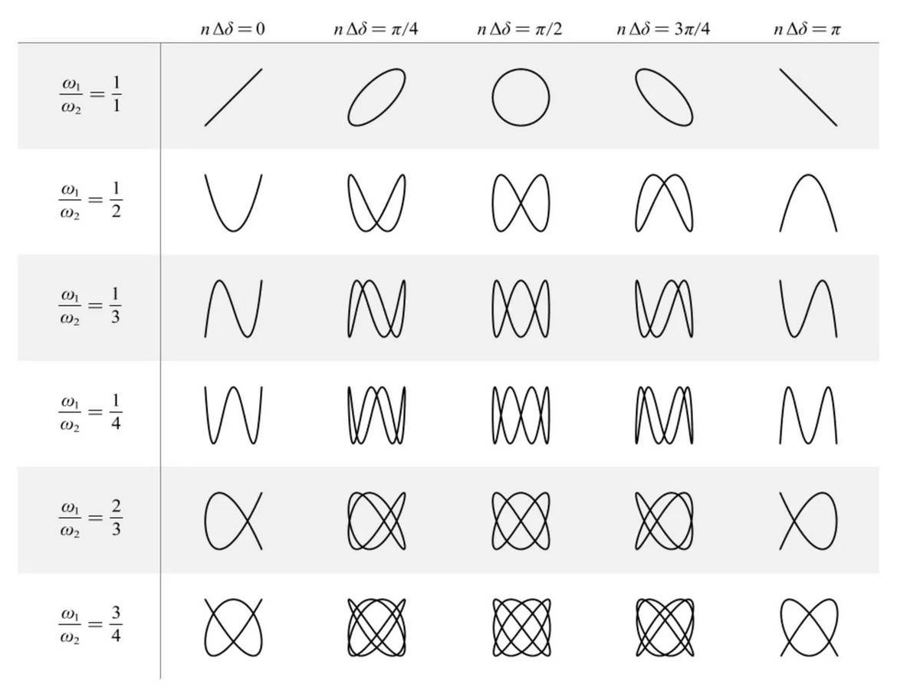

# 單一振子如何同時參與兩個簡諧運動？

## 內文
1. 如果兩同方向簡諧運動同頻率：$x_1 = A_1 cos(\omega t + \theta_1)$，$x_2 = A_2 cos(\omega t + \theta_2)$
   1. 用一般三角函數分析：$x = x_1 + x_2 = A_1 cos(\omega t + \theta_1) + A_2 cos(\omega t + \theta_2)$

      [[單一振子如何同時參與兩個簡諧運動？/⇒ 可以和角公式展開|摘要]]
   2. 用複數分析：
      1. $x_1 =A_1e^{i(\omega t + \theta_1)} = (A_1e^{i\theta_1})e^{i\omega t} = C_1e^{i\omega t}$
      2. $x_2 =A_2e^{i(\omega t + \theta_2)} = (A_2e^{i\theta_2})e^{i\omega t}= C_2e^{i\omega t}$
      3. $x = x_1 + x_2 =(A_1e^{i\theta_1})e^{i\omega t} + (A_2e^{i\theta_2})e^{i\omega t} = (Ae^{i\theta})e^{i\omega t} = Ce^{i\omega t}$

      [[單一振子如何同時參與兩個簡諧運動？/即直接複振幅相加 C = C1 + C2（複數平面上的向量相加）|摘要]]
2. 如果兩同方向簡諧運動不同頻率（但是同振幅 & 同初相位角）：
   $x_1 = A cos(\omega_1 t + \theta) = Ce^{i\omega_1t}$，$x_2 = A cos(\omega_2 t + \theta)= Ce^{i\omega_2t}$
   1. 用一般三角函數分析：
      $x = x_1 + x_2 = A_1 cos(\omega_1 t + \theta_1) + A_2 cos(\omega_2 t + \theta_2) \\= 2Acos(\frac{\omega_1-\omega_2}{2}t)cos(\frac{\omega_1+\omega_2}{2}t + \theta)$ （利用和差化積公式）
   2. 用複數分析：$x = x_1 + x_2 = Ce^{i\omega_1t} + Ce^{i\omega_2t } = C(e^{i\omega_1 t}+e^{i\omega_2 t}) = C(e^{i\frac{\omega_1 + \omega_2}{2} t})(e^{i\frac{\omega_1 - \omega_2}{2} t}+e^{-i\frac{\omega_1 - \omega_2}{2} t}) = 2Ccos(\frac{\omega_1 - \omega_2}{2} t)(e^{i\frac{\omega_1 + \omega_2}{2} t})$
   3. 結論：可以把合成的新波解釋為頻率為 $\frac{\omega_1+\omega_2}{2}$ 的密集波，其振幅以 $\frac{\vert \omega_1-\omega_2\vert}{2}$ （稱為**<u>拍頻</u>**）的頻率週期性開合（稱為被**<u>調製</u>**了）
      
3. 如果兩簡諧運動方向垂直：其軌跡可以畫成**<u>利薩茹圖形</u>**（即不看 x - t 圖了，變成軌跡動畫）
   1. 圖形只與兩頻率的簡單整數比及相位差有關
   2. 想知道頻率的簡單整數比，可以垂直水平各隨意畫一條線，看各自交點數量
   - 什麼時候可以用利薩茹圖形？以下二擇一即可
     1. 一個振子同時受到兩方向垂直的簡諧運動 ⇒ 其軌跡為利薩茹圖形
     2. 任意獨立的兩個一維訊號 $x_1(t)、x_2(t)$ 都可以在示波器上畫成利薩茹圖形（ $x_1(t)、x_2(t)$ 分別為直角座標的兩軸）
   
