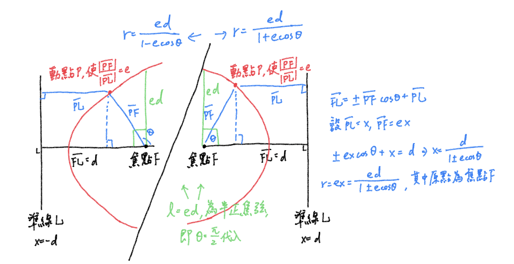

# 極座標通用公式：$r = \frac{ed}{1±ecos \theta}$ ⟺ $\frac{\overline {PF}}{\overline {PL}} = e$

## 內文
$(r, \theta)$ 為圖形在極座標系中的座標，$e = \frac{\overline {PF}}{\overline {PL}}$ 為偏心率，$d = \overline {FL}$ 為焦點與準線距離

1. $e = 0$ ⇒ 圓
2. $0 < e < 1$ ⇒ 橢圓
3. $e = 1$ ⇒ 拋物線
4. $e > 1$ ⇒ 雙曲線

