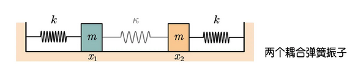

# 多振子的簡諧振動：簡正模

## 內文
### 自由度 = 2 的模型：耦合振盪

已知此系統只有兩個自由度，即左右小球偏離平衡點的位移，分別是 $x_1、x_2$ (右為正)

兩端彈簧彈性係數皆為 k，中間彈簧彈性係數為 $\kappa$（且 $\kappa \ll k$ ），小球質量均為 m

1. 拉格朗日量 $L=T-V = \frac{1}{2}m\dot x_1^2 + \frac{1}{2}m\dot x_2^2- \frac{1}{2}k x_1^2 - \frac{1}{2}k x_2^2 - \frac{1}{2}\kappa {(x_1-x_2)}^2$
2. 整理成 $L = \frac{1}{2}m\dot x_1^2 + \frac{1}{2}m\dot x_2^2- \frac{1}{2}(k+\kappa) x_1^2 - \frac{1}{2}(k+\kappa) x_2^2 + \kappa x_1x_2$ 代入拉格朗日方程 $\frac{\partial L}{\partial q_{j}} -\frac{d}{dt}(\frac{\partial L}{\partial q'_{j}}) = 0$
   $\begin{cases}- (k+\kappa)x_1 + \kappa x_2 - \frac{d}{dt}m\dot x_1 = 0\\- (k+\kappa)x_2 + \kappa x_1 - \frac{d}{dt}m\dot x_2 = 0\end{cases}$ ⇒ $\begin{cases} (k+\kappa)x_1 - \kappa x_2  =-m \ddot x_1\\(k+\kappa)x_2 -\kappa x_1 = -m \ddot x_2 \end{cases}$
3. <u>猜測此系統做簡諧振盪</u>，即 $x_1 = C_1e^{i\omega t}$，$x_2 = C_2e^{i\omega t}$
   ⇒ $\begin{cases} (k+\kappa) C_1e^{i\omega t} - \kappa C_2e^{i\omega t}= m\omega^2 C_1e^{i\omega t}\\(k+\kappa) C_2e^{i\omega t} - \kappa C_1e^{i\omega t}= m\omega^2 C_2e^{i\omega t}\end{cases}$
   ⇒$\begin{cases} \frac{k+\kappa}{m} C_1e^{i\omega t} - \frac{\kappa}{m} C_2e^{i\omega t}= \omega^2 C_1e^{i\omega t}\\\frac{k+\kappa}{m} C_2e^{i\omega t} - \frac{\kappa}{m} C_1e^{i\omega t}= \omega^2 C_2e^{i\omega t}\end{cases}$
   ⇒ $\begin{bmatrix} \frac{k+\kappa}{m} & - \frac{\kappa}{m} \\ - \frac{\kappa}{m} & \frac{k+\kappa}{m}\end{bmatrix}\begin{bmatrix} C_1\\    C_2\end{bmatrix}=\omega^2\begin{bmatrix} C_1\\    C_2 \end{bmatrix}$
4. $\omega^2$ 即為此矩陣 $\begin{bmatrix} \frac{k+\kappa}{m} & - \frac{\kappa}{m} \\ - \frac{\kappa}{m} & \frac{k+\kappa}{m}\end{bmatrix}$ 的**<u>特徵值</u>**，$\begin{bmatrix} C_1\\ C_2 \end{bmatrix}$即為此矩陣**<u>特徵向量</u>**
   ⇒ 算出 $\omega^2 = \frac{k+\kappa}{m}  ± \frac{\kappa}{m}$ ⇒ $\omega = \sqrt{\frac{k}{m}}$ or $\sqrt{\frac{k+2\kappa}{m}}$ 代回上面方程組
   1. 使 $\omega_1 = \sqrt{\frac{k}{m}}$ ⇒ $C_1 = C_2$ ，即兩球**同左同右運動**
      ⇒ $\begin{bmatrix} x_1\\ x_2 \end{bmatrix}=\begin{bmatrix} C_1\\ C_2 \end{bmatrix}e^{i\omega_1 t} = \cfrac{1}{\sqrt{2}}\begin{bmatrix} 1\\ 1 \end{bmatrix}Ae^{i\omega_1 t}$
   2. 使 $\omega_2 = \sqrt{\frac{k+2\kappa}{m}}$ ⇒ $C_1 = -C_2$ ，即兩球**大開大合運動**
      ⇒ $\begin{bmatrix} x_1\\ x_2 \end{bmatrix}=\begin{bmatrix} C_1\\ C_2 \end{bmatrix}e^{i\omega_1 t} = \cfrac{1}{\sqrt{2}}\begin{bmatrix} 1\\ -1 \end{bmatrix}Be^{i\omega_2 t}$
   - 以上 $\cfrac{1}{\sqrt{2}}\begin{bmatrix} 1\\ 1 \end{bmatrix}、\cfrac{1}{\sqrt{2}}\begin{bmatrix} 1\\ -1 \end{bmatrix}$均為**<u>單位特徵向量</u>**，即向量長度為 1 。A、B 為係數，即此特徵向量$\begin{bmatrix} C_1\\ C_2 \end{bmatrix}$的長度
5. 實際振動方程會是以上兩種簡諧振動的疊加，即
   $$
   \begin{bmatrix} x_1\\ x_2 \end{bmatrix} = A(\cfrac{1}{\sqrt{2}}\begin{bmatrix} 1\\ 1 \end{bmatrix}e^{i\omega_1 t}) + B(\cfrac{1}{\sqrt{2}}\begin{bmatrix} 1\\ -1 \end{bmatrix}e^{i\omega_2 t})
   $$
6. 實際分析 $x_1、x_2$ 會發現不容易分析，因為兩座標間不獨立，會互相影響
   ⇒ 選取新廣義座標 $Q_1、Q_2$ 使 $\begin{bmatrix} x_1\\ x_2 \end{bmatrix} = (\cfrac{1}{\sqrt{2}}\begin{bmatrix} 1\\ 1 \end{bmatrix})Q_1 + (\cfrac{1}{\sqrt{2}}\begin{bmatrix} 1\\ -1 \end{bmatrix})Q_2$
   ⇒ 新的振動方程可以直接寫成 $\begin{cases} Q_1 =Ae^{i\omega_1 t} \\ Q_2 =Be^{i\omega_2 t} \end{cases}$ （或是 ），其中 $Q_1、Q_2$ 為互相獨立的座標（稱為**<u>簡正座標</u>**），各自對應複振幅 A、B，**<u>簡正頻率</u>** $\omega_1 = \sqrt{\frac{k}{m}}、\omega_2= \sqrt{\frac{k+2\kappa}{m}}$，而這兩組獨立的振動，稱為兩支**<u>簡正模</u>**
7. 拉格朗日量 L 用新的座標表示：
   $L = \frac{1}{2}m\dot Q_1^2 + \frac{1}{2}m\dot Q_2^2- \frac{1}{2}k Q_1^2 - \frac{1}{2}(k+2\kappa) Q_2^2$ （兩座標完全獨立）

### 自由度 ≥ 2 的模型

1. 對於多質點系統而言，其位能 $V$ 不一定可以直接寫成 $V(q) = \frac{1}{2}\sum_j Kq_j^2$ 的形式 ex: 單擺位能為 $mgl(1-cos\theta)$，只在小角度時 $1-cos\theta = 2sin^2(\frac{1}{2}\theta)\approx \frac{1}{2}\theta^2$
2. 然而小角度時確實可以近似：利用泰勒展開式，並捨棄三階以上高階項
   $$
   V(q) = V(0) + \sum_i(\frac{\partial V}{\partial q_i}\vert_{q=0})q_i + \frac{1}{2}\sum_{i,j}(\frac{\partial^2 V}{\partial q_i\partial q_j}\vert_{q=0})q_iq_j + …
   $$
   其中 $q$ 為該系統現在狀態偏離平衡點的位移，$q=0$ 為平衡點
   因為 V(0) = 0 （位能原點可自由決定），$\frac{\partial V}{\partial q}\vert_{q=0} = 0$ （平衡點必為位能極值點）
   $$
   V(q) = \frac{1}{2}\sum_{i,j}(\frac{\partial^2 V}{\partial q_i\partial q_j}\vert_{q=0})q_iq_j = \frac{1}{2}\sum_{i,j}K_{ij}q_iq_j = \frac{1}{2}\begin{bmatrix} q_1& q_2&\cdots&q_s\end{bmatrix}\begin{bmatrix} K_{11}& K_{12}& \cdots &  K_{1s}\\ K_{21}& K_{22}& \cdots &  K_{2s}\\\vdots & \vdots & \ddots & \vdots \\K_{s1}& K_{s2}& \cdots &  K_{ss}\\\end{bmatrix}\begin{bmatrix} q_1\\ q_2\\\vdots\\q_s\end{bmatrix}
   $$
   其中 K 為實對稱矩陣，即 $K_{ij} = K_{ji}$，s 為系統自由度，亦即座標 q 數量
3. 將此系統拉格朗日量 $L = T-V = \frac{1}{2}\sum_i m_i \dot q_i^2 - \frac{1}{2}\sum_{i,j}K_{ij}q_iq_j$ 帶入拉格朗日方程
   ⇒ 對於所有 s 個 i 而言， $m_i \ddot q_i + \sum_{j}K_{ij}q_j$ ，
   即 $\begin{bmatrix} m_1\ddot q_1\\   m_2\ddot q_2\\\vdots\\m_s\ddot  q_s\end{bmatrix}+ \begin{bmatrix} K_{11}& K_{12}& \cdots &  K_{1s}\\ K_{21}& K_{22}& \cdots &  K_{2s}\\\vdots & \vdots & \ddots & \vdots \\K_{s1}& K_{s2}& \cdots &  K_{ss}\\\end{bmatrix}\begin{bmatrix} q_1\\ q_2\\\vdots\\q_s\end{bmatrix} =0$
4. 依舊設想所有自由度上皆是簡諧運動 ⇒ $q_i = C_ie^{i\omega t}$ 代入
   $-\omega^2\begin{bmatrix}  m_1C_1\\ m_2C_2\\\vdots\\ m_sC_s\end{bmatrix} e^{i\omega t}+ \begin{bmatrix} K_{11}& K_{12}& \cdots & K_{1s}\\ K_{21}& K_{22}& \cdots & K_{2s}\\\vdots & \vdots & \ddots & \vdots \\K_{s1}& K_{s2}& \cdots & K_{ss}\\\end{bmatrix}\begin{bmatrix} C_1\\ C_2\\\vdots\\C_s\end{bmatrix}e^{i\omega t} =0$
   ⇒ $\omega^2\begin{bmatrix}  \sqrt{m_1}C_1\\ \sqrt{m_2}C_2\\\vdots\\ \sqrt{m_s}C_s\end{bmatrix} = \begin{bmatrix} \frac{K_{11}}{\sqrt{m_1}\sqrt{m_1}} & \frac{K_{12}}{\sqrt{m_1}\sqrt{m_2}}&\cdots & \frac{K_{1s}}{\sqrt{m_1}\sqrt{m_s}}\\ \frac{K_{21}}{\sqrt{m_2}\sqrt{m_1}} & \frac{K_{22}}{\sqrt{m_2}\sqrt{m_2}}&\cdots & \frac{K_{2s}}{\sqrt{m_2}\sqrt{m_s}}\\\vdots &\vdots & \ddots & \vdots \\\frac{K_{s1}}{\sqrt{m_s}\sqrt{m_1}}&\frac{K_{s2}}{\sqrt{m_s}\sqrt{m_2}}& \cdots & \frac{K_{ss}}{\sqrt{m_s}\sqrt{m_s}}\\\end{bmatrix}\begin{bmatrix}  \sqrt{m_1}C_1\\ \sqrt{m_2}C_2\\\vdots\\ \sqrt{m_s}C_s\end{bmatrix}$
   ⇒ 重新命名此式，使 $v_i = \sqrt{m_i}C_i 、K'_{ij} = \frac{K_{ij}}{\sqrt{m_i}\sqrt{m_j}}$
   ⇒ $\omega^2 \vec v = K' \vec v$
   ⇒ $\omega^2$ 為矩陣 $K'$ 的**<u>特徵值</u>**，$\vec v$ 為矩陣 $K'$ 的**<u>特徵向量</u>**
5. 系統總共有 s 個**<u>簡正頻率</u>** $\omega = \{\omega_1,...,\omega_a,...,\omega_s \}$ ，對應到 s 個特徵向量 $\vec v$。此時我們構造一個映射矩陣 $V = [\vec v_1,..., \vec v_a,..., \vec v_s]$以進行座標變換：將原廣義座標
   $\vec q=\begin{bmatrix} q_1\\ q_2\\\vdots\\q_s\end{bmatrix}$ 變換為以特徵向量 $\vec v$ 為基的 **<u>簡正座標</u>** $\vec Q = \begin{bmatrix} Q_1\\ Q_2\\\vdots\\Q_s\end{bmatrix}$ ，則此系統的振動可以表示成 $\begin{cases} Q_1 = A_1e^{i\omega_1t}\\ Q_2= A_2e^{i\omega_2t}\\\cdots\\Q_s =A_se^{i\omega_st} \end{cases}$，即 s 支**<u>簡正模</u>**（真實振動為這 s 種獨立振動的線性組合，每支簡正模 $\{\omega_i, Q_i\}$ 的加權係數為 $A_i$ ，即複振幅）
   而拉格朗日量可以表示為 $L = \cfrac{1}{2}\displaystyle\sum_{a=1}^s{\vert \vec v_a\vert}^2\dot Q_a^2 - \cfrac{1}{2}\displaystyle\sum_{a=1}^s\omega_a^2{\vert \vec v_a\vert}^2 Q_a^2$
   - 注意：這裡 5. 中的 $\vec v_a$ 指的是第 a 個特徵向量 $\vec v$，而前面 4. 中的 $v_i$ 則是指某特徵向量 $\vec v$ 的第 i 個值。
   - 注意：$\vec q$ 與 $\vec Q$ 的轉換： $\begin{bmatrix} \sqrt{m_1}q_1\\ \sqrt{m_2}q_2\\\vdots\\\sqrt{m_s}q_s\end{bmatrix} = \begin{bmatrix} v_{11}& v_{12}& \cdots & v_{1s}\\ v_{21}& v_{22}& \cdots & v_{2s}\\\vdots & \vdots & \ddots & \vdots \\v_{s1}& v_{s2}& \cdots & v_{ss}\\\end{bmatrix}\begin{bmatrix} Q_1\\ Q_2\\\vdots\\Q_s\end{bmatrix} = V\vec Q$
