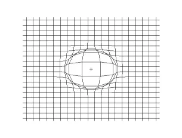
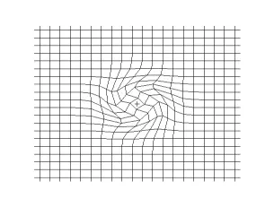
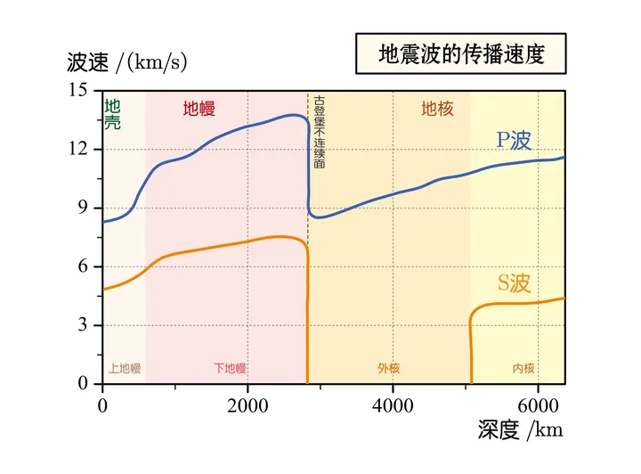

# 彈性力學實例：彈性體中的波

## 內文
1. [[彈性力學實例：彈性體中的波/ChatGPT 對於水中聲速的計算|扁平]]
2. 對彈性體動力學方程 $\rho\frac{\partial^2 \vec u}{(\partial t)^2}=\mu\nabla^2 \vec u + (\lambda + \mu) \nabla \delta + \overline f$ 兩邊同時取散度 & 旋度，並假設此彈性體為無外力狀態（$\overline f = 0$）可得：
   $\begin{cases}\rho\frac{\partial^2 }{(\partial t)^2} (\nabla \cdot \vec u) =\mu\nabla^2 (\nabla \cdot \vec u) + (\lambda + \mu) \nabla^2 \delta \\ \rho\frac{\partial^2 }{(\partial t)^2} (\nabla \times \vec u)=\mu\nabla^2 (\nabla \times \vec u) \end{cases}$
3. 已知 $\nabla \cdot \vec u = \delta$；設 $\nabla \times \vec u = \Phi$ 並將兩個都帶入 ⇒
   $\begin{cases}\rho\frac{\partial^2  \delta }{(\partial t)^2}=\mu\nabla^2  \delta  + (\lambda + \mu) \nabla^2 \delta =  (\lambda + 2\mu) \nabla^2 \delta\\ \rho\frac{\partial^2 \Phi}{(\partial t)^2}=\mu\nabla^2 \Phi \end{cases}$ ⇒ 發現兩個波動方程
4. 這兩個波動方程，其實相當於把 $\vec u(\vec r,t) = \vec Acos(\vec k\cdot \vec r - \omega t + \theta_0)$ 此方程式取散度 & 旋度 ⇒
   $$
   \begin{cases}\delta(\vec r,t) = \nabla \cdot  \vec u(\vec r,t) = (\vec k \cdot \vec A)cos(\vec k\cdot \vec r - \omega t + \theta_0)\\ \Phi(\vec r,t) = \nabla \times  \vec u(\vec r,t) = (\vec k \times \vec A)cos(\vec k\cdot \vec r - \omega t + \theta_0)\end{cases}
   $$
5. 第一條波動方程：$\begin{cases}\rho\frac{\partial^2 \delta }{(\partial t)^2}= (\lambda + 2\mu) \nabla^2 \delta\\ \delta(\vec r,t) = (\vec k \cdot \vec A)cos(\vec k\cdot \vec r - \omega t + \theta_0)\end{cases}$
   1. 體應變 $\delta$ 的振幅為 $\vec k \cdot \vec A$
      ⇒ 代表唯有當波數 $\vec k$ 平行於 $\vec u$ 的振幅 $\vec A$ 時才有波動，即此波為**<u>縱波 (疏密波、p 波)</u>**
   2. 波速為 $v_p = \sqrt{\frac{\lambda + 2\mu}{\rho}} = \sqrt{\frac{K+ \frac{4}{3}G}{\rho}}$
   3. 動畫示意圖如下
      
6. 第二條波動方程：$\begin{cases}\rho\frac{\partial^2 \Phi}{(\partial t)^2}=\mu\nabla^2 \Phi \\ \Phi(\vec r,t) = (\vec k \times \vec A)cos(\vec k\cdot \vec r - \omega t + \theta_0)\end{cases}$
   1. $\Phi$ 的振幅為 $\vec k \times \vec A$
      ⇒ 代表唯有當波數 $\vec k$ 垂直於 $\vec u$ 的振幅 $\vec A$ 時才有波動，即此波為**<u>橫波 (剪切波、s 波)</u>**
   2. 波速為 $v_s = \sqrt{\frac{\mu}{\rho}} = \sqrt{\frac{G}{\rho}}$
   3. 動畫示意圖如下
      
7. 可以看出 p 波 (縱波) 波速大於 s 波 (橫波)
8. **<u>在流體中</u>** $G = 0$ **<u>，因此流體中縱波波速為</u>**$\sqrt{\frac{K}{\rho}}$ **<u>且無橫波</u>**
9. 地震波：p 波波速大於 s 波，且外核無 s 波
   
