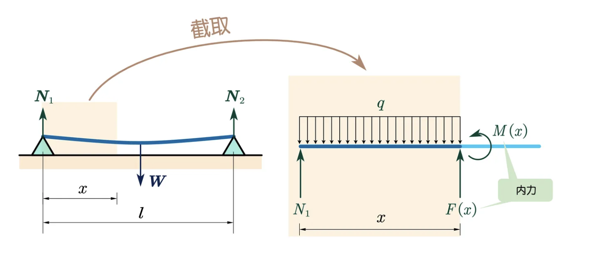

# 彈性力學實例：柱的扭轉 & 梁的彎曲

## 內文
### 薄壁圓筒

### 實心圓柱

### 梁的彎曲

- 已知此梁長度為 $l$，受到的總重力 $W_0 = mg$，假設梁的兩側支撐點均只提供向上的支撐力 N，即 $N_1 = N_2 = \frac{W_0}{2}$，並假設此梁的截面是矩形 (寬 $=b$，高 $=h$)
  1. 注意此梁受的的重力 W 並非集中於一點，而是均勻分散於整條梁
  2. 假設此梁因為長度遠大於截面寬度，因此梁的形變主要是因為彎曲而非剪切
- [[彈性力學實例：柱的扭轉 & 梁的彎曲/第一步：寫出彎矩 M(x) 方程式，即梁上每個點的彎矩|扁平]]
- [[彈性力學實例：柱的扭轉 & 梁的彎曲/第二步：寫出彎矩 M(x) 與形變(曲率 rho (x))的關係 rho(x)=frac EIzM|扁平]]
- [[彈性力學實例：柱的扭轉 & 梁的彎曲/第三步：推得形變方程式 w(x)|扁平]]
- [[彈性力學實例：柱的扭轉 & 梁的彎曲/補充：彎矩 M(x) 是什麼|扁平]]
- [[彈性力學實例：柱的扭轉 & 梁的彎曲/補充：慣性矩 Iz 是什麼|扁平]]

### 總結

1. 如何防止變形與斷裂：增加抗彎剛度 & 抗扭剛度
2. 抗彎剛度：$EI_z$，即彈性模數 $E$ & 慣性矩 $I_z =\int_A y^2 d A(y)$
   1. 越遠離中性層的材料，慣性矩越強 ⇒ 工字鋼抗彎剛度很高（但抗扭很差）
