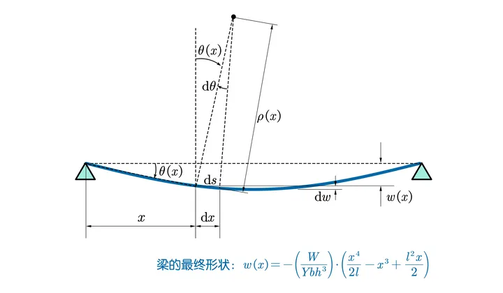

# 第三步：推得形變方程式 $w(x)$

## 內文

1. 曲率與形變的關係：定義變形後梁的軸線與原本水平位置的距離為 $w(x)$（向上為正），稱為**<u>撓度</u>**。
2. 在小撓度的情形下 $\begin{cases}\frac{dw(x)}{dx} = tan(\theta) \approx \theta(x) \\ \frac{d \theta(x)}{dx} = \frac{1}{\rho(x)} \end{cases}$，即 $\frac{1}{\rho(x)}$ 是 $w(x)$ 的二次微分
3. 將已知的 $\rho(x)、M(x)、I_z$ 代入：
   $w(x) = \int \int \frac{1}{\rho(x)} dx dx  = \int \int\frac{M(x) }{EI_z}dx dx = \int \int \frac{12 }{Ebh^3}\frac{W_0x}{2}(1-\frac{x}{l}) dx dx  \\= \int \int \frac{6 W_0}{Ebh^3l}(lx-x^2) dx dx  = \frac{6 W_0}{Ebh^3l} (\frac{l}{6}x^3 - \frac{1}{12}x^4 + C_1x + C_2)$
4. 利用邊界條件 $w(0) = w(l) = 0$ 可以算出 $\begin{cases}C_1 =-\frac{l^3}{12} \\ C_2 =0 \end{cases}$ 代入
   $$
   ⇒ w(x) = \frac{ W_0}{2Ebh^3l} (- x^4 + 2lx^3  - l^3x )
   $$
   此即為此梁的圖形方程式
