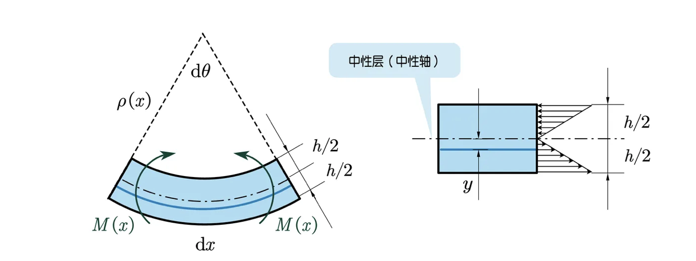

# 第二步：寫出彎矩 $M(x)$ 與形變(曲率 $\rho (x)$)的關係 $\rho(x)=\frac {EI_z}{M(x) }$$$

## 內文

1. 如上圖在切面處 (距左支撐點 $x$ 處) 切一小段梁出來分析，其長度 $dx$ ，曲率半徑 $\rho (x)$，對應的圓心角 $d\theta = \frac{dx}{\rho(x)}$，作用在其上的彎矩 $M(x) = M_彎(x)$
   - 彎矩 $M(x)$會讓小段梁的右側逆時針旋轉，而彎矩 $M(x-dx)$會讓小段梁的左側順時針旋轉 (這部分會跟左邊隔壁小段梁的右邊抵銷) 。不過因為 $dx$ 很小，因此可以先當做 $M(x-dx) \approx M(x)$
   - 因為彎矩不會串聯變大，所以 $dx$ 切多短都沒差
2. 梁的彎矩是由上半層梁的壓縮 + 下半層梁的拉伸所提供
   ⇒ 可以找到一個**<u>中性層</u>**，即剛好不壓縮也不拉伸的那層 (會通過質心，因此就在正中間)。此時可以定義其他橫截面的位置為其到中性層的距離 $y$（向下為正）
3. 對於每層橫截面 $dy$，都可以算出其提供的彎矩 $dM$（以中性層為支點）：
   $d\vec M(y) = d\vec F \times \vec y = [\sigma d  A(y)] y  =E\epsilon y  d A(y) = \frac{E}{\rho(x)}  y^2 d A(y)$
   - $dM(y)$ （前後）方向與 $d\vec F$（左右） 、 $\vec y$ （上下）均垂直
   - 注意此處 $d \vec A$ 為深藍色部分的豎截面( y-z 平面)，即 $d \vec A = b(y)dy = bdy$
   - 根據虎克定律，$\sigma= E\epsilon$
   - 中性層長度為 $dx =\rho(x) d\theta$ ⇒ 因此 $\epsilon (x,y) = \frac{\Delta(dx)}{dx}=\frac{yd\theta}{\rho(x) d\theta} = \frac{y}{\rho(x)}$
4. 定義**<u>慣性矩</u>** $I_z =\int_A y^2 d A(y)$ ⇒ 整個小段梁的彎矩與曲率的關係如下：
   $$
   M(x) = \int \frac{E}{\rho(x)}  y^2 d A = \frac{EI_z}{\rho(x)} =\frac {Ebh^3}{12\rho(x)}
   $$
   - 此例中梁的截面為矩形， $I_z =\int_{y=-h/2}^{y=h/2} y^2 d A = \int_{y=-h/2}^{y=h/2} by^2 d y =\frac{bh^3}{12}$
   - 詳情見<u>補充：慣性矩是什麼</u>
5. 總結：前述公式可以寫成 $\rho(x)=\frac {EI_z}{M(x) }$，即
   1. 彎矩 $M(x)$ 越大的地方，曲率半徑 $\rho(x)$ 越小（即越彎）
   2. **<u>抗彎剛度</u>** $EI_z$ 越大的地方，曲率半徑越大（越不彎）
