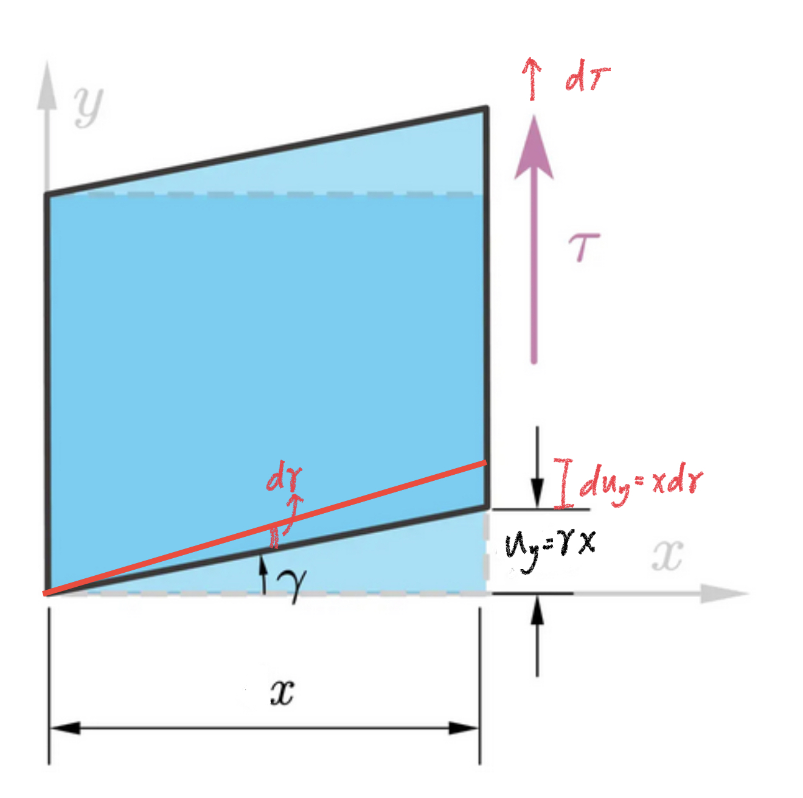
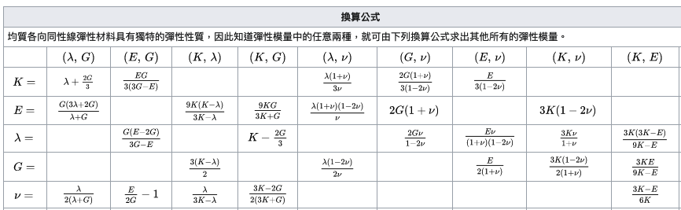

# 彈性模數、廣義虎克定律、彈力位能

## 內文
### 彈性模數

材料的基本性質

1. **<u>楊氏模量 E</u>** ：$E = \frac{\sigma}{\epsilon} = \frac{\sigma_x}{\epsilon_x} = \frac{\sigma_y}{\epsilon_y}= \frac{\sigma_z}{\epsilon_z}$ ，即微觀下的虎克定律，正應力與正應變成正比
2. **<u>剪切模量 G</u>** (與 $\lambda$ 一起出現時寫成 $\mu$ ，稱為第二拉密模量)：$G = \frac{\tau}{\gamma}= \frac{\tau_{xy}}{\gamma_{xy}}= \frac{\tau_{xz}}{\gamma_{xz}}= \frac{\tau_{yz}}{\gamma_{yz}}$ ，即剪切虎克定律，剪應力與剪應變成正比
3. **<u>泊松比</u>** $\nu$： $\nu = -\frac{\epsilon'}{\epsilon}$，即對質元的一個面施力產生應變 $\epsilon$，其餘面也均會有應變 $\epsilon '$
4. **<u>體積模量 K</u>**：$K = \frac{\sigma_m}{\delta} = -V\frac{\partial p}{\partial V}$，可以想像成 ( 1 / 壓縮率 )
5. **<u>第一拉密模量</u>** $\lambda$ ：$\lambda = \frac{E\nu}{(1-2\nu)(1+\nu)}$ ，用參數組成的參數，後面會用到

### 應力與應變的關係 part 1：多重作用力

當作用在物體上的應力來自於 $\vec x、\vec y、\vec z$ 三個方向時，物體的應變就會同時受這三個應力影響（統一定義應力、應變向外均為正）：

1. 以應變表示應力：
   $$
   \begin{cases} \epsilon_x =  \frac{\sigma_x}{E} - \nu \frac{\sigma_y}{E} - \nu \frac{\sigma_z}{E} =  \frac{1+\nu}{E}\sigma_x - \frac{\nu}{E}(\sigma_x+\sigma_y+\sigma_z) = \frac{1+\nu}{E}\sigma_x  - \frac{\nu}{1-2\nu}(\epsilon_x+\epsilon_y+\epsilon_z) \\ \epsilon_y =  \frac{\sigma_y}{E} - \nu \frac{\sigma_x}{E} - \nu \frac{\sigma_z}{E} =  \frac{1+\nu}{E}\sigma_y - \frac{\nu}{E}(\sigma_x+\sigma_y+\sigma_z)= \frac{1+\nu}{E}\sigma_y  - \frac{\nu}{1-2\nu}(\epsilon_x+\epsilon_y+\epsilon_z) \\ \epsilon_z =  \frac{\sigma_z}{E} - \nu \frac{\sigma_x}{E} - \nu \frac{\sigma_y}{E} =  \frac{1+\nu}{E}\sigma_z - \frac{\nu}{E}(\sigma_x+\sigma_y+\sigma_z)= \frac{1+\nu}{E}\sigma_z  - \frac{\nu}{1-2\nu}(\epsilon_x+\epsilon_y+\epsilon_z)\end{cases}
   $$

   [[彈性模數、廣義虎克定律、彈力位能/此處用到 epsilonx+epsilony+epsilonz = frac1-2nuE|摘要]]
2. 以應力表示應變：
   $$
   \begin{cases} \sigma_x =   \frac{E\nu}{(1-2\nu)(1+\nu)}(\epsilon_x + \epsilon_y+\epsilon_z) + \frac{E}{1+\nu}\epsilon_x =\lambda \delta +  2\mu \epsilon_x \\ \sigma_y =   \frac{E\nu}{(1-2\nu)(1+\nu)}(\epsilon_x + \epsilon_y+\epsilon_z) + \frac{E}{1+\nu}\epsilon_y =\lambda \delta +  2\mu \epsilon_y \\ \sigma_z =   \frac{E\nu}{(1-2\nu)(1+\nu)}(\epsilon_x + \epsilon_y+\epsilon_z) + \frac{E}{1+\nu}\epsilon_z =\lambda \delta +  2\mu \epsilon_z \end{cases}
   $$
   - 此處用到 $G(=\mu) = \frac{E}{2(1+\nu)}$ （見下方彈性模數之間的關係）

### 應力與應變的關係 part 2：廣義虎克定律

應力張量 $\overleftrightarrow \sigma = \begin{bmatrix} \sigma_x & \tau_{xy} & \tau_{xz}\\ \tau_{yx} & \sigma_y & \tau_{yz}\\ \tau_{zx} & \tau_{zy} & \sigma_z \end{bmatrix}$，應變張量 $\overleftrightarrow e = \begin{bmatrix} \epsilon_x & \frac{1}{2}\gamma_{xy} & \frac{1}{2}\gamma_{xz} \\ \frac{1}{2}\gamma_{yx} & \epsilon_y & \frac{1}{2}\gamma_{yz} \\ \frac{1}{2}\gamma_{zx} & \frac{1}{2} \gamma_{zy} & \epsilon_z \end{bmatrix}$

而兩者之間的關係 $\overleftrightarrow \sigma = \overleftrightarrow C \overleftrightarrow e$ 或 $\overleftrightarrow e = \overleftrightarrow S \overleftrightarrow \sigma$ 即為 **<u>廣義虎克定律</u>**

又因為 $\overleftrightarrow \sigma 、\overleftrightarrow e$ 均為二階張量，因此 $\overleftrightarrow C$ 是四階張量：可以寫為以下幾種形式

$$
\begin{bmatrix}
\epsilon_x \\
\epsilon_y \\
\epsilon_z \\
\frac{1}{2}\gamma_{xy}  \\
\frac{1}{2}\gamma_{yz} \\
\frac{1}{2}\gamma_{xz} \\
\end{bmatrix} = \begin{bmatrix}
\frac{1}{E} & \frac{-\nu}{E} & \frac{-\nu}{E} & 0 & 0 & 0 \\
\frac{-\nu}{E} & \frac{1}{E} & -\frac{-\nu}{E} & 0 & 0 & 0 \\
\frac{-\nu}{E} & \frac{-\nu}{E} & \frac{1}{E} & 0 & 0 & 0 \\
0&0&0&\frac{1}{2G}&0&0  \\
0&0&0&0&\frac{1}{2G}&0 \\
0&0&0&0&0&\frac{1}{2G} \\
\end{bmatrix}\   \begin{bmatrix}
 \sigma_x \\
 \sigma_y\\
 \sigma_z\\
\tau_{xy} \\
\tau_{xz}\\
\tau_{yz}\\
\end{bmatrix}
$$

$$
\begin{bmatrix}
 \sigma_x \\
 \sigma_y\\
 \sigma_z\\
\tau_{xy} \\
\tau_{xz}\\
\tau_{yz}\\
\end{bmatrix} = \begin{bmatrix}
2\mu+\lambda & \lambda & \lambda & 0 & 0 & 0 \\
\lambda & 2\mu+\lambda & \lambda & 0 & 0 & 0 \\
\lambda & \lambda & 2\mu+\lambda & 0 & 0 & 0 \\
0&0&0&2\mu&0&0  \\
0&0&0&0&2\mu&0 \\
0&0&0&0&0&2\mu \\
\end{bmatrix}\   \begin{bmatrix}
\epsilon_x \\
\epsilon_y \\
\epsilon_z \\
\frac{1}{2}\gamma_{xy}  \\
\frac{1}{2}\gamma_{yz} \\
\frac{1}{2}\gamma_{xz} \\
\end{bmatrix}
$$

$$
\begin{bmatrix}
 \sigma_x & \tau_{xy} & \tau_{xz}\\
\tau_{yx} &  \sigma_y & \tau_{yz}\\
\tau_{zx} & \tau_{zy} &  \sigma_z
\end{bmatrix} = 2\mu\begin{bmatrix}
\epsilon_x & \frac{1}{2}\gamma_{xy} & \frac{1}{2}\gamma_{xz} \\
\frac{1}{2}\gamma_{yx}  &  \epsilon_y & \frac{1}{2}\gamma_{yz} \\
\frac{1}{2}\gamma_{zx}  & \frac{1}{2} \gamma_{zy} &  \epsilon_z
\end{bmatrix} + \lambda \delta I
$$

- 只有在**<u>各向同性</u>**材料中才有這麼漂亮的虎克定律，不然它會是一個 $6 \times 6 = 36$ 個未知數的大矩陣

### 彈力位能

1. 正彈力位能（以 $\vec x$ 方向位移 $u_x$ 為例）：因為正位移 $u_x = l_x\epsilon_x$ ⇒
   $U = \frac{1}{2}kx^2 = \frac{1}{2}(\frac{F}{l_x\epsilon_x})(l_x\epsilon_x)^2 = \frac{1}{2}(\frac{\sigma_x A_{yz}}{l_x\epsilon_x})(l_x\epsilon_x)^2 = \frac{1}{2}(\frac{E A_{yz}}{l_x})(l\epsilon_x)^2  \\=\frac{1}{2}E \epsilon_x^2  l_xA_{yz}=\frac{1}{2}E \epsilon_x^2 V$
   - 也可以從頭推：$W = \int Fds = \int (\sigma_x A_{yz})(l_xd\epsilon_x) = V\int E \epsilon_xd\epsilon_x$
2. 正彈力位能密度：$\overline U = \frac{1}{2}E \epsilon_x^2 = \frac{1}{2}\sigma_x \epsilon_x = \frac{\sigma_x^2}{2E}$
3. 切彈力位能（以平面 $yx$ 往 $\vec y$ 方向位移 $u_y$ 為例）：因為沒有 $U = \frac{1}{2}kx^2$ 這麼棒的公式，所以只能從頭推起 ⇒ $W = \int Fds = \int (\tau_{xy} A_{yz} )(du_y) = \int (\tau_{xy} A_{yz} )(l_xd\gamma_{xy})$
   
4. 切彈力位能密度：$\overline W = \int \tau_{xy} d\gamma_{xy} = \frac{1}{2}\tau_{xy} \gamma_{xy} = \frac{1}{2}G \gamma_{xy}^2 = \frac{\tau_{xy} ^2}{2G}$
5. **<u>總彈力位能密度</u>**：
   $$
   \overline U = \frac{1}{2}\sigma_x \epsilon_x + \frac{1}{2}\sigma_y \epsilon_y + \frac{1}{2}\sigma_z \epsilon_z + \frac{1}{2}\tau_{xy} \gamma_{xy} + \frac{1}{2}\tau_{yz} \gamma_{yz} + \frac{1}{2}\tau_{xz} \gamma_{xz} \\= \frac{1}{2E}[\sigma_x^2 + \sigma_y^2+\sigma_z^2-2\nu(\sigma_x\sigma_y + \sigma_y\sigma_z + \sigma_x\sigma_z)] \\+ \frac{1}{2G}(\tau_{xy}^2 + \tau_{zy}^2 + \tau_{xz}^2   ) \\=\frac{1}{2}\lambda\delta^2+\mu(\epsilon_x^2+\epsilon_y^2+\epsilon_z^2 + \frac{\gamma_{xy}^2}{2}+ \frac{\gamma_{yz}^2}{2}+ \frac{\gamma_{xz}^2}{2})
   $$
   - 此處用到 $\epsilon_x = \frac{1}{E} (\sigma_x- \nu \sigma_y- \nu \sigma_z)$ 、 $\sigma_x =\lambda \delta + 2\mu \epsilon_x$ 、 $G =\mu$

### 彈性模數之間的關係

彈性模數總共只有**<u>兩個</u>**自由度，即任何彈性模數都可以用另外兩個任意彈性模數組合出來

- [[彈性模數、廣義虎克定律、彈力位能/K、nu、E 的關係：K = fracE3(1-2nu)|扁平]]
- [[彈性模數、廣義虎克定律、彈力位能/G、nu、E 的關係：G = fracE2(1+nu)|扁平]]
- $\lambda、\nu、E$ 的關係：$\lambda = \frac{E\nu}{(1-2\nu)(1+\nu)}$ （這是定義）
