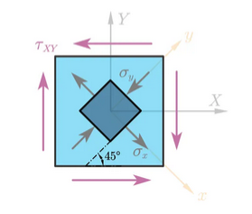

# $G、\nu、E$ 的關係：$G = \frac{E}{2(1+\nu)}$

## 內文

1. 對於上圖的淺藍色質元而言，只受到純粹的剪應力 $\tau_{xy}$
   ⇒ 其彈力位能密度 $\overline U = \frac{1}{2G}\tau_{xy} ^2$
2. 然而若是改取深藍色方塊為新質元（改變切割方式），則新質元應力矩陣應為
   $$
   \begin{bmatrix}
 \sigma_x & \tau_{xy} \\
\tau_{yx} &  \sigma_y
\end{bmatrix}_新 = \begin{bmatrix}
 cos(\frac{\pi}{4}) &  sin(\frac{\pi}{4}) \\
 -sin(\frac{\pi}{4}) &   cos(\frac{\pi}{4})
\end{bmatrix} \begin{bmatrix}
 \sigma_x & \tau_{xy} \\
\tau_{yx} &  \sigma_y \\
\end{bmatrix}_舊 \begin{bmatrix}
 cos(\frac{\pi}{4}) &  -sin(\frac{\pi}{4}) \\
 sin(\frac{\pi}{4}) &   cos(\frac{\pi}{4})
\end{bmatrix} = \begin{bmatrix}
 \frac{\sqrt{2}}{2} &  \frac{\sqrt{2}}{2} \\
 -\frac{\sqrt{2}}{2} &   \frac{\sqrt{2}}{2}
\end{bmatrix} \begin{bmatrix}
 \sigma_x & \tau_{xy} \\
\tau_{yx} &  \sigma_y \\
\end{bmatrix}_舊 \begin{bmatrix}
\frac{\sqrt{2}}{2} &  -\frac{\sqrt{2}}{2} \\
\frac{\sqrt{2}}{2} &   \frac{\sqrt{2}}{2}
\end{bmatrix} =  \begin{bmatrix}
\tau_{xy} & 0 \\
0 &  -\tau_{xy}
\end{bmatrix}_舊
   $$
   即新 $\sigma_x = \tau_{xy舊}$ ，新 $\sigma_y = -\tau_{xy舊}$ ，新 $\tau_{xy}=0$
   ⇒ 其彈力位能密度 $\overline U = \frac{1}{2E}(\sigma_x^2 + \sigma_y^2-2\nu\sigma_x\sigma_y ) = \frac{1+\nu}{E}\tau_{xy} ^2$
3. 兩種取質元的方式應該算出相同的彈力位能密度 ⇒ $\frac{1}{2G}\tau_{xy} ^2 = \frac{1+\nu}{E}\tau_{xy} ^2$
   ⇒ $G = \frac{E}{2(1+\nu)}$
