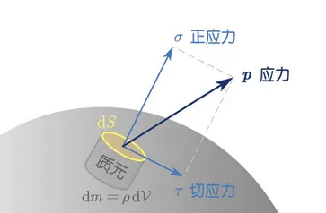
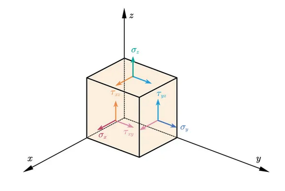

# 應力

## 內文
對於單一微小質元的某個面 $\vec A$ 而言，會受到 $\vec F$ 的力，此時可以定義應力 $\sigma$ 使 $\vec F = \sigma * \vec A$ (因為是微小質元因此一般寫作 $d\vec F =\sigma * d\vec A$ )

其中應力 $\sigma$ 又可以分成與 $\vec A$ 垂直的正應力 $\sigma$ ，以及與 $\vec A$ 平行的切應力 $\tau$

如果質元取的是正立方體，則可畫出應力圖如下

1. **<u>正應力</u>** $\sigma$：三維空間中有三個，分別為 $\sigma_x、\sigma_y、\sigma_z$
   - **<u>平均應力</u>** $\sigma_m$： $\sigma_m = \frac{1}{3}(\sigma_x+\sigma_y+\sigma_z)$，又稱淨水壓 (hydrostatic pressure)
2. **<u>切應力</u>** $\tau$：三維空間中有六個，分別為 $\tau_{xy}、\tau_{xz}、\tau_{yx}、\tau_{yz}、\tau_{zx}、\tau_{zy}$，但因為質元力矩平衡，因此 $\tau_{xy}=\tau_{yx}、\tau_{xz}=\tau_{zx}、\tau_{yz}=\tau_{zy}$
   - 如果取轉動軸平行 y 軸且通過質點中心，何謂造成力矩的只有 $\tau_{xz}$ & $\tau_{zx}$，因此兩者必定大小相等且方向相對
3. **<u>應力張量</u>** $\overleftrightarrow \sigma$ ：事實上，因為 $\vec F = \overleftrightarrow \sigma * \vec A$ ，因此 $\sigma$ 其實是一個二階張量，即
   $$
   \overleftrightarrow \sigma =  \begin{bmatrix}
 \sigma_x & \tau_{xy} & \tau_{xz}\\
\tau_{yx} &  \sigma_y & \tau_{yz}\\
\tau_{zx} & \tau_{zy} &  \sigma_z
\end{bmatrix}
   $$
   既然可以寫成實對稱矩陣形式，那就可以找到應力主軸作為新座標軸，使新應力張量 $\overleftrightarrow \sigma = \begin{bmatrix} \sigma_x & 0 & 0\\ 0 & \sigma_y & 0\\ 0 & 0 & \sigma_z \end{bmatrix}$

   [[應力/應力分析就是線性代數|摘要]]
