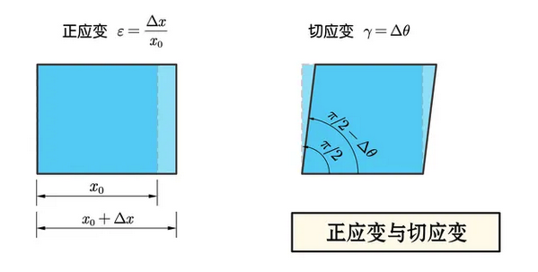
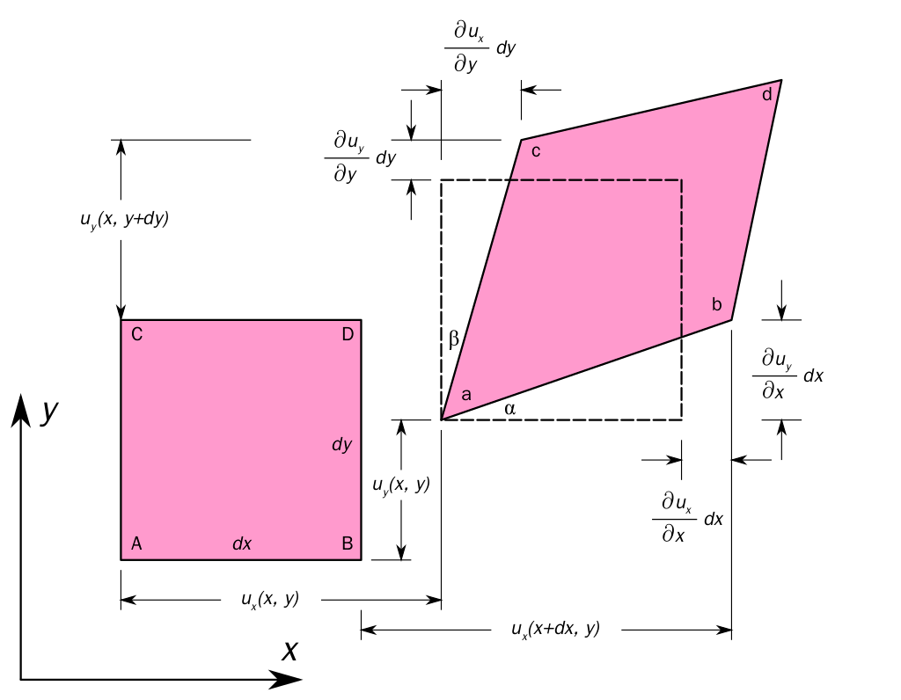

# 應變

## 內文
對於單一微小質元 m 而言，因為受力而產生的形變即稱為應變，定義應變 e 使 $e = \frac{\vec l'-\vec l}{\vec l} = \frac{\Delta \vec l}{\vec l}$ ，若定義 $\vec u = \vec l'-\vec l = \Delta \vec l$ ，則 $\vec u = e * \vec l$

其中座標軸方向將 $\vec l$ 分解成 $\vec l = \vec x + \vec y + \vec z$，因此應變 e 也可以分成與 $\vec x、\vec y、\vec z$ 平行的正應變 $\epsilon$ ，以及與 $\vec x、\vec y、\vec z$ 垂直的切應變 $\gamma$

1. **<u>正應變</u>** $\epsilon$：三維空間中有三個，分別為 $\epsilon_x、\epsilon_y、\epsilon_z$，其中 $\epsilon_x = \frac{\Delta l_x}{l_x} = \frac{\partial u_x}{\partial x}$，另外兩個以此類推
2. **<u>切應變</u>** $\gamma$：三維空間中有六個，分別為 $\gamma_{xy}、\gamma_{xz}、\gamma_{yx}、\gamma_{yz}、\gamma_{zx}、\gamma_{zy}$，又因為 x軸與 y 軸夾角即為 y 軸與 x 軸夾角，因此 $\gamma_{xy}=\gamma_{yx}、\gamma_{xz}=\gamma_{zx}、\gamma_{yz}=\gamma_{zy}$
   其中 $\gamma_{xy} = \angle \theta =\angle \alpha + \angle \beta =  \frac{\partial u_y}{\partial x} + \frac{\partial u_x}{\partial y}$
   
3. **<u>體應變</u>** $\delta$：定義 $\delta = \frac{\Delta V}{V} = \frac{V'- V}{V}$，又因為 $V'= V(1+\epsilon_x)(1+\epsilon_y)(1+\epsilon_z)$
   ⇒ $\delta = \epsilon_x+\epsilon_y+\epsilon_z =  \frac{\partial u_x}{\partial x} + \frac{\partial u_y}{\partial y}+ \frac{\partial u_z}{\partial z} = \nabla \cdot \vec u$
4. **<u>應變張量</u>** $\overleftrightarrow e$：看起來應該要等於 $\begin{bmatrix} \epsilon_x & \gamma_{xy} & \gamma_{xz}\\ \gamma_{yx} & \epsilon_y & \gamma_{yz}\\ \gamma_{zx} & \gamma_{zy} & \epsilon_z \end{bmatrix}$，但是這樣不符合張量的運算規則，因此真正的應變張量為
   $$
   \overleftrightarrow e =  \begin{bmatrix}
\epsilon_x & \frac{1}{2}\gamma_{xy} & \frac{1}{2}\gamma_{xz} \\
\frac{1}{2}\gamma_{yx}  &  \epsilon_y & \frac{1}{2}\gamma_{yz} \\
\frac{1}{2}\gamma_{zx}  & \frac{1}{2} \gamma_{zy} &  \epsilon_z
\end{bmatrix} = \begin{bmatrix}
\frac{\partial u_x}{\partial x} & \frac{1}{2}(\frac{\partial u_y}{\partial x} + \frac{\partial u_x}{\partial y}) & \frac{1}{2}(\frac{\partial u_z}{\partial x} + \frac{\partial u_x}{\partial z}) \\
\frac{1}{2}(\frac{\partial u_x}{\partial y} + \frac{\partial u_y}{\partial x} ) &  \frac{\partial u_y}{\partial y} & \frac{1}{2}(\frac{\partial u_z}{\partial y} + \frac{\partial u_y}{\partial z}) \\
\frac{1}{2}(\frac{\partial u_x}{\partial z} + \frac{\partial u_z}{\partial x})  & \frac{1}{2} (\frac{\partial u_y}{\partial z} + \frac{\partial u_z}{\partial y})&  \frac{\partial u_z}{\partial z}
\end{bmatrix}
   $$
   而這個張量可以使 $(\vec l')^2-(\vec l)^2 = \vec l  \ \overleftrightarrow e \ \vec l$ （乘開來就知道）

   [[應變/張量的運算規則 (待讀)，即沒有除以二的矩陣為工程應變，而 overleftrightarrow|摘要]]
