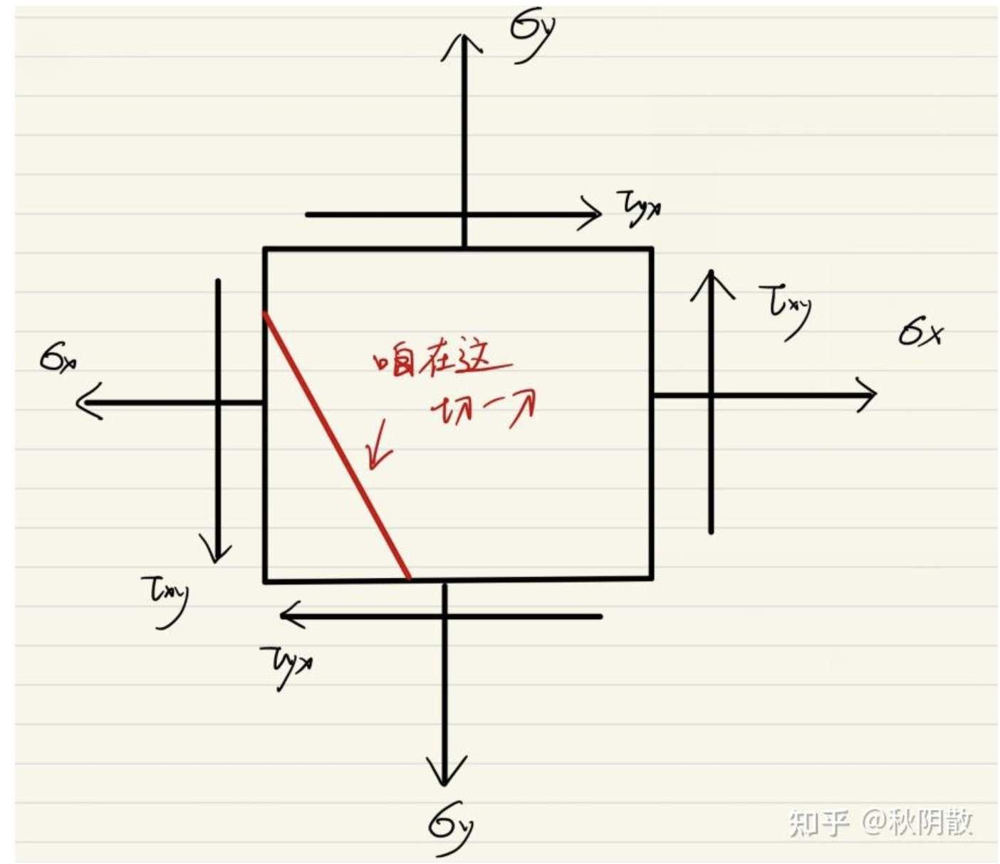
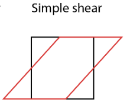
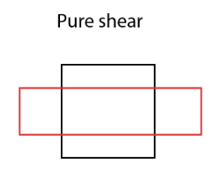

# 應力與應變的張量分析

## 內文
### 應力張量的座標轉換

（以二階為例）

1. 對於應力張量 $\overleftrightarrow \sigma = \begin{bmatrix} \sigma_x & \tau_{xy} \\ \tau_{xy} & \sigma_y \\ \end{bmatrix}$ 而言，如果應力狀態不動，而旋轉座標系 $\theta$ 度，則新座標系的應力張量應為
   $$
   \overleftrightarrow \sigma_{新} =  \begin{bmatrix}
 cos(\theta) &  sin(\theta) \\
 -sin(\theta) &   cos(\theta)
\end{bmatrix} \begin{bmatrix}
 \sigma_x & \tau_{xy} \\
\tau_{xy} &  \sigma_y \\
\end{bmatrix}_舊 \begin{bmatrix}
 cos(\theta) &  -sin(\theta) \\
 sin(\theta) &   cos(\theta)
\end{bmatrix}
   $$
   即 $\overleftrightarrow \sigma_{新}   ＝R^{-1}\overleftrightarrow \sigma_{舊}R$， 其中旋轉矩陣 $R = \begin{bmatrix} cos(\theta) & -sin(\theta) \\ sin(\theta) & cos(\theta) \end{bmatrix}$
   - 知乎：[https://zhuanlan.zhihu.com/p/433004507](https://zhuanlan.zhihu.com/p/433004507) （不要用奇怪的兩倍角）
2. 如果物體在某直角座標系中發現所有剪應力消失（$\tau =0$），則此時的座標軸方向稱為**<u>主應力方向</u>**。如何找出主應力方向？⇒ 找出**<u>特徵值 & 特徵向量</u>**即可對角化矩陣
   - 若為二階應力張量則會發現此時 $\sigma_x、\sigma_y$ 一個為應力最大值，另一個為最小值

   [[應力與應變的張量分析/beginbmatrix sigmax & tauxy tauxy & sigmay|摘要]]
   - 用特徵值算出特徵向量 ⇒ 再用特徵向量算出主應力方向
     
   - 如果不旋轉座標系，而是在質元中間斜切一刀（如上圖所示），則如果切出來的平面與主應力方向平行或垂直，稱此平面為**<u>主平面</u>**：此平面上不會有切應力

### 應力張量的分析

1. 由上可知，應力張量 $\overleftrightarrow \sigma = \begin{bmatrix} \sigma_x & \tau_{xy} & \tau_{xz}\\ \tau_{yx} & \sigma_y & \tau_{yz}\\ \tau_{zx} & \tau_{zy} & \sigma_z \end{bmatrix}$ 可以隨座標系統轉換，因此不可以稱 $\tau$ 為純偏應力，$\sigma_x、\sigma_y、\sigma_z$ 為純正應力（不然旋轉一下就會變化）
2. 真正的純正應力 (hydrostatic stress) 是 $\sigma_m = \frac{1}{3}(\sigma_x+\sigma_y+\sigma_z)$ ，即平均應力
3. 真正的偏應力 (deviatoric stress) 是$\begin{bmatrix} \sigma_x - \sigma_m & \tau_{xy} & \tau_{xz}\\ \tau_{yx} & \sigma_y- \sigma_m & \tau_{yz}\\ \tau_{zx} & \tau_{zy} & \sigma_z- \sigma_m \end{bmatrix}$
4. 即 **<u>應力張量</u>** $\overleftrightarrow \sigma$ **<u>= 純正應力 + 純剪應力</u>**

$\begin{bmatrix} \sigma_x & \tau_{xy} & \tau_{xz}\\ \tau_{yx} & \sigma_y & \tau_{yz}\\ \tau_{zx} & \tau_{zy} & \sigma_z \end{bmatrix} = \begin{bmatrix} \sigma_m & 0 & 0\\ 0 & \sigma_m & 0\\ 0 & 0 & \sigma_m \end{bmatrix} + \begin{bmatrix} \sigma_x - \sigma_m & \tau_{xy} & \tau_{xz}\\ \tau_{yx} & \sigma_y- \sigma_m & \tau_{yz}\\ \tau_{zx} & \tau_{zy} & \sigma_z- \sigma_m \end{bmatrix}$

[[應力與應變的張量分析/圖示|摘要]]

### 應變張量的分析

1. 同理，應變張量 $\overleftrightarrow e = \begin{bmatrix} \epsilon_x & \frac{1}{2}\gamma_{xy} & \frac{1}{2}\gamma_{xz} \\ \frac{1}{2}\gamma_{yx} & \epsilon_y & \frac{1}{2}\gamma_{yz} \\ \frac{1}{2}\gamma_{zx} & \frac{1}{2} \gamma_{zy} & \epsilon_z \end{bmatrix}$ 也可以隨座標系統轉換
2. 真正的純正應變 (volumetric strain) 是 $\epsilon_m = \frac{1}{3}(\epsilon_x+\epsilon_y+\epsilon_z) = \frac{1}{3}\delta$
   - 即對**<u>體積改變</u>**有貢獻的部分
3. 真正的偏應變 (deviatoric strain) 是 $\begin{bmatrix} \epsilon_x - \epsilon_m & \frac{1}{2}\gamma_{xy} & \frac{1}{2}\gamma_{xz} \\ \frac{1}{2}\gamma_{yx} & \epsilon_y-\epsilon_m & \frac{1}{2}\gamma_{yz} \\ \frac{1}{2}\gamma_{zx} & \frac{1}{2} \gamma_{zy} & \epsilon_z-\epsilon_m \end{bmatrix}$
   - 即真正對**<u>形變</u>**有貢獻的部分
4. 即**<u>應變張量</u>** $\overleftrightarrow e$ **<u>= 純正應變 + 偏應變</u>**

$\begin{bmatrix} \epsilon_x & \frac{1}{2}\gamma_{xy} & \frac{1}{2}\gamma_{xz} \\ \frac{1}{2}\gamma_{yx} & \epsilon_y & \frac{1}{2}\gamma_{yz} \\ \frac{1}{2}\gamma_{zx} & \frac{1}{2} \gamma_{zy} & \epsilon_z \end{bmatrix} = \begin{bmatrix} \epsilon_m & 0 & 0\\ 0 & \epsilon_m & 0\\ 0 & 0 & \epsilon_m \end{bmatrix} + \begin{bmatrix} \epsilon_x - \epsilon_m & \frac{1}{2}\gamma_{xy} & \frac{1}{2}\gamma_{xz} \\ \frac{1}{2}\gamma_{yx} & \epsilon_y-\epsilon_m & \frac{1}{2}\gamma_{yz} \\ \frac{1}{2}\gamma_{zx} & \frac{1}{2} \gamma_{zy} & \epsilon_z-\epsilon_m \end{bmatrix}$

5. 偏應變又可以再分成簡單剪切 & 純剪切：
   $$
   \begin{bmatrix}
\epsilon_x - \epsilon_m  & \frac{1}{2}\gamma_{xy} & \frac{1}{2}\gamma_{xz} \\
\frac{1}{2}\gamma_{yx}  &  \epsilon_y-\epsilon_m  & \frac{1}{2}\gamma_{yz} \\
\frac{1}{2}\gamma_{zx}  & \frac{1}{2} \gamma_{zy} &  \epsilon_z-\epsilon_m
\end{bmatrix} \\= \begin{bmatrix}
0 & \frac{1}{2}\gamma_{xy} & 0 \\
\frac{1}{2}\gamma_{yx} & 0 & 0 \\
0 & 0 & 0
\end{bmatrix} + \begin{bmatrix}
0 & 0 & 0 \\
0 & 0 & \frac{1}{2}\gamma_{yz} \\
0 & \frac{1}{2} \gamma_{zy} & 0
\end{bmatrix} + \begin{bmatrix}
0 & 0 & \frac{1}{2}\gamma_{xz} \\
0 & 0 & 0 \\
\frac{1}{2}\gamma_{zx} & 0 & 0
\end{bmatrix} \\+ \begin{bmatrix}
\frac{\epsilon_x - \epsilon_y}{3} & 0 & 0 \\
0 & \frac{\epsilon_y - \epsilon_x}{3} & 0 \\
0 & 0 & 0
\end{bmatrix}+\begin{bmatrix}
0 & 0 & 0 \\
0 & \frac{\epsilon_y - \epsilon_z}{3} & 0 \\
0 & 0 & \frac{\epsilon_z - \epsilon_y}{3}
\end{bmatrix}+\begin{bmatrix}
\frac{\epsilon_z - \epsilon_x}{3} & 0 & 0 \\
0 & 0 & 0 \\
0 & 0 & \frac{\epsilon_x - \epsilon_z}{3}
\end{bmatrix}
   $$
   其中第二行稱為簡單剪切 (simple shear)，第三行稱為純剪切（pure shear）
   

   
6. [[應力與應變的張量分析/圖示 2|扁平]]

[[應力與應變的張量分析/應變張量與旋轉張量的關係|全文]]
