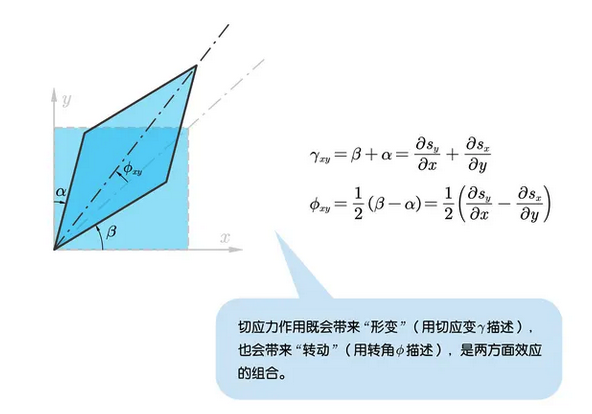

# 應變的運動學分析

## 內文
同 <u>應力 & 應變</u> 一節，$\vec u = \vec l'-\vec l$ 表示某兩個點的相對關係的變化

1. $\nabla \cdot \vec u$ 的意義：體應變 $\delta$（伸縮），見 <u>應力 & 應變</u> 中的 <u>體應變</u>
2. $\nabla \times \vec u$ 的意義：旋轉
   $\nabla \times \vec u = ( \frac{\partial u_z}{\partial y} - \frac{\partial u_y}{\partial z} )\hat{i} + ( \frac{\partial u_x}{\partial z} - \frac{\partial u_z}{\partial x} )\hat{j} + ( \frac{\partial u_y}{\partial x} - \frac{\partial u_x}{\partial y} )\hat{k}$
   
   其中 $\frac{\partial u_y}{\partial x} - \frac{\partial u_x}{\partial y} = \angle \beta - \angle \alpha = 2\phi_{xy} = 2\phi_{z}$，即 x-y 平面上，以 z 軸為軸心的旋轉
   $$
   ⇒ \nabla \times \vec u  =  ( \frac{\partial u_z}{\partial y} - \frac{\partial u_y}{\partial z} )\hat{i} +
( \frac{\partial u_x}{\partial z} - \frac{\partial u_z}{\partial x} )\hat{j}  +
( \frac{\partial u_y}{\partial x} - \frac{\partial u_x}{\partial y} )\hat{k} \\ =  2\phi_x\hat{i} + 2\phi_y\hat{j}  +2\phi_z\hat{k}
   $$
3. 旋轉矩陣
   1. [https://en.wikipedia.org/wiki/Infinitesimal_strain_theory#Relation_to_infinitesimal_rotation_tensor](https://en.wikipedia.org/wiki/Infinitesimal_strain_theory#Relation_to_infinitesimal_rotation_tensor)
   2. [https://en.wikipedia.org/wiki/Infinitesimal_rotation_matrix](https://en.wikipedia.org/wiki/Infinitesimal_rotation_matrix)
   3. [https://www.google.com/search?q=strain+tensor+and+rotation+vector&client=firefox-b-d&sca_esv=2d3f8d6fe95110c0&tbm=isch&sxsrf=ACQVn0_sxMu1UK4EuUErhHwdJlODM_rTJA:1706977346661&source=lnms&sa=X&ved=2ahUKEwjdnYyTyo-EAxXBja8BHQkFArEQ_AUoAXoECAIQAw&biw=1920&bih=995&dpr=1#imgrc=QJVnm2UXDV9ORM](https://www.google.com/search?q=strain+tensor+and+rotation+vector&client=firefox-b-d&sca_esv=2d3f8d6fe95110c0&tbm=isch&sxsrf=ACQVn0_sxMu1UK4EuUErhHwdJlODM_rTJA:1706977346661&source=lnms&sa=X&ved=2ahUKEwjdnYyTyo-EAxXBja8BHQkFArEQ_AUoAXoECAIQAw&biw=1920&bih=995&dpr=1#imgrc=QJVnm2UXDV9ORM)
   4. [https://en.wikipedia.org/wiki/Linear_elasticity#Mathematical_formulation](https://en.wikipedia.org/wiki/Linear_elasticity#Mathematical_formulation)
