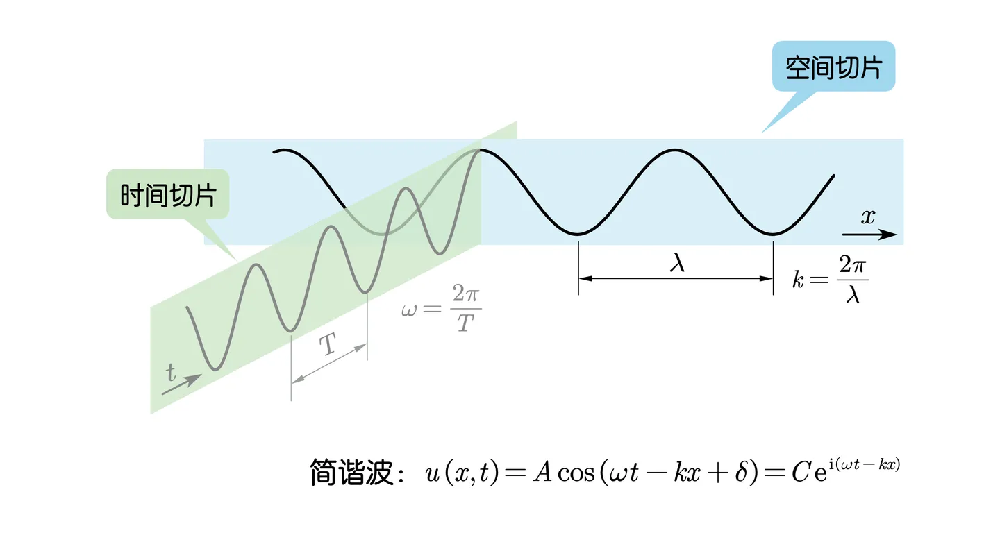
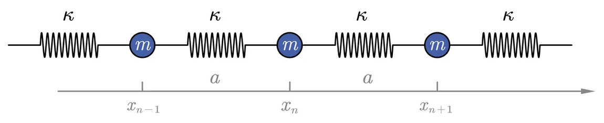
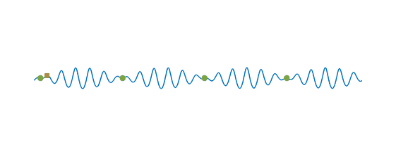

# 波動：一般簡諧波、色散關係、波動方程

## 內文
### 簡諧波

1. 對於一個沿時間、空間傳播的波而言，如果波源是簡諧振動，則稱為**<u>簡諧波</u>**
2. 對於此波而言，總有一個標誌運動狀態的物理量同時是空間$(x,y,z)$ & 時間 $(t)$ 的函數，ex: 介質位移、介質密度、介質壓力、電場 & 磁場 …
3. 此物理量 $u(\vec r,t) =Ae^{i(\omega t - \vec k \cdot \vec r + \delta)} =Ce^{i(\omega t - \vec k \cdot \vec r)}$ ，其中
   1. $A$ 為振幅，$\delta$ 為初相角， $C = Ae^{i\delta}$ 為複振幅
   2. $t$ 為**<u>時間</u>**，$\omega$ 為**<u>角頻率</u>**（即$\frac{1}{2\pi}$秒內有幾個波），$T =\frac{2\pi}{\omega}$ 為週期
   3. $\vec r$ 為**<u>位置</u>**，$\vec k$ 為**<u>角波數</u>**（即$\frac{1}{2\pi}$公尺內有幾個波，方向為波的前進方向），$\lambda =\frac{2\pi}{k}$ 為波長
   4. 波速 $v = \frac{\lambda}{ T} = \frac{\omega}{ k} = \frac{2\pi}{ kT} = \frac{\omega \lambda}{2\pi}$

   [[波動：一般簡諧波、色散關係、波動方程/Cei(omega t - vec k cdot vec r) 推導過程|摘要]]

### 色散關係

1. 假設一個無限長的一維 -彈簧-小球-彈簧-小球- 鏈，其中
   1. 每個小球質量均為 m
   2. 每個彈簧彈性係數均為 $\kappa$、每個彈簧長度均為 a
   3. 第 n 個小球平衡位置座標 $x_{n} = na$，各小球偏移平衡位置的位移為 $u_n$
2. 每個質點受到左右彈簧的彈力總和 $F = m\ddot u = \kappa(u_{n+1}-u_{n} ) - \kappa(u_{n}-u_{n-1} )$
   ⇒ $\ddot u = \frac{\kappa}{m}(u_{n+1} + u_{n-1} -2u_{n} )$。
3. 設 $\omega_0 = \sqrt{\frac{\kappa}{m}}$，並將 $u_n(x_n,t) = Ce^{i(\omega t-kx)}=Ce^{i(\omega t-kna)}$ 代入
   ⇒ $-\omega^2 Ce^{i(\omega t-kna)} = \omega_0^2Ce^{i(\omega t-kna)}(e^{i(-ka)} + e^{i(ka)} -2)$
   ⇒ $-\omega^2  = \omega_0^2(2cos(ka) -2)$⇒ $\omega^2 = 2\omega_0^2(1 - cos(ka))$
   ⇒ $\omega^2  = 4\omega_0^2sin^2(\frac{ka}{2})$
4. 結論：角速度 $\omega(k) = 2\omega_0sin(\frac{ka}{2})$ ，波速 $v = \frac{\omega (k)}{k} = \frac{2\omega_0}{k}sin(\frac{ka}{2})$
   ⇒ 波的傳播速度與 <u>角頻率</u> $\omega(k)$ 或是 <u>角波數</u> $k$ 有關，稱為**<u>有色散波</u>** ex: 彈簧波
5. 如果 $ka \ll 1$，波速 $v = \omega_0a$ ⇒ 與角頻率 $\omega(k)$ 無關，為**<u>無色散波</u>** ex:聲波
6. 此波單位長度的能量密度為 $w = \frac{E}{l} = \frac{\frac{1}{2}\kappa A^2}{a} = \frac{m\omega_0^2A^2}{2a}$，$A$ 為振幅大小 $\vert C \vert$
   波動時動能 & 位能互相轉換不影響單位長度總能量密度

### 波動方程

1. 在前一段的彈簧波中，已知 $\frac{\partial^2u}{\partial t^2}=\ddot u = \omega_0^2(u_{n+1} + u_{n-1} -2u_{n} )$
2. 同時 $\frac{\Delta u}{\Delta x} = \frac{u_{n+1}-u_{n}}{\Delta x}$ ， $\cfrac{\Delta\frac{\Delta u}{\Delta x}}{{\Delta x}} = \cfrac{\frac{u_{n+1}-u_{n}}{\Delta x} - \frac{u_{n}-u_{n-1}}{\Delta x}}{\Delta x} = \cfrac{u_{n+1} + u_{n-1} -2u_{n} }{(\Delta x)^2}$
   $\frac{\Delta\frac{\Delta u}{\Delta x}}{{\Delta x}}$ 取極限後相當於 $\frac{\partial^2 u}{\partial x^2}$ ，${\Delta x}$ 相當於小彈簧長度 a
   ⇒ $\frac{\partial^2 u}{\partial x^2} =  \frac{u_{n+1} + u_{n-1} -2u_{n} }{a^2}$
3. 帶入第一式 $\frac{\partial^2u}{\partial t^2} = \omega_0^2a^2 \frac{\partial^2u}{\partial x^2} = v^2 \frac{\partial^2u}{\partial x^2}$，其中 $v=\omega_0a$ 為無色散波波速
4. 改寫成三維形式：
   $$
   \frac{\partial^2u}{\partial t^2} = v^2 \nabla^2u
   $$
   此即為**<u>波動方程</u>**，描述一線性、無色散、無耗散介質中的波的一切通用形式

### 相速度 & 群速度

1. 波包：因為波的干涉而組成一球一球的波動
2. 相速度（紅）：$v_p = \frac{\omega}{ k}$，<u>波包中的峰 & 谷</u>的移動速度
3. 群速度（綠）：$v_g = \frac{\partial \omega}{\partial k}$，<u>波包本身</u>的移動速度，亦為能量 & 資訊的傳遞速度
   1. 因為能量儲存在振幅裡
   2. 在前兩段的彈簧波中，$v_g = \omega_0 a cos(\frac{ka}{2})$ ，明顯與相速度 $\frac{2\omega_0}{k}sin(\frac{ka}{2})$ 不同

   [[波動：一般簡諧波、色散關係、波動方程/公式推導|摘要]]
4. 只有<u>在色散介質中的非單頻波 (</u> $\omega \not \varpropto k$ <u>)</u>，才會有相速度 & 群速度的差異
