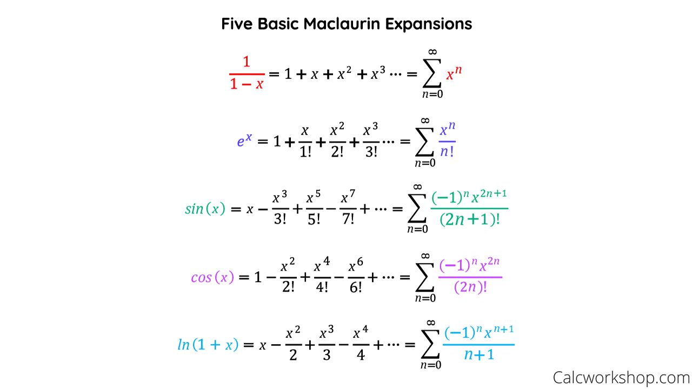
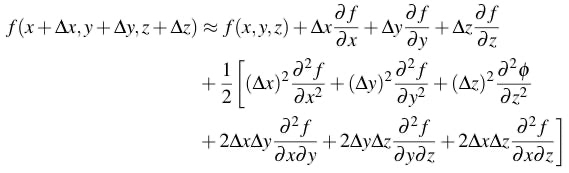

# 泰勒展開式

## 內文
1. $f(x) = f(a) + f'(a)(x-a) + \frac{1}{2!}f''(a){(x-a)}^2 + ...$
   - 當 $(x-a)$ 很小，第三項以後可以刪去
2. $f(b) - f(a) = f'(a)(b-a) + \frac{1}{2!}f''(a){(b-a)}^2 + ...$
   - 當 $(b-a)$ 很小，第三項以後可以刪去
3. $f(x + \varepsilon) = f(x) + \varepsilon f'(x) + \frac{1}{2!}{\varepsilon}^2f''(x) +...$
   - 當 $\varepsilon$ 很小，第三項以後可以刪去

- 注意：a、b、x 都可以互換

4. $e^\varepsilon = 1+ \varepsilon$ if $\varepsilon \approx 0$
5. ln(1+\epsilon) \approx \epsilon
4. 多變數的泰勒展開：
   
