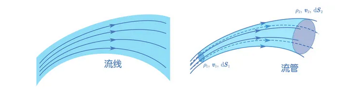
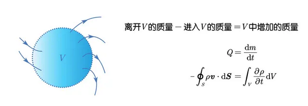

# 流體的連續性方程

## 內文

1. 在流體中，任意點都可以畫出流速的方向，這些線條連起來稱為**<u>流線</u>**
2. 因為質量守恆，因此對於任何流體而言，其所構成的流場內的**<u>流線均不會相交</u>**（如果相交代表同一個點的流體同時有兩個不同方向的流速 ⇒ 不合理，除非是源點或是匯點，即流體憑空出現 / 憑空消失之處）
3. 若在流場裡任意畫一個封閉曲線，再沿著此曲線上每個點作流線 ⇒ 形成管狀的構造，即**<u>流管</u>**。因為流線永不相交，因此流管內外的流體永遠不會穿進 / 穿出流管壁
4. 若定義單位時間通過某一截面的流體總值量為流量 Q ，則 $Q = \int \rho \vec v \cdot d \vec A$
   因為流管內的流體永遠在流管內，又由於流體質量守恆，因此從流管的入口進去多少流體，就會從流管的出口出去多少流體
   ⇒ $Q_1 = Q_2$，即 $\rho_1 \vec v_1 \cdot d \vec A_1 = \rho_2 \vec v_2 \cdot d \vec A_2$

5. 同理，對於某封閉曲面圍起來的體積，也遵守質量守恆定律，即質量變化 = 通過曲面的流量：$m = \int \rho d V$ ⇒ $Q = \frac{dm}{dt} = \int \frac{\partial \rho}{\partial t} d V$ ，又因為 $Q = \oint \rho \vec v \cdot d \vec A$
   ⇒ $\int \frac{\partial \rho}{\partial t} d V = - \oint \rho \vec v \cdot d \vec A$ （$\vec v、\vec A$ 都定義向外為正）
6. 根據高斯定理，$\oint u d \vec A = \int (\nabla \cdot u) dV$
   ⇒ $\int \frac{\partial \rho}{\partial t} d V = - \oint \rho \vec v \cdot d \vec A = -\int (\nabla \cdot \rho \vec v) dV$
   ⇒ $\int [ \frac{\partial \rho}{\partial t} + \nabla \cdot (\rho \vec v)] dV = 0$
   ，又因為 dV 是隨意亂取的，因此可得**<u>連續體方程</u>**：
   $$
   \frac{\partial \rho}{\partial t} + \nabla \cdot (\rho \vec v) =0
   $$
7. 延伸：
   1. 如果 $\frac{\partial \rho}{\partial t} = 0$ （定常流動）⇒ $\nabla \cdot (\rho \vec v) = 0$
   2. $\frac{\partial \rho}{\partial t} + \nabla \cdot (\rho \vec v) =0$
      ⇒ $\frac{\partial \rho}{\partial t} + \rho \nabla \cdot  \vec v + (\vec v \cdot \nabla) \rho  =0$，又因為 $\frac{d\rho}{dt} = \frac{\partial \rho}{\partial t} + (\vec v\cdot\nabla) \rho$
      ⇒ $\frac{d\rho}{dt} + \rho \nabla \cdot \vec v = 0$
      ⇒ 如果 $\frac{d \rho}{d t} = 0$ （不可壓縮流體）⇒ $\nabla \cdot \vec v = 0$ （即體應變率 $\dot \delta = 0$）
