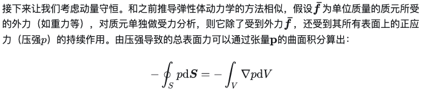

# 其他雜記

## 內文
此圖中 $\vec S$ 即為截面 $\vec A$

1. 這是因為想像 $\nabla p$ 的梯度場，把 $\nabla p$ 的流線畫出來，$\nabla p * dL$ = 此流線進出此質元時的 $\Delta p$也可以表示為 pdA（因為A有方向，兩個面會反方向）
2. 也可以另外想像對於一個立方質元（邊長 dx, dy, dz）而言，x 方向受力等於兩面壓力差$F_x = \frac{\partial p}{\partial x}dx*dA$
