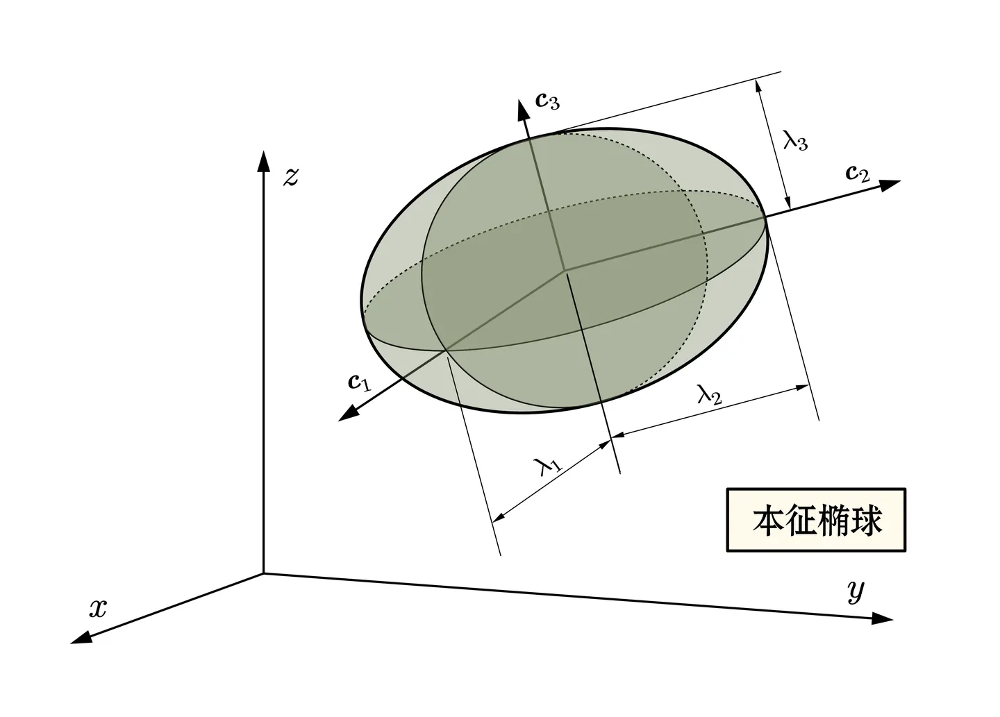

# 實對稱矩陣的特色：**<u>特徵值 = 奇異值</u>**

## 內文
1. s 階實對稱矩陣有 s 個特徵向量，對應到 s 個<u>實數</u>特徵值
2. 如果實對稱矩陣有兩個對應到不同特徵值的特徵向量，則必定正交
3. 如果實對稱矩陣有兩個對應到相同特徵值的特徵向量，則可以構成一個平面圓，此圓中任一半徑都可以是此矩陣特徵向量，對應到相同特徵值

即可以想像一個以特徵向量為軸，特徵值為長度的特徵橢球

