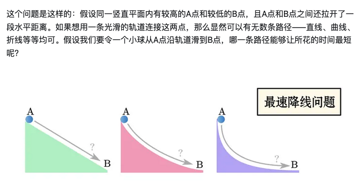
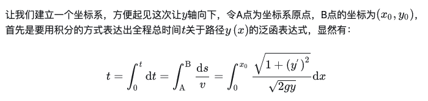
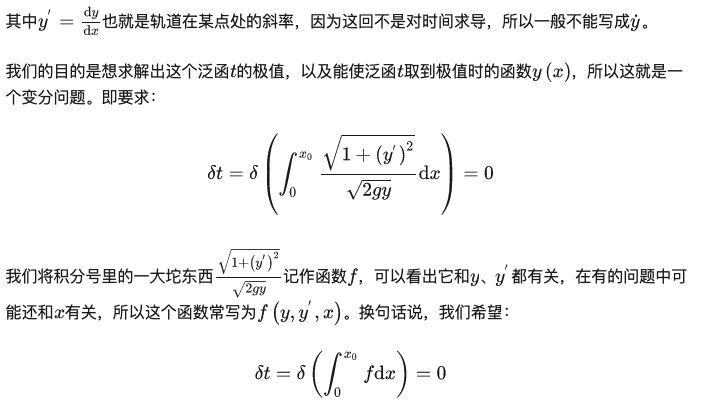
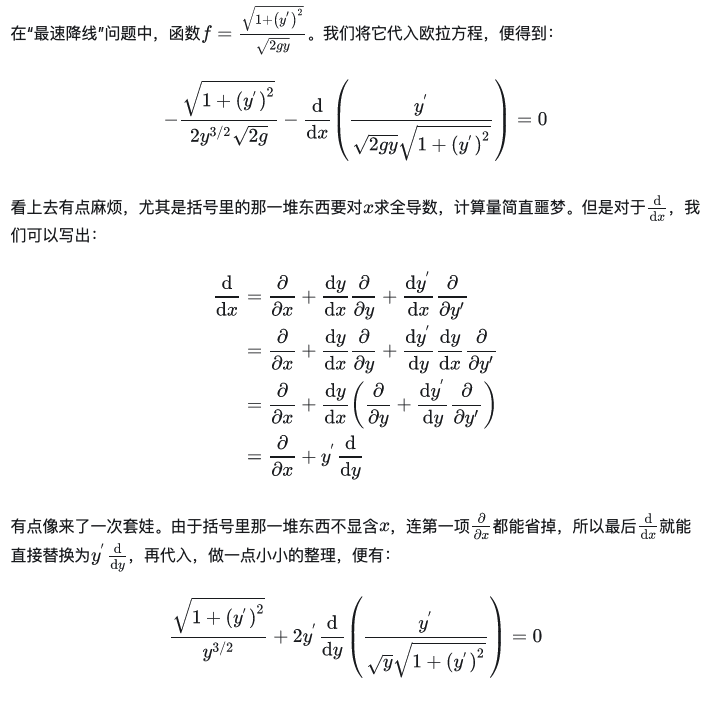
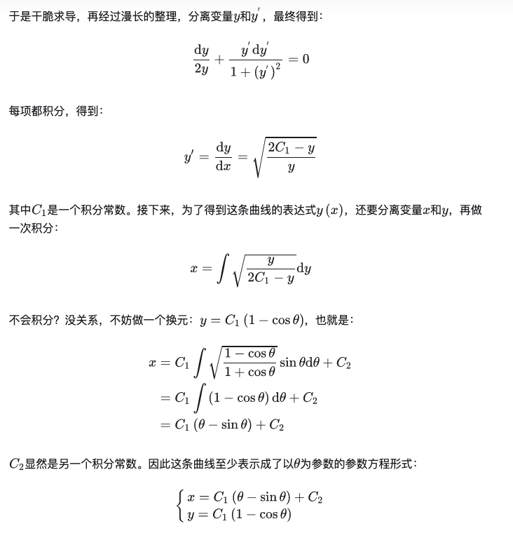

# 舉例：最速降線問題：[https://zhuanlan.zhihu.com/p/461836720](https://zhuanlan.zhihu.com/p/461836720)

## 內文

↑ 此處是因為 $ds= \sqrt{(dx)^2 + (dy)^2} \ne d\sqrt{x^2+y^2}$（因為曲線 $s\ne \sqrt{x^2+y^2}$ ）

詳細計算過程：

1. 可以假設那坨根號為 k，$dk=\frac{y’}{k}d(y')$
2. 不要用 $y'\frac{d}{dy}$，改用上面前一行的$y'\frac{d}{dy} = y'(\frac{\partial}{\partial y} + \frac{dy'}{dy}\frac{\partial}{\partial y'})$

