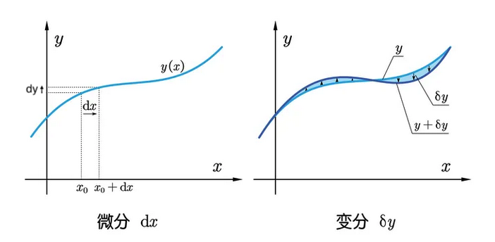

# 變分：函數 / 泛函微小的改變

## 內文
1. 對於不同的函數 $y(x)$ 而言，會有不同的泛函 $S(y)$ 的值。如果只對 $y(x)$ 進行非常微小的改變，則 $S(y)$ 應該也只會有非常微小的改變
2. 此處所言的改變是在不改變參數 x 的情形下改變函數 y 本身，使同一個參數 x 帶進去函數 y 會得到不同的答案 ⇒ 見下面兩圖中 $dy$ & $𝛿y$ 的差別
3. 此處函數 y 微小的改變稱為 $𝛿y$，而泛函 $S(y)$ 微小的改變稱為 $𝛿S$
4. 自變數 x 不會因為函數 y 變化而跟著變化，因此 $𝛿x = 0$

- 注意：
  - 虛位移 𝛿s 其實可以想像成 s(t) 函數的不確定性（虛功 𝛿W(F,x) 也可以想像成<u>功函數</u>的不確定性）。
  - 同理一般在用變分時也需要注意此時的「約束條件」ex: 用變分法可以得出<u>面積固定</u>時最小的周長是圓形
