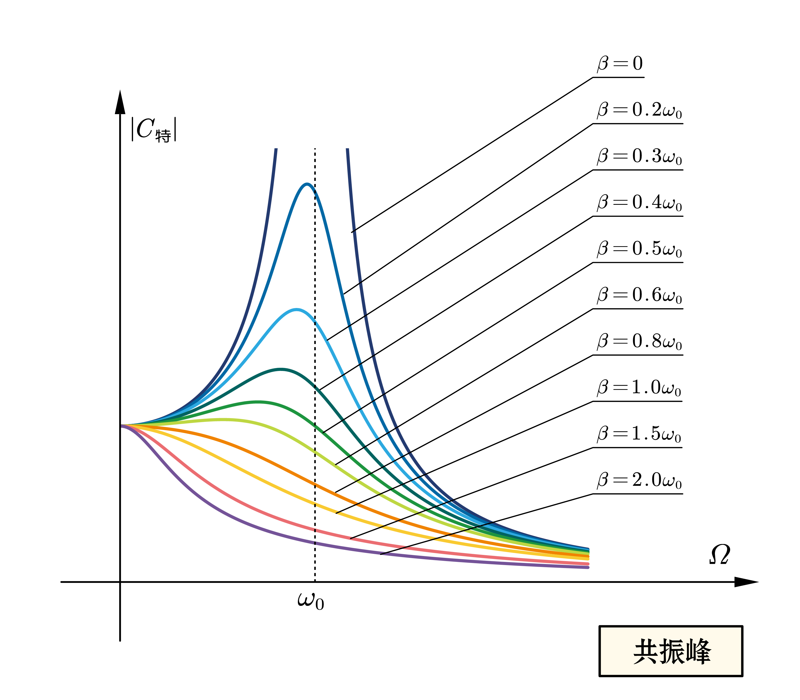
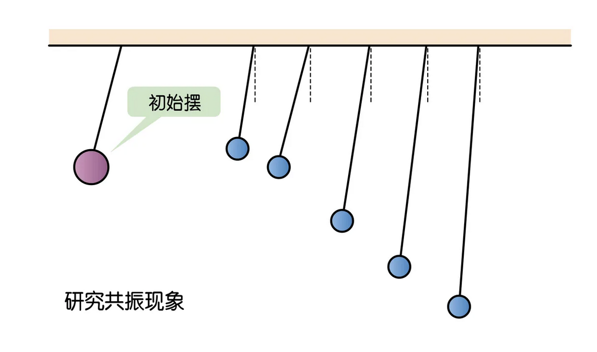

# 阻尼振動、受迫振動、共振

## 內文
### 阻尼振動

1. 對於一個單一振子 & 單一頻率的保守振動系統而言，$m\vec{\ddot x} + k\vec x = 0$（詳見<u>單一振子的簡諧振動</u>）
2. 但是如果是在耗散系統中，如果阻力與速度成正比 $\vec f = -b \vec v$，則振動微分方程可以改寫為 $m\vec{\ddot x} + b\vec{\dot x} + k\vec x = 0$
   - 注意：
     - 此系統的拉格朗日方程可以表示為 $\frac{\partial L}{\partial x} -\frac{d}{dt}(\frac{\partial L}{\partial \dot x}) = -\frac{\partial G}{\partial \dot x}$
     - 其中 $G = \frac{1}{2}b{\dot x}^2$，稱為耗散係數
3. 如何解此微分方程？⇒ <u>猜測此系統做簡諧振盪</u>，即 $x = Ce^{i\omega t}$ 代入
   ⇒ $-m\omega ^2  + i b \omega + k = 0$ ，使用公式解
   ⇒ $\omega = \frac{b}{2m}i \pm \sqrt{-(\frac{b}{2m})^2 + \frac{k}{m}}$ 頻率有虛數？ ⇒ 沒關係，直接帶入
   ⇒ $x = Ce^{i(\frac{b}{2m}i \pm \sqrt{-(\frac{b}{2m})^2 + \frac{k}{m}})t}$ ⇒ $x = Ce^{-\frac{b}{2m}t } e^{\pm i(\sqrt{-(\frac{b}{2m})^2 + \frac{k}{m}})t}$
   其中 $Ce^{-\frac{b}{2m}t }$ 整體可以看成此振動的振幅。若將 $\sqrt{\frac{k}{m}}$ 稱為**<u>物體固有頻率</u>** $\omega_0$，$\frac{b}{2m}$稱為**<u>阻尼係數</u>** $\beta$
   ⇒ $x = Ce^{-\beta t } e^{\pm i(\sqrt{ \omega_0^2-\beta^2})t}$
4. 可以看出<u>振幅</u> $Ce^{-\beta t }$ <u>隨時間拉長而衰減</u>，而頻率 $\sqrt{\omega_0^2-\beta^2 }$ 可以分情況討論：
   1. $\omega_0^2 > \beta^2$ ，即阻力 $\beta = \frac{b}{2m}$ 較小
      1. 頻率 $\omega_r = \sqrt{\omega_0^2-\beta^2 } < \omega_0$ 是實根，比原頻率 $\omega_0$ 慢但仍是類簡諧運動
      2. $\pm \omega_r$ 只代表初始相位的不同，實際頻率只有一種
      3. 振幅 $Ce^{-\beta t }$ 隨時間拉長而越來越小，直至停止，稱為**<u>欠阻尼</u>**
   2. $\omega_0^2 < \beta^2$ ，即阻力 $\beta = \frac{b}{2m}$ 較大
      1. $\sqrt{\omega_0^2-\beta^2 }$ 只有虛根，記作 $\omega_ii$
      2. $x = Ce^{-(\beta \pm \omega_i )t}$ ⇒ 沒有振動項，根本動不起來
      ⇒ 振子偏移平衡點的距離 $x$ 隨時間衰減，最終直接回到平衡位置，稱為**<u>過阻尼</u>**
   3. $\omega_0^2 = \beta^2$
      1. $\sqrt{\omega_0^2-\beta^2 } = 0$ ⇒ $x = Ce^{-\beta t}$，一樣沒有振動項，動不起來
      2. 回到平衡位置所需時間最短，稱為**<u>臨界阻尼</u>**

   [[阻尼振動、受迫振動、共振/三種情形圖片比較|摘要]]

### 受迫振動

1. 因為有阻尼使振動衰減，因此額外給予此系統外力，讓它振動。常見外力同樣有週期性變化， $\vec F(t) = F e^{i\Omega t}$ ⇒ 振動微分方程可以改寫為 $m\vec{\ddot x} + b\vec{\dot x} + k\vec x = \vec F$
2. $x = Ce^{i\omega t} 、 \vec F(t) = F e^{i\Omega t}$ 代入 ⇒ $(m\omega ^2 + i b \omega + k )Ce^{i\omega t}= F e^{i\Omega t}$
3. 此為非齊次微分方程 ⇒ 通解 + 特解
   1. 通解即為 $x_通 = C_通e^{-\beta t } e^{\pm i(\sqrt{ \omega_0^2-\beta^2})t}$（假裝常數項 = 0），即正常的阻尼運動
   2. 特解即為 $\omega = \Omega$ ，代入求複振幅 $C_特 = \frac{F}{-m\Omega ^2 + i b \Omega + k} = \frac{F}{m}\frac{1}{(\omega_0^2-\Omega^2)+2\beta \Omega i}$，其初相位 $\theta = \arctan(-\frac{2\beta \Omega }{\omega_0^2-\Omega^2})$
   3. 實際解 $x(t) = x_通 + x_特 =C_通e^{-\beta t } e^{\pm i(\sqrt{ \omega_0^2-\beta^2})t} + \frac{F}{m}\frac{1}{(\omega_0^2-\Omega^2)+2\beta \Omega i} e^{i\Omega t}$

      [[阻尼振動、受迫振動、共振/即為隨時間衰減的暫態解 & 與外力頻率 Omega 相同頻率的穩態解的疊加（圖）|摘要]]

### 共振

1. 穩態解的複振幅大小
   $\vert C_特 \vert = \vert\frac{F}{m}\frac{1}{(\omega_0^2-\Omega^2)+2\beta \Omega i}\vert = \frac{F}{m} \frac{1}{\sqrt{(\omega_0^2-\Omega^2)^2+4\beta^2 \Omega^2}} = \frac{F}{m}\frac{1}{\sqrt{(\Omega^2 +2\beta^2- \omega_0^2)^2+4\beta^2 (\omega_0^2-\beta^2)}}$
   與系統內在性質（物體固有頻率 $\omega_0$、阻尼係數 $\beta$）& 外力性質（外力頻率 $\Omega$）均有關
2. 使振幅最大的那個外力頻率稱為**<u>共振頻率</u>** $\Omega_0$
   
3. 當 $2\beta^2-\omega_0^2 <0$ 時，可以激發共振，共振最高點時外力頻率為 $\Omega = \sqrt{\omega_0^2 - 2\beta^2}$
   1. 當阻尼係數 $\beta = 0$ 時， $\Omega_0 = \omega_0$
   2. 當阻尼係數 $\beta$ 增大時， $\Omega_0$ 會略小於 $\omega_0$
4. 當 $2\beta^2-\omega_0^2 \geq 0$ 時，無法激發共振

舉例：在同一根線上懸掛多支單擺，並讓初始擺開始運動時，所有擺都會振動起來，頻 率階等於初始擺的頻率，但固有頻率越接近初始擺頻率的振幅會較大

